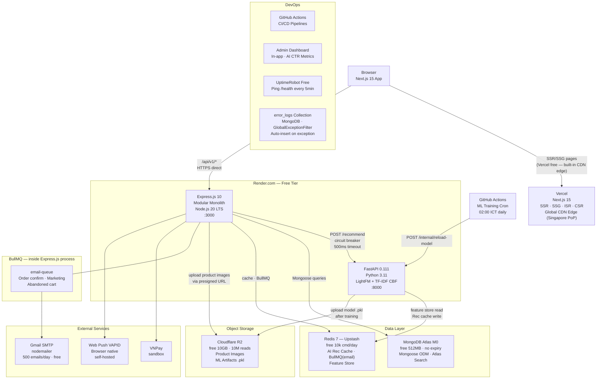
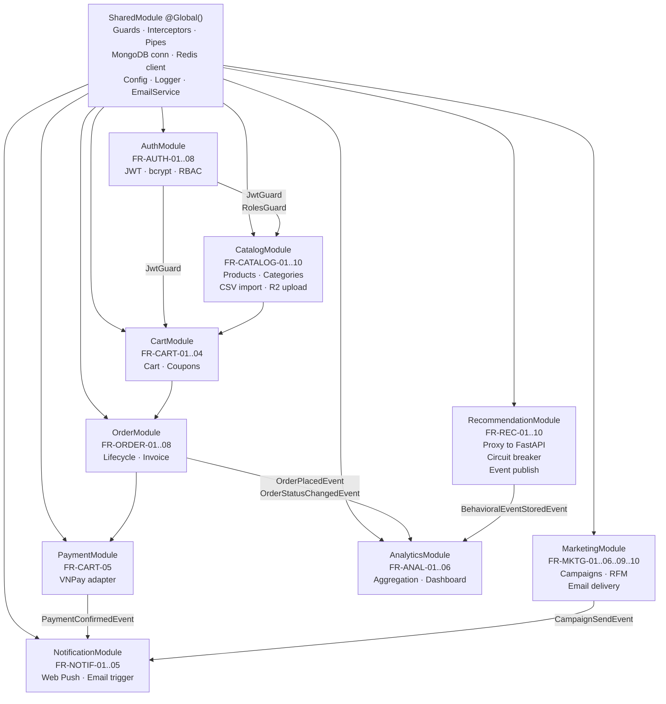
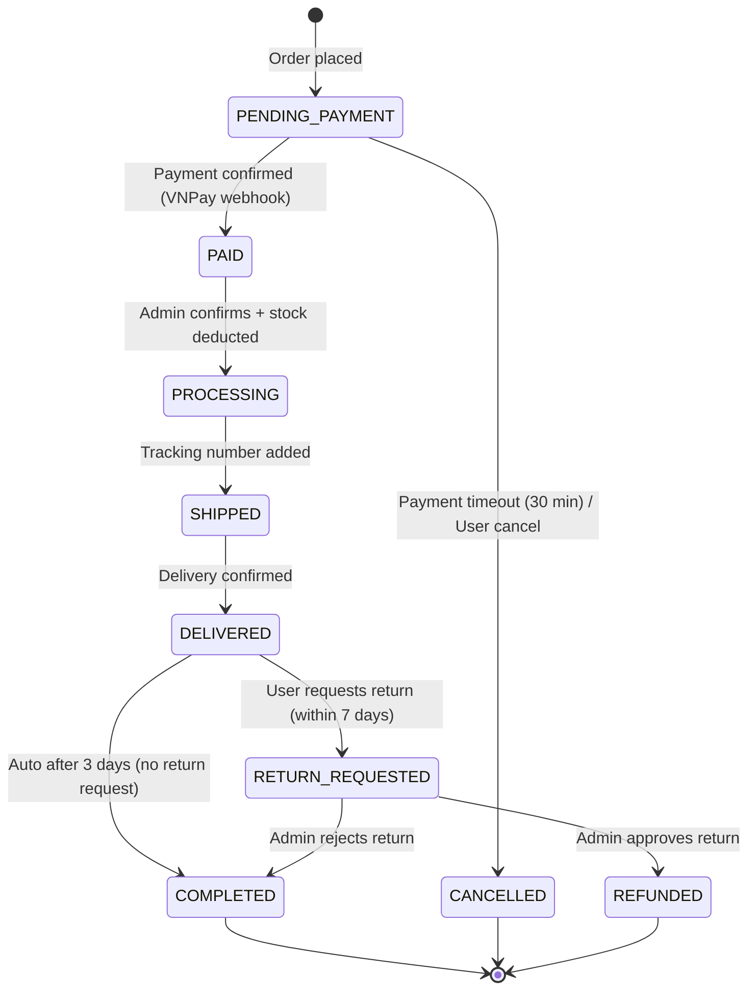
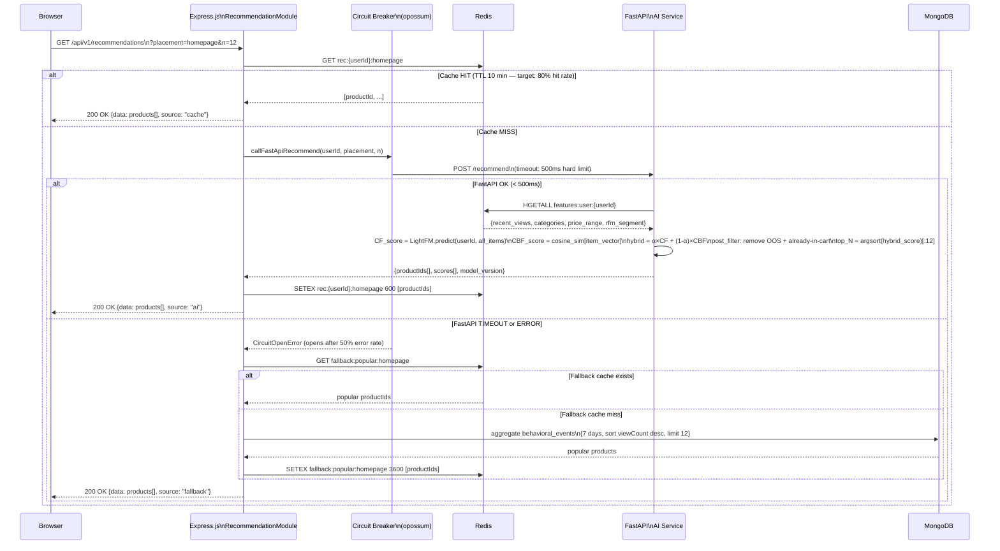
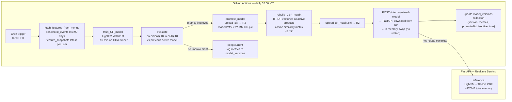
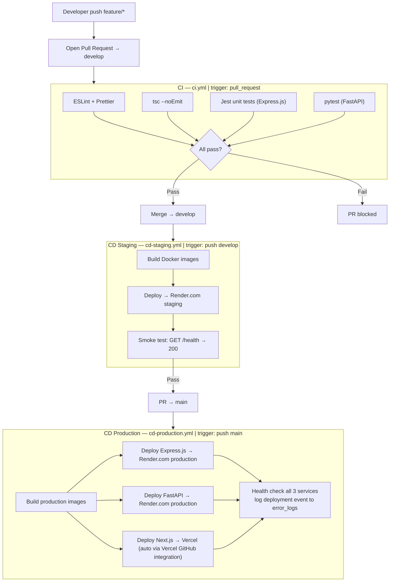

# Architecture Design Document

**Project:** SMART ECOMMERCE AI SYSTEM
**Version:** 2.0.0
**Date:** 2026-04-01
**Author:** Senior Software Architect
**Status:** Approved
**References:** `docs/TECH_STACK.md` v2.0.0 · `docs/REQUIREMENTS.md` v2.2.0

---

## Table of Contents

1. [Architecture Style & Rationale](#1-architecture-style--rationale)
2. [System Architecture Diagram](#2-system-architecture-diagram)
3. [Core Service Breakdown](#3-core-service-breakdown)
4. [AI Services Architecture](#4-ai-services-architecture)
5. [API Design Standards](#5-api-design-standards)
6. [Security Architecture](#6-security-architecture)
7. [Deployment Architecture](#7-deployment-architecture)
8. [Single Points of Failure](#8-single-points-of-failure)
9. [Architecture Decision Records](#9-architecture-decision-records)

---

## 1. Architecture Style & Rationale

### 1.1 Choice: "Majestic Monolith + AI Sidecar"

The system consists of exactly **two deployable units**:

| Unit | Runtime | Role |
|---|---|---|
| **Express.js API** | Node.js 20 LTS | All business logic: catalog, cart, order, payment, marketing, notification, analytics |
| **FastAPI AI Service** | Python 3.11 | Serves only ML inference + training — the sole reason for separating it: Python ecosystem |

Connection between the two units: **internal REST call** (Express.js → FastAPI) protected by a circuit breaker, with **Redis** as a shared cache layer (feature store + rec cache).

### 1.2 Why NOT Microservices

| Reason | Explanation |
|---|---|
| 1 developer + AI tools | Distributed system overhead (service discovery, inter-service auth, distributed tracing, saga pattern) = unmanageable for a solo developer |
| 16-week timeline / ~40 FRs | Development velocity > architectural isolation. Monolith = no network latency between modules |
| Current scale | 100k users/month, 5k concurrent peak does not require horizontal split per domain |
| Budget $0 | Each microservice = 1 Render slot; free tier only has 2 slots (sufficient for Express.js + FastAPI) |
| "Make it work first" | Monolith with clear boundaries → refactor to microservices when truly needed |

### 1.3 Migration Path — Strangler Fig Pattern

```
Phase 1 (current):     [Express.js Monolith] + [FastAPI AI Sidecar]
                           ↓ (if scaling is needed, after graduation)
Phase 2:               [Express.js Core] + [RecommendationService] + [FastAPI AI]
                       (extract RecommendationModule → standalone service)
                           ↓ (if marketing batch jobs become too heavy)
Phase 3:               [Express.js Core] + [RecommendationService] + [MarketingService] + [FastAPI AI]
```

**Strangler Fig principle:** No big-bang rewrite. The module with the highest load → extracted first. Express.js module boundaries today = future service boundaries.

---

## 2. System Architecture Diagram



### 2.1 SSL/TLS Architecture (Without Cloudflare CDN Proxy)

Since ADR-004 (removing the Cloudflare CDN proxy), SSL/TLS is handled directly by the managed hosting providers:

| Service | TLS Provider | Certificate | Auto-Renew |
|---|---|---|---|
| **Vercel** (Next.js) | Let's Encrypt via Vercel | Issued for custom domain automatically | ✅ Yes |
| **Render.com** (Express.js + FastAPI) | Let's Encrypt via Render | Issued for `*.onrender.com` subdomain | ✅ Yes |
| **Cloudflare R2** | Cloudflare built-in | For R2 public bucket URLs | ✅ Yes |

No manual SSL configuration is needed. Cloudflare does not need to act as an SSL termination proxy.

### 2.2 Request Flow Summary

| Flow | Path |
|---|---|
| **Page load (SSR)** | Browser → Vercel Edge CDN → Next.js RSC → Express.js API (if server data is needed) |
| **API call** | Browser → Express.js `/api/v1/*` (HTTPS direct, TLS via Render) |
| **Search** | Browser → Express.js → MongoDB Atlas Search → response |
| **AI Recommendation** | Browser → Express.js RecommendationModule → Redis cache check → (miss) → FastAPI → Redis feature store → LightFM+CBF → Express.js cache → response |
| **Behavioral Event** | Browser → Express.js → async MongoDB insert (fire-and-forget) |
| **Training pipeline** | GitHub Actions cron 02:00 ICT → fetch MongoDB → train LightFM → evaluate → promote → upload R2 → hot-reload FastAPI |
| **Payment** | Browser → Express.js → VNPay → webhook callback → Express.js HMAC verify → update order |
| **Email** | Express.js → BullMQ `email-queue` → nodemailer → Gmail SMTP → inbox |
| **Error logging** | Express.js AllExceptionsFilter → async MongoDB `error_logs` insert (fire-and-forget) |

---

## 3. Core Service Breakdown

### 3.1 Express.js Bootstrap Sequence (`main.ts`)

```typescript
async function bootstrap() {
  const app = await NestFactory.create(AppModule);

  // 1. Global prefix
  app.setGlobalPrefix('api/v1');

  // 2. Validation pipe (DTO whitelist + transform)
  app.useGlobalPipes(new ValidationPipe({
    whitelist: true,          // strip unknown fields
    forbidNonWhitelisted: true,
    transform: true,          // auto-cast primitives
    transformOptions: { enableImplicitConversion: true },
  }));

  // 3. Global response interceptor (wrap in { success, data, meta } envelope)
  app.useGlobalInterceptors(new ResponseInterceptor());

  // 4. Global exception filter (format error + async insert to error_logs)
  app.useGlobalFilters(new AllExceptionsFilter());

  // 5. CORS (whitelist frontend URLs only)
  app.enableCors({
    origin: [process.env.FRONTEND_URL, 'http://localhost:3000'],
    credentials: true,
  });

  // 6. Swagger (dev only)
  if (process.env.NODE_ENV !== 'production') {
    const config = new DocumentBuilder()
      .setTitle('Smart Ecommerce API')
      .setVersion('2.0.0')
      .addBearerAuth()
      .build();
    SwaggerModule.setup('api/docs', app, SwaggerModule.createDocument(app, config));
  }

  await app.listen(process.env.PORT || 3001);
}
```

### 3.2 Express.js Module Architecture



### 3.3 Module Responsibility Matrix

| Module | FR Coverage | Core Responsibilities | MongoDB Collections | External Deps |
|---|---|---|---|---|
| **SharedModule** | — | DB conn, Redis client, Config, Logger, EmailService (nodemailer), Guards, Pipes, Interceptors | — | Gmail SMTP |
| **AuthModule** | FR-AUTH-01..08 | Register, Login, JWT issue/refresh/revoke, bcrypt hashing, RBAC Guards | `users` | — |
| **CatalogModule** | FR-CATALOG-01..10 | Product CRUD, variant management, category tree, bulk CSV import, image upload, inventory track | `products`, `categories`, `reviews` | R2 (images), Atlas Search |
| **CartModule** | FR-CART-01..04 | Cart add/update/remove, coupon validation, stock check, cart merge (guest → auth) | `carts`, `coupons` | — |
| **OrderModule** | FR-ORDER-01..08 | Order placement (MongoDB transaction), status FSM, inventory deduct, shipping update, invoice gen | `orders` | BullMQ (email job) |
| **PaymentModule** | FR-CART-05 | `IPaymentGateway` interface, VNPay adapter, webhook HMAC-SHA512 verify, payment status sync | embedded in `orders` | VNPay |
| **RecommendationModule** | FR-REC-01..10 | FastAPI proxy with circuit breaker, behavioral event async MongoDB write, fallback logic | `behavioral_events` | FastAPI AI Service, Redis |
| **MarketingModule** | FR-MKTG-01..03, 06, 09, 10 | Campaign CRUD, RFM segmentation (MongoDB aggregation), email delivery via BullMQ | `campaigns`, `segments` | Gmail SMTP (nodemailer), BullMQ |
| **NotificationModule** | FR-NOTIF-01..05 | Web Push VAPID send, email via BullMQ (nodemailer), push subscription management | `push_subscriptions` | Gmail SMTP (nodemailer), Web Push API |
| **AnalyticsModule** | FR-ANAL-01..06 | Dashboard metrics aggregation, product performance, campaign ROI, AI CTR computation | `behavioral_events`, `orders`, `campaigns` | — (in-app Admin Dashboard) |

### 3.4 Order Status State Machine



**Transition rules:**
- Stock deducted: when PAID → PROCESSING
- Stock restored: when → CANCELLED or → REFUNDED
- Refund triggered: when PAID → CANCELLED (auto) or when admin approves RETURN_REQUESTED
- EventEmitter2 fires `order.status.changed` on every transition → NotificationModule sends email

### 3.5 Cross-Module Event Communication

All async cross-module communication uses **EventEmitter2** (no direct service injection):

| Event | Emitter | Listener | Payload |
|---|---|---|---|
| `order.placed` | OrderModule | NotificationModule | `{ orderId, userId, email, items[] }` |
| `order.status.changed` | OrderModule | NotificationModule, AnalyticsModule | `{ orderId, oldStatus, newStatus, userId }` |
| `payment.confirmed` | PaymentModule | OrderModule | `{ orderId, transactionId, amount }` |
| `behavioral.event.stored` | RecommendationModule | AnalyticsModule | `{ userId, eventType, productId, timestamp }` |
| `campaign.send` | MarketingModule | NotificationModule | `{ campaignId, segmentId, channel, templateId }` |
| `cart.abandoned` | CartModule (scheduled) | MarketingModule | `{ userId, cartId, items[], abandonedAt }` |

---

## 4. AI Services Architecture

### 4.1 FastAPI Service Structure

```
ai-service/
├── app/
│   ├── main.py                    # FastAPI init, CORS, /health endpoint
│   ├── config.py                  # pydantic-settings: REDIS_URL, MONGO_URI, R2_*
│   ├── routers/
│   │   ├── recommend.py           # POST /recommend
│   │   ├── features.py            # POST /features/update (Express.js internal call)
│   │   └── internal.py            # POST /internal/reload-model (GitHub Actions call)
│   ├── services/
│   │   ├── cf_service.py          # LightFM model load + predict()
│   │   ├── cbf_service.py         # TF-IDF cosine similarity matrix + query()
│   │   ├── hybrid.py              # α-weighted scoring + post_filter()
│   │   └── fallback.py            # get_popular_products() — circuit open fallback
│   └── ml/
│       ├── train_cf.py            # LightFM fit, evaluate (precision@10, recall@10)
│       ├── train_cbf.py           # TF-IDF vectorize + cosine sim matrix build
│       └── model_registry.py      # Cloudflare R2 upload/download .pkl artifacts
├── scripts/
│   └── train_pipeline.py          # Entry point called by GitHub Actions cron
├── tests/
│   ├── test_recommend.py
│   └── test_training.py
├── Dockerfile                     # python:3.11-slim, pip layer cached
└── requirements.txt
```

### 4.2 Recommendation Realtime Flow



### 4.3 Circuit Breaker Configuration

```typescript
// src/modules/recommendation/services/recommendation.service.ts
import CircuitBreaker from 'opossum';

const breakerOptions = {
  timeout: 500,                      // ms — FastAPI must respond within 500ms
  errorThresholdPercentage: 50,      // 50% failures → open circuit
  resetTimeout: 60_000,              // 60s before half-open probe
  volumeThreshold: 5,                // min 5 requests before calculating error rate
  name: 'fastapi-recommendation',
};

const breaker = new CircuitBreaker(this.callFastApiRecommend.bind(this), breakerOptions);

breaker.fallback(() => this.getPopularityFallback());
breaker.on('open',     () => this.logger.warn('AI circuit OPEN — using popularity fallback'));
breaker.on('halfOpen', () => this.logger.log('AI circuit HALF-OPEN — probing FastAPI'));
breaker.on('close',    () => this.logger.log('AI circuit CLOSED — AI recommendations restored'));
```

### 4.4 ML Training Pipeline — Daily 02:00 ICT



| Phase | Timing | Detail |
|---|---|---|
| **Training** | Daily 02:00 ICT | GitHub Actions cron → `scripts/train_pipeline.py` |
| **Evaluation gate** | After each training | precision@10, recall@10 — only promote if both metrics ≥ current active model |
| **Artifact storage** | After promotion | Upload `.pkl` + `.npz` to Cloudflare R2 (`models/cf/YYYY-MM-DD/`) |
| **Hot-reload** | After upload | `POST /internal/reload-model` → FastAPI downloads from R2, swaps in-memory (no container restart) |
| **Rollback** | Manual if CTR drops | Same endpoint with `{ version: "YYYY-MM-DD-previous" }` |
| **Cold start** | On FastAPI container restart | Auto-download latest active model from R2 on startup |

### 4.5 Feature Store Design

```
Redis key: features:user:{userId}     Hash type    TTL: 2 hours

Fields:
  recent_product_ids    JSON array of last 20 viewed product IDs
  recent_category_ids   JSON array of last 10 viewed category IDs
  avg_price_range       "low" | "medium" | "high" (computed from purchase history)
  rfm_segment           "champions" | "loyal" | "at_risk" | "lost" | "new"
  last_order_at         ISO8601 timestamp
  total_orders          integer count

Update triggers:
  - On behavioral event (view, purchase) → Express.js calls POST /features/update → FastAPI updates Redis
  - On order completed → OrderModule emits event → RecommendationModule updates features
  - TTL refresh: on every update (sliding expiry)

Fallback if key missing:
  FastAPI computes features on-demand from MongoDB behavioral_events (adds ~20ms)
  Then stores in Redis for subsequent requests
```

---

## 5. API Design Standards

### 5.1 URL Conventions

```
Base URL: /api/v1

Resource endpoints:
  GET    /api/v1/products                          List (paginated, filterable)
  POST   /api/v1/products                          Create (staff/admin)
  GET    /api/v1/products/:id                      Detail
  PATCH  /api/v1/products/:id                      Update (partial)
  DELETE /api/v1/products/:id                      Soft-delete

Nested resources:
  GET    /api/v1/products/:id/reviews              Product reviews
  POST   /api/v1/orders/:id/status                 Update order status
  POST   /api/v1/campaigns/:id/send                Trigger campaign send

Special:
  GET    /api/v1/recommendations?placement=homepage&n=12
  GET    /api/v1/search/products?q=áo+thun&category=...&minPrice=...
  POST   /api/v1/events                            Behavioral event ingestion
  GET    /health                                   Service health check (UptimeRobot ping target)
  POST   /internal/reload-model                    FastAPI model hot-reload (GitHub Actions only)
```

### 5.2 Standard Response Envelopes

**Success — single resource:**
```json
{
  "success": true,
  "data": {
    "_id": "65f4a2b3c0e1d2f3a4b5c6d7",
    "name": "Áo thun cotton unisex",
    "price": 299000,
    "status": "active"
  },
  "meta": { "requestId": "550e8400-e29b-41d4-a716-446655440000" }
}
```

**Success — paginated list:**
```json
{
  "success": true,
  "data": [ { "_id": "...", "name": "Product 1" }, { "_id": "...", "name": "Product 2" } ],
  "meta": {
    "total": 1234,
    "page": 2,
    "limit": 20,
    "totalPages": 62,
    "requestId": "550e8400-e29b-41d4-a716-446655440000"
  }
}
```

**Error — not found / business logic:**
```json
{
  "success": false,
  "error": {
    "code": "PRODUCT_NOT_FOUND",
    "message": "Product '65f4a2b3' not found or has been deleted"
  },
  "meta": { "requestId": "550e8400-e29b-41d4-a716-446655440000" }
}
```

**Error — validation (422):**
```json
{
  "success": false,
  "error": {
    "code": "VALIDATION_ERROR",
    "message": "Request validation failed",
    "details": [
      { "field": "price", "message": "price must be a positive integer (VND)" },
      { "field": "name",  "message": "name must not be empty" }
    ]
  },
  "meta": { "requestId": "550e8400-e29b-41d4-a716-446655440000" }
}
```

**Error — AI service circuit open (graceful degradation):**
```json
{
  "success": true,
  "data": [ { "_id": "...", "name": "Popular Product 1" } ],
  "meta": {
    "requestId": "...",
    "source": "fallback",
    "reason": "AI service temporarily unavailable"
  }
}
```

### 5.3 Error Code Registry

Defined in `libs/shared/src/constants/error-codes.ts` — never use raw strings in code.

| Code | HTTP Status | Meaning |
|---|---|---|
| `AUTH_CREDENTIALS_INVALID` | 401 | Email/password mismatch |
| `AUTH_TOKEN_EXPIRED` | 401 | JWT access token expired |
| `AUTH_TOKEN_INVALID` | 401 | JWT signature invalid or malformed |
| `AUTH_REFRESH_INVALID` | 401 | Refresh token revoked or expired |
| `AUTH_FORBIDDEN` | 403 | Insufficient role for this operation |
| `AUTH_EMAIL_EXISTS` | 409 | Email already registered |
| `AUTH_ACCOUNT_UNVERIFIED` | 403 | Email not yet verified |
| `PRODUCT_NOT_FOUND` | 404 | Product ID not found |
| `PRODUCT_OUT_OF_STOCK` | 422 | Requested quantity exceeds current stock |
| `CART_EMPTY` | 422 | Cannot checkout with empty cart |
| `CART_STOCK_CHANGED` | 422 | Stock changed since item was added to cart |
| `ORDER_NOT_FOUND` | 404 | Order ID not found |
| `ORDER_INVALID_TRANSITION` | 422 | Status transition not allowed by FSM |
| `ORDER_CANCEL_NOT_ALLOWED` | 422 | Order past CONFIRMED state, cannot cancel |
| `PAYMENT_WEBHOOK_INVALID` | 400 | HMAC-SHA512 signature mismatch |
| `COUPON_NOT_FOUND` | 404 | Coupon code does not exist |
| `COUPON_EXPIRED` | 422 | Coupon past expiry date |
| `COUPON_USAGE_EXCEEDED` | 422 | Coupon max usage reached |
| `COUPON_MIN_ORDER_NOT_MET` | 422 | Cart total below coupon minimum |
| `RATE_LIMIT_EXCEEDED` | 429 | Too many requests — retry after N seconds |
| `VALIDATION_ERROR` | 422 | Request body/params failed validation |
| `INTERNAL_ERROR` | 500 | Unexpected server error (logged to error_logs) |

### 5.4 Pagination & Filtering

```
Standard query params:
  page     integer ≥ 1      (default: 1)
  limit    integer 1–100    (default: 20)
  sort     field name       (default: createdAt)
  order    asc | desc       (default: desc)

Example:
  GET /api/v1/products?page=2&limit=20&sort=price&order=asc
    &category=electronics&minPrice=100000&maxPrice=500000
    &inStock=true&rating=4
```

### 5.5 Rate Limiting

| Endpoint Group | Limit | Window | Throttler Store |
|---|---|---|---|
| `POST /auth/login` | 10 req | per minute per IP | Redis (ThrottlerStorageRedisService) |
| `POST /auth/register` | 5 req | per minute per IP | Redis |
| `POST /auth/refresh` | 20 req | per minute per user | Redis |
| `GET /search/products` | 60 req | per minute per IP | Redis |
| `POST /events` (behavioral) | 500 req | per minute per user | Memory (in-process, reset on restart) |
| `GET /api/v1/*` (general) | 100 req | per minute per user | Redis |

Implementation: `@express/throttler` with `ThrottlerModule.forRootAsync` using `ThrottlerStorageRedisService`.

---

## 6. Security Architecture

### 6.1 JWT Authentication Flow

```mermaid
sequenceDiagram
    participant Client
    participant Express.js as Express.js AuthModule
    participant Redis as Redis (Upstash)
    participant MongoDB

    Note over Client,MongoDB: LOGIN
    Client->>Express.js: POST /api/v1/auth/login {email, password}
    Express.js->>MongoDB: users.findOne({email, deletedAt: null})
    MongoDB-->>Express.js: user {_id, passwordHash, roles, status}
    Express.js->>Express.js: bcrypt.compare(password, hash) — cost 12
    alt Matches
        Express.js->>Express.js: sign accessToken RS256\n{sub: userId, roles, exp: now+15min}
        Express.js->>Express.js: generate refreshToken = crypto.randomUUID()\nhash = SHA-256(token)
        Express.js->>Redis: SETEX sess:{hash} 604800 {userId, roles}
        Express.js-->>Client: 200 {accessToken}\nSet-Cookie: refreshToken=...\n  HttpOnly; Secure; SameSite=Strict
    else Wrong password
        Express.js-->>Client: 401 AUTH_CREDENTIALS_INVALID
    end

    Note over Client,MongoDB: AUTHENTICATED REQUEST
    Client->>Express.js: GET /api/v1/orders\nAuthorization: Bearer {accessToken}
    Express.js->>Express.js: JwtAuthGuard: verify RS256 + check exp
    Express.js->>Express.js: RolesGuard: req.user.roles vs @Roles() decorator
    Express.js-->>Client: 200 {orders}

    Note over Client,MongoDB: TOKEN REFRESH
    Client->>Express.js: POST /api/v1/auth/refresh (cookie: refreshToken)
    Express.js->>Express.js: hash = SHA-256(cookie value)
    Express.js->>Redis: GET sess:{hash}
    alt Session exists
        Redis-->>Express.js: {userId, roles}
        Express.js->>Redis: DEL sess:{oldHash}\nSETEX sess:{newHash} 604800 {userId, roles}
        Express.js-->>Client: 200 {newAccessToken}\nSet-Cookie: newRefreshToken
    else Not found
        Express.js-->>Client: 401 AUTH_REFRESH_INVALID
    end
```

### 6.2 RBAC Authorization Matrix

| Action | `buyer` | `staff` | `admin` |
|---|---|---|---|
| Browse catalog, search, view product detail | ✓ | ✓ | ✓ |
| Manage own cart, place order | ✓ | ✓ | ✓ |
| View own orders, own profile | ✓ | ✓ | ✓ |
| Write product review (verified purchase only) | ✓ | ✗ | ✓ |
| Create/update/delete products | ✗ | ✓ | ✓ |
| Manage inventory, categories | ✗ | ✓ | ✓ |
| View all orders, update order status | ✗ | ✓ | ✓ |
| Create/send marketing campaigns | ✗ | ✓ | ✓ |
| View analytics dashboard | ✗ | ✓ | ✓ |
| User management, role assignment | ✗ | ✗ | ✓ |
| System configuration | ✗ | ✗ | ✓ |

### 6.3 Data Security

| Layer | Mechanism |
|---|---|
| **In transit** | TLS 1.2+ enforced (Vercel HSTS + Render.com auto-TLS); all API calls over HTTPS |
| **Passwords** | bcrypt cost factor 12 (~250ms hash time; prevents brute force) |
| **Refresh tokens** | Stored as SHA-256 hash in Redis only — raw token never persisted |
| **JWT signing** | RS256 asymmetric — private key in env var, public key in config |
| **NoSQL injection** | Mongoose strict schema; DTO whitelist strips unknown fields; never use `$where` |
| **XSS** | React auto-escapes HTML; Next.js CSP headers via `next.config.js` headers() |
| **CSRF** | `SameSite=Strict` cookie + state-changing endpoints require `Authorization` header |
| **Payment webhooks** | HMAC-SHA512 signature verification before any order state change |
| **Audit trail** | `audit_logs` collection — app service account has INSERT-ONLY permission (no UPDATE/DELETE) |
| **Error logs** | `error_logs` collection — async insert from `AllExceptionsFilter`; never returned to client |
| **Secrets** | `.env` only (never committed); GitHub Actions Secrets for CI/CD; Render env vars for production |

### 6.4 Error Logging (In-house, no Sentry)

```typescript
// src/shared/filters/all-exceptions.filter.ts
@Catch()
export class AllExceptionsFilter implements ExceptionFilter {
  constructor(
    private readonly errorLogRepo: ErrorLogRepository,
    private readonly logger: Logger,
  ) {}

  catch(exception: unknown, host: ArgumentsHost): void {
    const ctx = host.switchToHttp();
    const request = ctx.getRequest<Request>();
    const response = ctx.getResponse<Response>();

    const status = exception instanceof HttpException
      ? exception.getStatus()
      : HttpStatus.INTERNAL_SERVER_ERROR;

    const requestId = request.headers['x-request-id'] as string
      || generateRequestId();

    // Async insert to error_logs (fire-and-forget — never blocks response)
    if (status >= 500) {
      this.errorLogRepo.insertAsync({
        level: 'error',
        message: exception instanceof Error ? exception.message : String(exception),
        stack: exception instanceof Error ? exception.stack : undefined,
        path: request.url,
        method: request.method,
        statusCode: status,
        userId: request.user?._id,
        requestId,
      }).catch(err => this.logger.error('Failed to write error_log', err));
    }

    response.status(status).json({
      success: false,
      error: { code: 'INTERNAL_ERROR', message: 'An unexpected error occurred' },
      meta: { requestId },
    });
  }
}
```

---

## 7. Deployment Architecture

### 7.1 Environments

| Environment | Branch | Infrastructure | Purpose |
|---|---|---|---|
| **local** | `feature/*` | Docker Compose (all services local) | Daily development, unit tests |
| **staging** | `develop` | Render.com (auto-deploy on push) | Integration tests, demo preview |
| **production** | `main` | Render.com + Vercel + MongoDB Atlas M0 | Thesis defense demo |

### 7.2 Docker Compose (Local Dev)

```yaml
# infra/docker-compose.yml
services:
  mongodb:
    image: mongo:7
    ports: ["27017:27017"]
    volumes: ["mongo_data:/data/db"]

  redis:
    image: redis:7-alpine
    ports: ["6379:6379"]
    command: redis-server --maxmemory 256mb --maxmemory-policy allkeys-lru

  express:
    build: ./apps/api
    ports: ["3001:3001"]
    environment:
      MONGO_URI: mongodb://mongodb:27017/smartecom
      REDIS_URL: redis://redis:6379
      SMTP_HOST: smtp.gmail.com
      SMTP_PORT: "587"
      SMTP_USER: ${GMAIL_USER}
      SMTP_PASS: ${GMAIL_APP_PASSWORD}
      INTERNAL_API_SECRET: ${INTERNAL_API_SECRET}
    volumes: ["./apps/api/src:/app/src"]   # hot reload
    depends_on: [mongodb, redis]

  nextjs:
    build: ./apps/web
    ports: ["3000:3000"]
    environment:
      NEXT_PUBLIC_API_URL: http://localhost:3001
    volumes: ["./apps/web/src:/app/src"]

  fastapi:
    build: ./apps/ai-service
    ports: ["8000:8000"]
    environment:
      REDIS_URL: redis://redis:6379
      MONGO_URI: mongodb://mongodb:27017/smartecom
      R2_BUCKET: ${R2_BUCKET}
      R2_ACCESS_KEY: ${R2_ACCESS_KEY}
      R2_SECRET_KEY: ${R2_SECRET_KEY}
      INTERNAL_API_SECRET: ${INTERNAL_API_SECRET}
    depends_on: [redis, mongodb]
    command: uvicorn app.main:app --host 0.0.0.0 --port 8000 --reload

volumes:
  mongo_data:
```

### 7.3 CI/CD Pipeline



### 7.4 Zero-Downtime Strategy

| Service | Mechanism |
|---|---|
| **Express.js on Render.com** | Rolling deploy: new container → health check passes → traffic switches → old stops |
| **FastAPI on Render.com** | Same rolling deploy; model hot-reload is in-process (no container restart needed) |
| **Next.js on Vercel** | Atomic deployments — instant swap, instant rollback to any previous deployment |
| **MongoDB** | Mongoose flexible schema → additive-only changes → zero migration downtime |
| **Redis / BullMQ** | `process.on('SIGTERM')` → `worker.close()` → in-flight email jobs complete before shutdown |

---

## 8. Single Points of Failure

| SPOF | Severity | Impact | Mitigation Strategy |
|---|---|---|---|
| **MongoDB Atlas M0** | HIGH | All read/write fails — complete system down | Mongoose auto-reconnect (3 retries, exponential backoff); Atlas M0 99.9% SLA; daily backup via Atlas scheduled backup |
| **Render.com Express.js** | HIGH | All API endpoints inaccessible | UptimeRobot alert within 5 min; Render.com 99.5% SLA; rolling deploy = zero downtime during releases |
| **Render.com FastAPI** | MEDIUM | AI recommendations unavailable | Circuit breaker → popularity fallback in < 100ms; core e-commerce (catalog, cart, order) fully unaffected |
| **Render.com spin-down** | LOW | 10-15s cold start after 15 min idle | UptimeRobot pings `/health` every 5 min → service never spins down during demo hours |
| **Upstash Redis** | MEDIUM | AI rec cache cold; email queue paused; feature store miss | Graceful degradation: AI fallback to MongoDB popularity query; BullMQ jobs retry on reconnect; rate limiting degrades to memory store |
| **Cloudflare R2** | LOW | Product images don't load; model artifacts inaccessible on restart | CDN caches recent images; FastAPI keeps model in-memory (no restart = no R2 needed); Express.js serves placeholder image URL |
| **Vercel** | MEDIUM | Frontend UI inaccessible | Vercel 99.99% SLA; instant rollback; API still functional (mobile/headless access) |
| **GitHub Actions** | LOW | CI/CD blocked; daily ML training skipped | Previous model version stays active in FastAPI memory; training resumes automatically next day; local builds unaffected |
| **Gmail SMTP** | LOW | Transactional + marketing emails undeliverable | BullMQ retries 3× with 5-min exponential backoff; failed jobs logged to `error_logs`; orders still complete (email non-blocking) |

---

## 9. Architecture Decision Records

### ADR-001 — Modular Monolith over Microservices

**Date:** 2026-03-24 | **Status:** Accepted

**Context:** 1 developer, 16-week timeline, $0 budget (2 Render free slots), 100k users/month scale.

**Decision:** Single Express.js deployable unit. FastAPI as AI sidecar only (Python ML ecosystem requirement). Clear Express.js module boundaries = future microservice extraction path.

**Consequences:**
- (+) Development velocity; no distributed system overhead; full ACID transactions in-process
- (+) Free tier fits: 2 Render slots = Express.js + FastAPI
- (-) Cannot scale individual modules independently
- (-) Single process — module bug can affect overall process (mitigated: ExceptionFilter isolates to HTTP response)

---

### ADR-002 — Direct MongoDB Write over Redis Streams for Behavioral Events

**Date:** 2026-03-24 | **Status:** Accepted

**Context:** Need async pipeline for behavioral events (view, click, purchase) for ML training. Options evaluated: Kafka (no free tier), Redis Streams (consumes Upstash quota + needs Celery process → OOM on 512MB), Direct MongoDB write (async insertOne ~2-5ms, zero Redis commands).

**Decision:** `POST /api/v1/events` → async `collection.insertOne()` fire-and-forget. TTL index 90 days auto-purge.

**Consequences:**
- (+) Zero Redis commands; removes Celery dependency; MongoDB data ready for GitHub Actions training script
- (-) No event replay/buffering; potential write latency spike if MongoDB slow
- **Revisit trigger:** Event volume > 1,000/sec

---

### ADR-003 — Circuit Breaker Pattern for AI Service Integration

**Date:** 2026-03-24 | **Status:** Accepted

**Context:** FastAPI is separate container — can cold-start (15s), crash, or timeout. FR-REC-05 requires < 200ms. Core e-commerce must not be blocked by AI service failure.

**Decision:** `opossum` circuit breaker in RecommendationModule. Timeout: 500ms. Error threshold: 50%. Reset: 60s. Fallback: MongoDB popularity aggregation (cached 1h in Redis).

**Consequences:**
- (+) Core e-commerce availability independent of AI health
- (+) Users always see recommendations (popularity-based vs empty state)
- (-) During circuit open, BG-02 (CTR >= 5%) not achievable — popularity list is not personalized
- **Mitigation:** UptimeRobot keeps FastAPI warm → circuit rarely opens during demo

---

### ADR-004 — Remove Cloudflare CDN Proxy Layer

**Date:** 2026-04-01 | **Status:** Accepted

**Context:** Original architecture used Cloudflare as CDN/DDoS/SSL proxy in front of Vercel and Render.com. For a university demo with ~100 peak concurrent users, this adds an external dependency without proportional benefit.

**Decision:** Remove Cloudflare CDN proxy. Rely on:
- Vercel's built-in global CDN edge (Singapore PoP — ~20-40ms latency to Vietnam)
- Render.com's built-in HTTPS/TLS (auto-provisioned Let's Encrypt)
- `@express/throttler` for application-level rate limiting

Keep **Cloudflare R2** (object storage — separate product from CDN proxy).

**Consequences:**
- (+) One fewer external dependency; simpler DNS setup; no Cloudflare account required
- (+) Vercel Edge CDN already serves static assets globally from nearest PoP
- (-) No layer-7 DDoS protection beyond Vercel/Render infrastructure level
- **Acceptable risk:** University demo has near-zero DDoS threat surface
- **Revisit trigger:** When deploying to production domain with real traffic

---

### ADR-005 — Gmail SMTP (nodemailer) over Resend

**Date:** 2026-04-01 | **Status:** Accepted

**Context:** Need transactional + marketing email delivery. Resend requires domain verification (DNS TXT/MX) — not feasible for demo/thesis subdomain. Gmail SMTP via App Password: free, no DNS setup, 500 emails/day, sufficient for demo scale (~50-100 emails/day).

**Decision:** `nodemailer` npm package + Gmail SMTP (STARTTLS port 587). Config via `GMAIL_USER` + `GMAIL_APP_PASSWORD` env vars (App Password ≠ account password — Gmail 2FA required).

```typescript
nodemailer.createTransport({
  host: 'smtp.gmail.com',
  port: 587,
  secure: false,  // STARTTLS
  auth: { user: process.env.GMAIL_USER, pass: process.env.GMAIL_APP_PASSWORD },
});
```

**Consequences:**
- (+) Zero cost; no domain verification; works with any Gmail account
- (+) nodemailer is battle-tested (>5M weekly npm downloads)
- (-) No built-in open/click tracking (mitigated: UTM params + MongoDB metrics)
- (-) 500 emails/day limit (sufficient for demo; not for production scale)
- **Revisit trigger:** Production deployment with verified domain → migrate to Resend/AWS SES

---

*ARCHITECTURE.md — v2.0.0 — 2026-04-01*
*References: TECH_STACK.md v2.0.0 · REQUIREMENTS.md v2.2.0 · MODULE_STRUCTURE.md v2.0.0*
