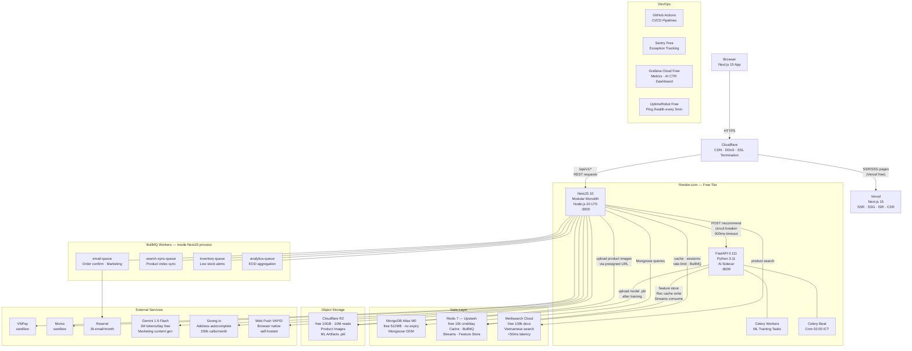
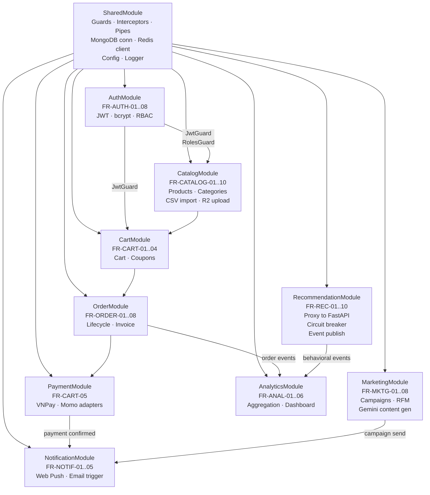
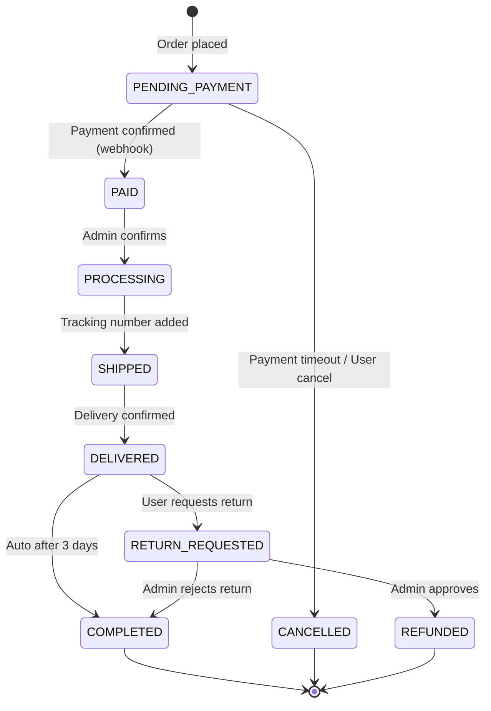
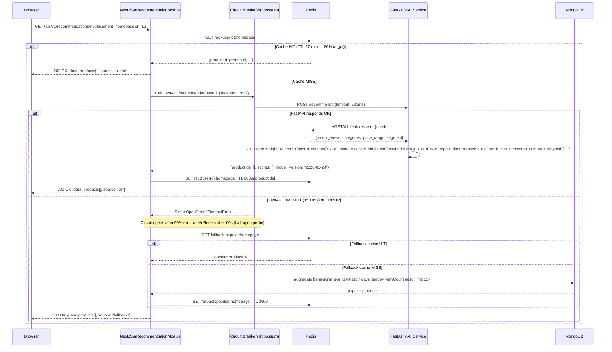
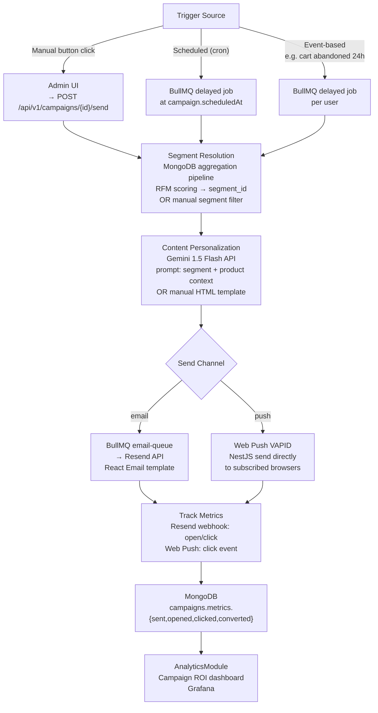
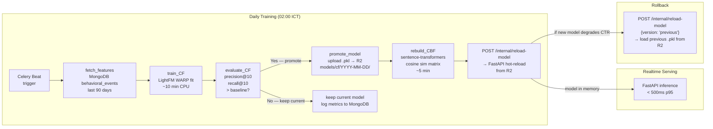
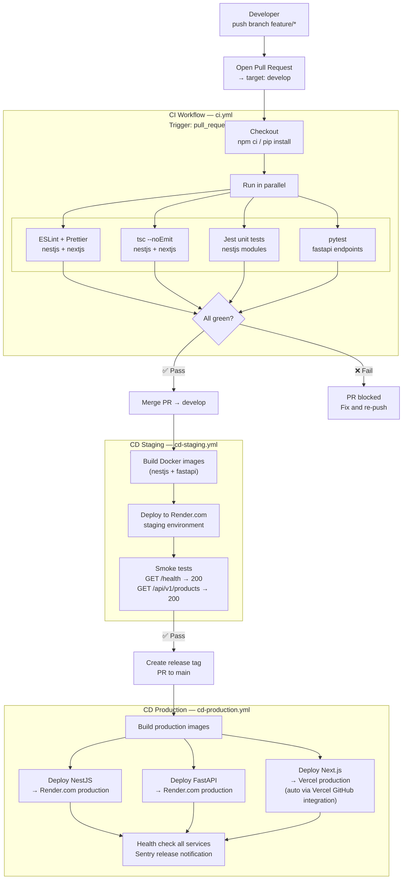

# Architecture Design Document

**Project:** SMART ECOMMERCE AI SYSTEM
**Version:** 1.0.0
**Date:** 2026-03-24
**Author:** Senior Software Architect
**Status:** Approved
**References:** `docs/TECH_STACK.md` v1.0.0 · `docs/REQUIREMENTS.md` v2.1.0

---

## Mục Lục

1. [Architecture Style & Rationale](#1-architecture-style--rationale)
2. [System Architecture Diagram](#2-system-architecture-diagram)
3. [Core Service Breakdown](#3-core-service-breakdown)
4. [AI Services Architecture](#4-ai-services-architecture)
5. [API Design Standards](#5-api-design-standards)
6. [Security Architecture](#6-security-architecture)
7. [Deployment Architecture](#7-deployment-architecture)
8. [Single Points of Failure](#8-single-points-of-failure)
9. [Architecture Decision Records](#9-architecture-decision-records)

---

## 1. Architecture Style & Rationale

### 1.1 Lựa Chọn: "Majestic Monolith + AI Sidecar"

Hệ thống gồm **hai deployable units** duy nhất:

| Unit | Runtime | Vai Trò |
|---|---|---|
| **NestJS API** | Node.js 20 LTS | Toàn bộ business logic: catalog, cart, order, payment, marketing, notification, analytics |
| **FastAPI AI Service** | Python 3.11 | Chỉ phục vụ ML inference + training — lý do duy nhất tách riêng: Python ecosystem |

Kết nối giữa hai units: **internal REST call** (NestJS → FastAPI) + **Redis Streams** (NestJS publish events → FastAPI consume).

### 1.2 Tại Sao KHÔNG Microservices

| Lý Do | Giải Thích |
|---|---|
| Team size 1 | Distributed system overhead (service discovery, inter-service auth, distributed tracing, saga pattern) = unmanageable cho solo developer |
| Timeline 16 tuần / 62 FRs | Development velocity > architectural isolation. Monolith = no network latency giữa modules |
| Scale hiện tại | 100k user/month, 5k concurrent peak không cần horizontal split per domain |
| Budget $0 | Mỗi microservice = 1 Render slot; free tier chỉ có 2 slots (đủ cho NestJS + FastAPI) |
| "Make it work first" | Monolith với clear boundaries → refactor sang microservices khi thực sự cần |

### 1.3 Migration Path — Strangler Fig Pattern

```
Phase 1 (hiện tại):    [NestJS Monolith] + [FastAPI AI Sidecar]
                           ↓ (nếu cần scale, sau graduation)
Phase 2:               [NestJS Core] + [RecommendationService] + [FastAPI AI]
                       (extract RecommendationModule → standalone service)
                           ↓ (nếu marketing batch jobs trở nên quá nặng)
Phase 3:               [NestJS Core] + [RecommendationService] + [MarketingService] + [FastAPI AI]
```

**Nguyên tắc Strangler Fig:** Không big-bang rewrite. Module nào chịu tải cao nhất → extract ra trước. NestJS module boundaries hôm nay = future service boundaries.

---

## 2. System Architecture Diagram



### 2.1 Request Flow Summary

| Luồng | Path |
|---|---|
| **Page load (SSR)** | Browser → CF → Vercel → Next.js RSC → NestJS API (nếu cần server data) |
| **API call** | Browser → CF → NestJS `/api/v1/*` → MongoDB / Redis |
| **Search** | Browser → NestJS → Meilisearch → response |
| **AI Recommendation** | Browser → NestJS RecommendationModule → Redis cache check → (miss) → FastAPI → Redis feature store → LightFM+CBF → NestJS cache → response |
| **Behavioral Event** | Browser → NestJS → Redis XADD `behavioral:events` → Celery consumer → MongoDB bulk insert |
| **Training pipeline** | Celery Beat 02:00 ICT → fetch MongoDB → train LightFM → evaluate → promote → upload R2 → hot-reload FastAPI |
| **Payment** | Browser → NestJS → VNPay/Momo → webhook callback → NestJS verify → update order |
| **Email** | NestJS → BullMQ `email-queue` → Resend API → inbox |

---

## 3. Core Service Breakdown

### 3.1 NestJS Module Architecture



### 3.2 Module Responsibility Matrix

| Module | FR Coverage | Core Responsibilities | MongoDB Collections | External Deps |
|---|---|---|---|---|
| **SharedModule** | — | DB conn, Redis client, Config, Logger, common DTOs, Guards, Pipes, Interceptors | — | — |
| **AuthModule** | FR-AUTH-01..08 | Register, Login, JWT issue/refresh/revoke, bcrypt hashing, RBAC Guards | `users` | Redis (sessions) |
| **CatalogModule** | FR-CATALOG-01..10 | Product CRUD, variant management, category tree, bulk CSV import, image upload, inventory track | `products`, `categories` | R2 (images), Meilisearch |
| **CartModule** | FR-CART-01..04 | Cart add/update/remove, coupon validation, stock check, cart merge (guest → auth) | `carts`, `coupons` | Redis (cart cache) |
| **OrderModule** | FR-ORDER-01..08 | Order placement, status FSM, inventory deduct (transaction), shipping update, invoice gen | `orders` | BullMQ (email job) |
| **PaymentModule** | FR-CART-05 | `IPaymentGateway` interface, VNPay adapter, Momo adapter, webhook HMAC verify, payment status sync | embedded in `orders` | VNPay, Momo |
| **RecommendationModule** | FR-REC-01..10 | FastAPI proxy with circuit breaker, behavioral event publish to Redis Streams, fallback logic | Redis Streams | FastAPI AI Service |
| **MarketingModule** | FR-MKTG-01..08 | Campaign CRUD, RFM segmentation (MongoDB aggregation), Gemini LLM content gen, BullMQ schedule | `campaigns`, `segments` | Gemini API, BullMQ |
| **NotificationModule** | FR-NOTIF-01..05 | Web Push VAPID send, email via BullMQ, push subscription management | — | Resend, Web Push |
| **AnalyticsModule** | FR-ANAL-01..06 | Dashboard metrics aggregation, product performance, campaign ROI, AI CTR computation | `behavioral_events`, `orders`, `campaigns` | Grafana (data source) |

### 3.3 Order Status State Machine



---

## 4. AI Services Architecture

### 4.1 FastAPI Service Structure

```
ai-service/
├── app/
│   ├── main.py                    # FastAPI app init, CORS, health endpoint
│   ├── config.py                  # Settings (env vars: REDIS_URL, R2_*, MONGO_URI)
│   ├── routers/
│   │   ├── recommend.py           # POST /recommend
│   │   ├── features.py            # POST /features/update (internal NestJS call)
│   │   └── internal.py            # POST /internal/reload-model
│   ├── services/
│   │   ├── cf_service.py          # LightFM model load + predict
│   │   ├── cbf_service.py         # Cosine similarity matrix compute + query
│   │   ├── hybrid.py              # α-weighted scoring + post-filter
│   │   └── fallback.py            # Popularity-based fallback (circuit open)
│   ├── ml/
│   │   ├── train_cf.py            # LightFM fit, evaluate (precision@10, recall@10)
│   │   ├── train_cbf.py           # sentence-transformers embed + cosine sim matrix
│   │   └── model_registry.py      # Cloudflare R2 upload/download .pkl artifacts
│   └── workers/
│       ├── celery_app.py          # Celery config (Redis broker + backend)
│       ├── beat_schedule.py       # Cron tasks: daily 02:00 ICT
│       └── event_consumer.py      # Redis Streams XREADGROUP consumer → MongoDB bulk insert
├── tests/
│   ├── test_recommend.py
│   └── test_training.py
├── Dockerfile
└── requirements.txt
```

### 4.2 Recommendation Realtime Flow



### 4.3 Circuit Breaker Configuration

```typescript
// src/recommendation/recommendation.service.ts
import CircuitBreaker from 'opossum';

const options = {
  timeout: 500,                    // ms — FastAPI must respond within 500ms
  errorThresholdPercentage: 50,    // % failures → open circuit
  resetTimeout: 60_000,            // ms — wait 60s before half-open probe
  volumeThreshold: 5,              // min requests before calculating error rate
  name: 'fastapi-recommendation',
};

const breaker = new CircuitBreaker(callFastApiRecommend, options);

breaker.fallback(() => getPopularityBasedFallback());
breaker.on('open', () => logger.warn('AI circuit OPEN — using fallback'));
breaker.on('halfOpen', () => logger.log('AI circuit HALF-OPEN — probing'));
breaker.on('close', () => logger.log('AI circuit CLOSED — AI service restored'));
```

### 4.4 Marketing Automation Flow



### 4.5 Model Lifecycle



| Phase | Timing | Mechanism |
|---|---|---|
| **Training** | Daily 02:00 ICT | Celery Beat → Celery Worker |
| **Evaluation** | After each training | precision@10, recall@10 vs previous |
| **Promotion** | If metrics improve | Upload `.pkl` to R2 + update `model_versions` collection |
| **Hot-reload** | After promotion | `POST /internal/reload-model` → FastAPI in-memory swap |
| **Rollback** | Manual or auto if CTR drops | Same endpoint with `{version: "previous"}` |

---

## 5. API Design Standards

### 5.1 URL Conventions

```
Base URL:  /api/v1

Pattern:
  /api/v1/{resource}                       Collection endpoint
  /api/v1/{resource}/{id}                  Single resource
  /api/v1/{resource}/{id}/{sub-resource}   Nested resource

Examples:
  GET    /api/v1/products                         List products (paginated, filterable)
  POST   /api/v1/products                         Create product (staff/admin)
  GET    /api/v1/products/{productId}             Get product detail
  PATCH  /api/v1/products/{productId}             Update product
  DELETE /api/v1/products/{productId}             Delete product
  GET    /api/v1/products/{productId}/reviews     Product reviews

  GET    /api/v1/orders                           My orders (buyer) or all orders (staff)
  POST   /api/v1/orders                           Place order
  GET    /api/v1/orders/{orderId}                 Order detail
  PATCH  /api/v1/orders/{orderId}/status          Update order status (staff)

  GET    /api/v1/recommendations                  AI recommendations
         ?placement=homepage|pdp|cart&n=12

  POST   /api/v1/auth/login
  POST   /api/v1/auth/refresh
  DELETE /api/v1/auth/logout
  POST   /api/v1/auth/register

  GET    /api/v1/search/products?q=...&category=...&minPrice=...&sort=...
```

**Naming rules:**
- Plural nouns: `/products`, `/orders`, `/users` (không phải `/product`, `/getOrder`)
- Lowercase, kebab-case: `/marketing-campaigns` (không phải camelCase)
- Actions dùng nested noun: `PATCH /orders/{id}/status` (không phải `/order/updateStatus`)
- Query params cho filter/sort/paginate (không embed trong path)

### 5.2 HTTP Methods

| Method | Semantics | Idempotent | Body |
|---|---|---|---|
| `GET` | Read resource(s) | Yes | No |
| `POST` | Create resource / trigger action | No | Yes |
| `PUT` | Full replacement | Yes | Yes |
| `PATCH` | Partial update | Yes (prefer) | Yes |
| `DELETE` | Remove resource | Yes | No |

### 5.3 Standard Response Envelopes

**Success — single resource:**
```json
{
  "success": true,
  "data": {
    "_id": "65f4a2b3c0e1d2f3a4b5c6d7",
    "name": "Áo thun cotton",
    "price": 299000
  },
  "meta": {
    "requestId": "550e8400-e29b-41d4-a716-446655440000"
  }
}
```

**Success — paginated list:**
```json
{
  "success": true,
  "data": [
    { "_id": "...", "name": "Product 1" },
    { "_id": "...", "name": "Product 2" }
  ],
  "meta": {
    "total": 1234,
    "page": 2,
    "limit": 20,
    "totalPages": 62,
    "requestId": "550e8400-e29b-41d4-a716-446655440000"
  }
}
```

**Error — business logic / not found:**
```json
{
  "success": false,
  "error": {
    "code": "PRODUCT_NOT_FOUND",
    "message": "Product with id '65f4a2b3' not found",
    "details": []
  },
  "meta": {
    "requestId": "550e8400-e29b-41d4-a716-446655440000"
  }
}
```

**Error — validation (422):**
```json
{
  "success": false,
  "error": {
    "code": "VALIDATION_ERROR",
    "message": "Request validation failed",
    "details": [
      { "field": "price", "message": "price must be a positive number" },
      { "field": "name", "message": "name must not be empty" }
    ]
  },
  "meta": {
    "requestId": "550e8400-e29b-41d4-a716-446655440000"
  }
}
```

### 5.4 Error Code Registry

| Code | HTTP Status | Meaning |
|---|---|---|
| `AUTH_TOKEN_EXPIRED` | 401 | JWT access token expired |
| `AUTH_TOKEN_INVALID` | 401 | JWT signature invalid |
| `AUTH_FORBIDDEN` | 403 | Insufficient role |
| `AUTH_REFRESH_INVALID` | 401 | Refresh token invalid or rotated |
| `PRODUCT_NOT_FOUND` | 404 | Product ID not found |
| `PRODUCT_OUT_OF_STOCK` | 422 | Requested quantity exceeds stock |
| `CART_EMPTY` | 422 | Cannot checkout with empty cart |
| `ORDER_NOT_FOUND` | 404 | Order ID not found |
| `ORDER_INVALID_STATUS` | 422 | Status transition not allowed |
| `PAYMENT_WEBHOOK_INVALID` | 400 | HMAC signature mismatch |
| `COUPON_EXPIRED` | 422 | Coupon past expiry date |
| `COUPON_USAGE_EXCEEDED` | 422 | Coupon usage limit reached |
| `RATE_LIMIT_EXCEEDED` | 429 | Too many requests |
| `AI_SERVICE_UNAVAILABLE` | 503 | FastAPI circuit open (fallback served) |
| `GEMINI_UNAVAILABLE` | 503 | LLM API unavailable — create content manually |
| `VALIDATION_ERROR` | 422 | Request body/params validation failed |
| `INTERNAL_ERROR` | 500 | Unexpected server error |

### 5.5 Authentication & Authorization Headers

```
# Authenticated requests
Authorization: Bearer {accessToken}

# Refresh token (HTTP-only cookie — not in header)
Cookie: refreshToken={opaqueToken}

# Internal service-to-service (NestJS → FastAPI)
X-Internal-Token: {INTERNAL_API_SECRET}  (shared env var, not exposed to clients)
```

### 5.6 Pagination Query Params

```
GET /api/v1/products?page=2&limit=20&sort=price&order=asc&category=electronics&minPrice=100000

Standard params:
  page    (default: 1)
  limit   (default: 20, max: 100)
  sort    field name (default: createdAt)
  order   asc | desc (default: desc)
```

### 5.7 Rate Limiting Strategy

| Endpoint Group | Limit | Window | Store |
|---|---|---|---|
| `POST /auth/login` | 10 req | per minute per IP | Redis sliding window |
| `POST /auth/register` | 5 req | per minute per IP | Redis sliding window |
| `POST /auth/refresh` | 20 req | per minute per IP | Redis sliding window |
| `GET /search/products` | 60 req | per minute per IP | Redis sliding window |
| `POST /events` (behavioral) | 500 req | per minute per user | Redis sliding window |
| `GET /api/v1/*` (general) | 100 req | per minute per user | Redis sliding window |
| `POST /admin/*` | 200 req | per minute per user | Redis sliding window |

Implementation: `@nestjs/throttler` + Redis store (`ThrottlerStorageRedisService`)

---

## 6. Security Architecture

### 6.1 JWT Authentication Flow

```mermaid
sequenceDiagram
    participant Client as Client\n(Browser)
    participant NestJS as NestJS\nAuthModule
    participant Redis as Redis\n(Upstash)
    participant MongoDB as MongoDB\nAtlas

    Note over Client,MongoDB: ── LOGIN ──
    Client->>NestJS: POST /api/v1/auth/login\n{email, password}
    NestJS->>MongoDB: db.users.findOne({email})
    MongoDB-->>NestJS: user {_id, email, passwordHash, roles}
    NestJS->>NestJS: bcrypt.compare(password, passwordHash)\ncost factor 12
    alt Password matches
        NestJS->>NestJS: sign accessToken (JWT)\n{sub: userId, roles, exp: +15min}
        NestJS->>NestJS: generate refreshToken (crypto.randomUUID)\nhash: SHA-256
        NestJS->>Redis: SET sess:{hash} {userId, roles}\nTTL 604800 (7 days)
        NestJS-->>Client: 200 OK {accessToken}\nSet-Cookie: refreshToken=...\n  HttpOnly; Secure; SameSite=Strict; Path=/api/v1/auth
    else Password wrong
        NestJS-->>Client: 401 {code: AUTH_CREDENTIALS_INVALID}
    end

    Note over Client,MongoDB: ── AUTHENTICATED REQUEST ──
    Client->>NestJS: GET /api/v1/orders\nAuthorization: Bearer {accessToken}
    NestJS->>NestJS: JwtAuthGuard:\n  verify RS256 signature\n  check exp claim
    alt Token valid
        NestJS->>NestJS: RolesGuard:\n  check req.user.roles vs @Roles() decorator
        NestJS-->>Client: 200 OK {orders}
    else Token expired
        NestJS-->>Client: 401 {code: AUTH_TOKEN_EXPIRED}
    end

    Note over Client,MongoDB: ── REFRESH ──
    Client->>NestJS: POST /api/v1/auth/refresh\n(cookie: refreshToken)
    NestJS->>NestJS: hash refreshToken cookie → SHA-256
    NestJS->>Redis: GET sess:{hash}
    alt Session exists
        Redis-->>NestJS: {userId, roles}
        NestJS->>NestJS: issue new accessToken (15min)\ngenerate new refreshToken (rotate)
        NestJS->>Redis: DEL sess:{oldHash}\nSET sess:{newHash} TTL 7days
        NestJS-->>Client: 200 OK {accessToken}\nSet-Cookie: refreshToken={newToken}
    else Session not found (revoked or expired)
        NestJS-->>Client: 401 {code: AUTH_REFRESH_INVALID}
    end

    Note over Client,MongoDB: ── LOGOUT ──
    Client->>NestJS: DELETE /api/v1/auth/logout\n(cookie: refreshToken)
    NestJS->>Redis: DEL sess:{hash}
    NestJS-->>Client: 204 No Content\nSet-Cookie: refreshToken=; Max-Age=0
```

### 6.2 RBAC Authorization Model

Three roles: `buyer` · `staff` · `admin`

```typescript
// Assigned at registration, stored in users.roles[]
// JWT payload: { sub: userId, roles: ['buyer'] }
// Guards: @Roles('staff', 'admin') → RolesGuard checks JWT roles
```

| Resource / Action | `buyer` | `staff` | `admin` |
|---|---|---|---|
| Browse catalog (GET /products) | ✓ | ✓ | ✓ |
| View product detail | ✓ | ✓ | ✓ |
| Search products | ✓ | ✓ | ✓ |
| Manage cart | ✓ | ✓ | ✓ |
| Place order | ✓ | ✓ | ✓ |
| View own orders | ✓ | ✓ | ✓ |
| Manage own profile / address | ✓ | ✓ | ✓ |
| Write product review | ✓ | ✗ | ✓ |
| Create / update products | ✗ | ✓ | ✓ |
| Manage inventory | ✗ | ✓ | ✓ |
| View all orders | ✗ | ✓ | ✓ |
| Update order status | ✗ | ✓ | ✓ |
| Create marketing campaigns | ✗ | ✓ | ✓ |
| View analytics dashboard | ✗ | ✓ | ✓ |
| User management (role assign) | ✗ | ✗ | ✓ |
| System configuration | ✗ | ✗ | ✓ |
| Coupon management | ✗ | ✓ | ✓ |

### 6.3 Data Security

| Layer | Mechanism |
|---|---|
| **In transit** | Cloudflare TLS 1.2+ (HSTS enabled); all API calls HTTPS |
| **Passwords** | bcrypt cost factor 12 (never stored plaintext) |
| **Refresh tokens** | Stored as SHA-256 hash in Redis (never raw token at rest) |
| **JWT signing** | RS256 (asymmetric) — private key in env var, public key verifiable |
| **NoSQL injection** | Mongoose strict schema validation; whitelist `$` operators; no `$where`, no raw queries |
| **XSS** | React automatic HTML escaping; Next.js CSP headers via `headers()` config |
| **CSRF** | `SameSite=Strict` cookie; state-changing endpoints require `Authorization` header (not cookie) |
| **Payment webhooks** | HMAC-SHA512 signature verification (VNPay standard) before processing |
| **Audit logs** | MongoDB `audit_logs` collection — app service account has INSERT only (no UPDATE/DELETE) |
| **Secrets** | Environment variables only; `.env` in `.gitignore`; GitHub Actions Secrets for CI/CD |

### 6.4 CORS Configuration

```typescript
// main.ts
app.enableCors({
  origin: [
    process.env.FRONTEND_URL,       // Vercel production URL
    'http://localhost:3000',         // Local Next.js dev
  ],
  methods: ['GET', 'POST', 'PUT', 'PATCH', 'DELETE'],
  credentials: true,                 // Allow cookies (refresh token)
  allowedHeaders: ['Content-Type', 'Authorization'],
});
```

---

## 7. Deployment Architecture

### 7.1 Environments

| Environment | Branch | Infrastructure | Purpose |
|---|---|---|---|
| **local** | `feature/*`, `develop` | Docker Compose (all services local) | Daily development, unit tests |
| **staging** | `develop` | Render.com (auto-deploy on merge) | Integration tests, stakeholder preview |
| **production** | `main` | Render.com + Vercel + MongoDB Atlas M0 | Thesis defense demo |

### 7.2 Docker Compose (Local Dev)

```yaml
# docker-compose.yml
services:

  mongodb:
    image: mongo:7
    ports: ["27017:27017"]
    volumes: ["mongo_data:/data/db"]

  redis:
    image: redis:7-alpine
    ports: ["6379:6379"]
    command: redis-server --maxmemory 256mb --maxmemory-policy allkeys-lru

  meilisearch:
    image: getmeili/meilisearch:v1.8
    ports: ["7700:7700"]
    environment:
      MEILI_MASTER_KEY: ${MEILI_MASTER_KEY}

  nestjs:
    build: ./apps/api
    ports: ["3001:3001"]
    environment:
      MONGO_URI: mongodb://mongodb:27017/smartecom
      REDIS_URL: redis://redis:6379
      MEILI_URL: http://meilisearch:7700
    volumes: ["./apps/api/src:/app/src"]  # hot reload
    depends_on: [mongodb, redis, meilisearch]

  nextjs:
    build: ./apps/web
    ports: ["3000:3000"]
    environment:
      NEXT_PUBLIC_API_URL: http://localhost:3001
    volumes: ["./apps/web/src:/app/src"]

  fastapi:
    build: ./apps/ai-service
    ports: ["8000:8000"]
    environment:
      REDIS_URL: redis://redis:6379
      MONGO_URI: mongodb://mongodb:27017/smartecom
    depends_on: [redis, mongodb]
    command: uvicorn app.main:app --host 0.0.0.0 --port 8000 --reload

  celery_worker:
    build: ./apps/ai-service
    environment:
      REDIS_URL: redis://redis:6379
      MONGO_URI: mongodb://mongodb:27017/smartecom
    depends_on: [redis, mongodb, fastapi]
    command: celery -A app.workers.celery_app worker --loglevel=info

  celery_beat:
    build: ./apps/ai-service
    environment:
      REDIS_URL: redis://redis:6379
    depends_on: [redis]
    command: celery -A app.workers.celery_app beat --loglevel=info

volumes:
  mongo_data:
```

### 7.3 CI/CD Pipeline



### 7.4 Zero-Downtime Strategy

| Service | Mechanism |
|---|---|
| **NestJS on Render.com** | Rolling deploy: new container starts, health check passes → traffic switches → old container stops |
| **FastAPI on Render.com** | Same rolling deploy. Model hot-reload handled in-process (no restart needed) |
| **Next.js on Vercel** | Atomic deployments — new deployment instantly swapped, instant rollback available |
| **MongoDB** | Mongoose flexible schema → no schema migrations → no downtime for schema changes |
| **Redis** | BullMQ graceful shutdown: `process.on('SIGTERM')` → `worker.close()` → in-flight jobs complete |

### 7.5 AI Workload Scaling

| Scenario | Strategy |
|---|---|
| **Demo (current)** | Celery training scheduled 02:00 ICT (off-peak); single worker process in FastAPI container |
| **Training vs Serving isolation** | Celery worker is separate process from FastAPI uvicorn → training CPU spike doesn't block inference |
| **Scale training (if needed)** | Dedicated Celery worker on separate Render.com service (Render Starter $7/mo) |
| **Scale inference (if needed)** | Multiple FastAPI uvicorn workers (`--workers 2`) within same container; or horizontal scale on Render |

---

## 8. Single Points of Failure

| SPOF | Severity | Impact | Mitigation |
|---|---|---|---|
| **MongoDB Atlas M0** (shared cluster) | HIGH | All read/write operations fail | Mongoose auto-reconnect with exponential backoff (3 retries); app-level retry for transient errors; Atlas M0 has 99.9% SLA on shared cluster |
| **Upstash Redis** | MEDIUM | Sessions lost, cache cold, BullMQ paused, rate-limiting disabled | Graceful degradation: skip cache (serve from MongoDB, slower); BullMQ jobs retry on reconnect; rate-limiting fails open (allow requests) |
| **FastAPI AI Service** | MEDIUM | AI recommendations unavailable | Circuit breaker → popularity-based fallback; core e-commerce (catalog, cart, checkout) fully unaffected |
| **Render.com NestJS** | HIGH | API completely down | UptimeRobot alert; Render.com 99.5% SLA; rolling deploy = no downtime during deploys |
| **Render.com spin-down** | LOW | 10-15s cold start after idle | UptimeRobot (free) pings `/health` every 5 min → service never idles during demo |
| **Meilisearch Cloud** | LOW | Product search returns no results | Fallback to MongoDB `$text` search (slower ~150ms, Vietnamese collation) |
| **Gemini API** (rate limit 15 req/min) | LOW | Marketing content gen unavailable | Fallback: 503 + "Please write content manually"; queue requests with BullMQ retry |
| **Cloudflare R2** | LOW | Images don't load; model artifacts inaccessible | CDN cache serves images; FastAPI keeps loaded model in memory (no restart needed for hours) |
| **Vercel** | MEDIUM | Frontend inaccessible | Vercel 99.99% SLA; instant rollback to previous deployment |
| **GitHub Actions** | LOW | CI/CD blocked | Push to main still deploys (manual trigger); local development unaffected |

---

## 9. Architecture Decision Records

Architecture Decision Records (ADR) ghi lại các quyết định kiến trúc quan trọng, lý do và hệ quả. Format: **Context → Decision → Consequences**.

---

### ADR-001 — Modular Monolith over Microservices

**Date:** 2026-03-24
**Status:** Accepted

**Context:**
- Team size: 1 developer (đồ án cá nhân)
- Timeline: 16 tuần, 62 functional requirements
- Budget: $0/month — maximum 2 free Render.com service slots
- Scale: 100k users/month, 5k concurrent peak — không phải hyperscale
- Microservices yêu cầu: service discovery (Consul/etcd), inter-service auth (mTLS), distributed tracing (Jaeger), saga pattern cho distributed transactions, API gateway, container orchestration (K8s) — tất cả đều tốn thêm engineering effort và tiền

**Decision:**
Triển khai NestJS như một Modular Monolith duy nhất. FastAPI là sidecar duy nhất, tách ra **chỉ vì Python ecosystem** cho ML. Các NestJS modules có ranh giới rõ ràng (1 module = 1 FR domain) để sau này có thể extract thành microservice nếu cần.

**Consequences:**
- (+) Development velocity tối đa: không có network latency giữa modules, không cần inter-service auth, full ACID transactions trong single process, dễ debug
- (+) Deploy đơn giản: 1 Render service = 1 NestJS instance
- (+) Free tier đủ: chỉ dùng 2 trong 2 Render slots (NestJS + FastAPI)
- (-) Không thể scale individual modules independently
- (-) Một bug nghiêm trọng trong bất kỳ module nào đều có thể làm chậm toàn bộ process (mitigated: NestJS `ExceptionFilter` isolate errors to HTTP response, not process crash)
- (-) Nếu scale lên >1M users: cần extract modules thành services (mitigated: clear module boundaries hôm nay = migration path rõ ràng)

---

### ADR-002 — Redis Streams over Apache Kafka for Behavioral Event Pipeline

**Date:** 2026-03-24
**Status:** Accepted

**Context:**
Cần pipeline async để ingest behavioral events (click, view, add-to-cart, purchase) từ người dùng phục vụ ML training. Peak load: 5,000 concurrent users × ~2 events/min = ~167 events/sec.

Kafka là industry standard cho event streaming nhưng:
- Minimum viable Kafka: 3 brokers + ZooKeeper/KRaft = minimum 3 VMs
- Không có Kafka free tier (Confluent Cloud 14-day trial only)
- Operational overhead: partition rebalancing, consumer group management, offset commit

Redis Streams đã có sẵn trong project (dùng cho cache, BullMQ, sessions):
- Redis Streams throughput > 100,000 msg/sec (>> 167 events/sec)
- Consumer groups hỗ trợ exactly-once processing pattern
- MAXLEN 50,000 = buffer 5 phút ở peak load
- Zero additional service, zero cost

**Decision:**
Dùng Redis Streams `behavioral:events` thay Kafka. NestJS `XADD`, Celery consumer `XREADGROUP`, batch insert vào MongoDB mỗi 500 events hoặc 5 giây (whichever comes first).

**Consequences:**
- (+) Zero cost, zero additional service
- (+) Already familiar technology (same Redis instance)
- (+) Sufficient throughput for current scale (167 events/sec << 100k/sec capacity)
- (-) No multi-day event replay (Kafka supports weeks of replay for debugging/reprocessing)
- (-) If Redis goes down, buffered events are lost — ML training falls back to MongoDB snapshot (last 90 days), so no data loss in terms of training data
- (-) Not suitable if event volume exceeds 10k/sec (current: 167/sec) — would need Kafka migration

**Trigger for revisiting:** If event volume exceeds 5,000/sec or need multi-day replay capability.

---

### ADR-003 — Circuit Breaker Pattern for AI Service Integration

**Date:** 2026-03-24
**Status:** Accepted

**Context:**
FastAPI AI service là separate process chạy trên separate Render container. Khả năng failure:
- FastAPI container đang cold-start (spin-down sau 15 min idle) → ~15s delay
- Celery training job đang chạy → CPU spike → inference slow
- Python ML library crash → 500 response
- Network timeout giữa Render containers

**Requirement (implicit):** Core e-commerce functions (catalog browsing, cart, checkout, payment) phải luôn available ngay cả khi AI service down. FR-REC-05 yêu cầu < 200ms — không thể block request 15s chờ FastAPI warm up.

**Decision:**
Dùng `opossum` (Node.js circuit breaker library) trong `RecommendationModule`:
- Timeout: 500ms (hard limit)
- Error threshold: 50% failures → open circuit
- Reset timeout: 60s → probe half-open
- Fallback: top-N popular products từ MongoDB (aggregated từ behavioral_events, cached 1h Redis)

Fallback response include `source: "fallback"` field để monitoring có thể track.

**Consequences:**
- (+) Core e-commerce availability = 100% independent of AI service health
- (+) Users luôn thấy recommendations (popularity-based thay vì blank) — better UX than empty state
- (+) Monitoring: circuit state (open/half-open/closed) logged to Sentry, alerted via Grafana
- (-) During circuit open, recommendations are NOT personalized → BG-02 (AI CTR >= 5%) sẽ không đạt được trong thời gian này
- (-) Popularity fallback may show same products to all users → less diversity
- (Mitigation) UptimeRobot ping `/health` mỗi 5 min → FastAPI không bao giờ cold-start trong giờ demo

---

*ARCHITECTURE.md — v1.0.0 — 2026-03-24*
*Tài liệu này là Bước 3/5 trong workflow thiết kế hệ thống.*
*Bước tiếp theo: `docs/MODULE_DESIGN.md` — Chi tiết từng NestJS module (endpoints, DTOs, service layer, Mongoose schemas)*
