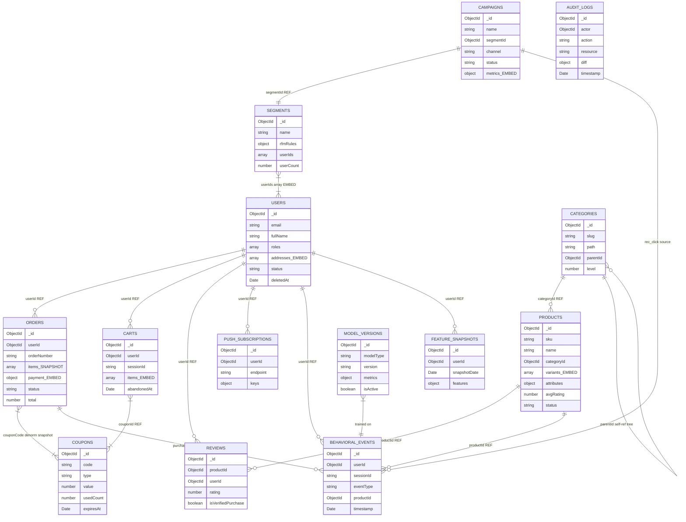

# DATABASE DESIGN — SMART ECOMMERCE AI SYSTEM
**Version:** 1.0.0 | **Date:** 2026-03-24 | **Author:** Solo Developer
**Database:** MongoDB Atlas M0 (Free Tier) | **ODM:** Mongoose 8.x | **Runtime:** NestJS (TypeScript)

---

## Table of Contents

0. [Design Philosophy](#0-design-philosophy)
1. [ERD Tổng Quan](#1-erd-tổng-quan)
2. [Embedding vs Referencing Decisions](#2-embedding-vs-referencing-decisions)
3. [Collection Designs (Mongoose Schemas)](#3-collection-designs-mongoose-schemas)
   - 3.1 [users](#31-users)
   - 3.2 [products](#32-products)
   - 3.3 [categories](#33-categories)
   - 3.4 [orders](#34-orders)
   - 3.5 [carts](#35-carts)
   - 3.6 [reviews](#36-reviews)
   - 3.7 [coupons](#37-coupons)
   - 3.8 [behavioral_events](#38-behavioral_events)
   - 3.9 [feature_snapshots](#39-feature_snapshots)
   - 3.10 [model_versions](#310-model_versions)
   - 3.11 [campaigns](#311-campaigns)
   - 3.12 [segments](#312-segments)
   - 3.13 [audit_logs](#313-audit_logs)
   - 3.14 [push_subscriptions](#314-push_subscriptions)
4. [Indexing Strategy](#4-indexing-strategy)
5. [Data Conventions](#5-data-conventions)
6. [Redis Data Structures](#6-redis-data-structures)
7. [Schema Versioning Strategy](#7-schema-versioning-strategy)
8. [Seeding Data](#8-seeding-data)
9. [Query Patterns](#9-query-patterns)
10. [Summary](#10-summary)

---

## 0. Design Philosophy

### Tại Sao MongoDB Cho E-Commerce?

| Vấn Đề | SQL Approach | MongoDB Document Approach |
|---|---|---|
| Product attributes | Riêng bảng `product_attributes` + JOINs | `attributes: {}` embedded — 1 query |
| Order snapshot | JOIN 4 bảng (order + items + products + variants) | Embedded + snapshot — 1 document |
| Flexible schema | ALTER TABLE mỗi category type | `attributes: Mixed` — schema-less per doc |
| Cart updates | UPDATE + transaction | `$set` + `$push` atomic operations |
| User address list | Separate `addresses` table + JOIN | Embedded array — 1 query |

### 3 Design Axioms

1. **Embed khi đọc cùng nhau** — nếu 2 entities luôn được load trong cùng request, embed sub-document để tránh JOIN
2. **Reference khi cập nhật độc lập** — nếu entity A có thể thay đổi mà không cần load entity B, dùng ObjectId reference
3. **Denormalize order snapshots để bất biến** — items, prices, địa chỉ giao hàng trong `orders` là snapshot tại thời điểm đặt hàng; product price thay đổi sau đó không ảnh hưởng đến lịch sử đơn hàng

### Quy Ước Kỹ Thuật

| Quy Ước | Quyết Định | Lý Do |
|---|---|---|
| Primary Key | MongoDB ObjectId (auto `_id`) | Built-in, 12-byte, time-sortable, unique across cluster |
| API ID | Serialize ObjectId → string trong ResponseDto | REST API không expose ObjectId trực tiếp |
| Timestamps | `{ timestamps: true }` → Mongoose tự gen `createdAt`, `updatedAt` | DRY, consistent across all collections |
| Soft Delete | Field `deletedAt: Date \| null`, default filter `{ deletedAt: null }` | Preserve data for audits; never hard-delete user/product data |
| Money (VND) | `Number` (integer, đơn vị đồng) | VND không có phần thập phân — không cần `Decimal128` |
| Text Search | Meilisearch primary; MongoDB `$text` fallback | Meilisearch hỗ trợ tiếng Việt + typo tolerance |
| Vector Search | MongoDB Atlas Vector Search (included in M0) | Free, no extra service needed for CBF embeddings |

---

## 1. ERD Tổng Quan

> **Notation:** `||--o{` = one-to-many, `}|--|{` = many-to-many, `||--||` = one-to-one
> **REF** = ObjectId reference (cross-collection), **EMBED** = embedded sub-document



---

## 2. Embedding vs Referencing Decisions

| Data | Strategy | Lý Do |
|---|---|---|
| `users.addresses[]` | **EMBED** | 2–5 địa chỉ/user, luôn load cùng user profile |
| `users.roles[]` | **EMBED** | String array nhỏ (<5 items), đọc mỗi request qua JWT guard |
| `products.variants[]` | **EMBED** | 1–50 variants/product, luôn load cùng product detail page |
| `products.images[]` | **EMBED** | URL strings nhỏ, không có lifecycle độc lập |
| `products.attributes{}` | **EMBED** | Flexible schema theo category, đọc cùng product — không query riêng |
| `orders.items[]` | **EMBED + SNAPSHOT** | Immutable sau khi đặt hàng — giá/tên product có thể thay đổi sau đó |
| `orders.payment{}` | **EMBED** | 1 payment per order, không cần query payment độc lập |
| `orders.timeline[]` | **EMBED** | Append-only status history, max 10 entries/order |
| `orders.shippingAddress{}` | **EMBED** | Snapshot tại thời điểm đặt hàng — địa chỉ user có thể thay đổi |
| `carts.items[]` | **EMBED** | Cart luôn load toàn bộ items trong 1 request |
| `campaigns.metrics{}` | **EMBED** | Updated in-place với MongoDB `$inc` — không cần join |
| `categories` | **SEPARATE COLLECTION** | Tree structure lớn, queried independently khi browse nav |
| `reviews` | **SEPARATE COLLECTION** | Many-per-product, paginated queries, independent write path |
| `behavioral_events` | **SEPARATE COLLECTION** | Time-series, write-heavy (167 events/sec), append-only |
| `feature_snapshots` | **SEPARATE COLLECTION** | ML training data, large, append-only |
| `audit_logs` | **SEPARATE COLLECTION** | INSERT-only, immutable compliance trail |
| `segments.userIds[]` | **EMBED** | Recomputed in batch daily, read-all-or-nothing pattern |

---

## 3. Collection Designs (Mongoose Schemas)

> **Import pattern** (applies to all schemas below):
> ```typescript
> import { Prop, Schema, SchemaFactory } from '@nestjs/mongoose';
> import { Document, Types } from 'mongoose';
> import * as mongoose from 'mongoose';
> ```

---

### 3.1 `users`

**Mục đích:** Lưu trữ thông tin tài khoản người dùng, địa chỉ giao hàng, trạng thái.
**Access patterns chính:**
- Login: lookup by `email` (indexed unique)
- Auth guard: `findById` + check `roles`
- Admin listing: filter by `status` + `deletedAt`

```typescript
// ── Embedded sub-schema ──────────────────────────────────────────
@Schema({ _id: false })
export class Address {
  @Prop({ required: true, trim: true })
  label: string;               // 'home' | 'office' | custom

  @Prop({ required: true, trim: true })
  street: string;

  @Prop({ required: true, trim: true })
  ward: string;

  @Prop({ required: true, trim: true })
  district: string;

  @Prop({ required: true, trim: true })
  city: string;

  @Prop({ required: true })
  phone: string;

  @Prop({ default: false })
  isDefault: boolean;
}
export const AddressSchema = SchemaFactory.createForClass(Address);

// ── Main schema ──────────────────────────────────────────────────
@Schema({ timestamps: true, collection: 'users' })
export class User extends Document {
  @Prop({ required: true, unique: true, lowercase: true, trim: true })
  email: string;

  @Prop({ required: true })
  passwordHash: string;                  // bcrypt cost=12

  @Prop({ required: true, trim: true })
  fullName: string;

  @Prop({
    type: [String],
    enum: ['buyer', 'staff', 'admin'],
    default: ['buyer'],
  })
  roles: string[];

  @Prop({ type: [AddressSchema], default: [] })
  addresses: Address[];

  @Prop({ default: null })
  avatarUrl: string | null;

  @Prop({
    default: 'active',
    enum: ['active', 'suspended', 'deleted'],
  })
  status: string;

  @Prop({ default: null })
  deletedAt: Date | null;

  @Prop({ default: null })
  lastLoginAt: Date | null;

  // createdAt, updatedAt auto via timestamps: true
}
```

**Example document:**
```json
{
  "_id": "ObjectId('65f4a2b3c0e1d2f3a4b5c6d7')",
  "email": "nguyen.van.a@gmail.com",
  "passwordHash": "$2b$12$K9Kz...",
  "fullName": "Nguyễn Văn A",
  "roles": ["buyer"],
  "addresses": [
    {
      "label": "home",
      "street": "123 Nguyễn Trãi",
      "ward": "Phường 3",
      "district": "Quận 5",
      "city": "TP. Hồ Chí Minh",
      "phone": "0901234567",
      "isDefault": true
    }
  ],
  "avatarUrl": null,
  "status": "active",
  "deletedAt": null,
  "lastLoginAt": "2026-03-24T08:00:00Z",
  "createdAt": "2026-01-01T00:00:00Z",
  "updatedAt": "2026-03-24T08:00:00Z"
}
```

**Indexes:**

| Field(s) | Type | Lý Do |
|---|---|---|
| `email` | Unique | Login lookup |
| `{ status, deletedAt }` | Compound | Filter active users, admin listing |
| `roles` | Multikey | Admin: list all staff/admin users |

---

### 3.2 `products`

**Mục đích:** Catalog sản phẩm, variants với stock tracking, sync với Meilisearch.
**Access patterns chính:**
- Catalog listing: filter `categoryId + status + deletedAt`, sort `avgRating`
- Product detail: `findById` — load variants, attributes in 1 query
- Search sync job: find `{ lastIndexedAt: null }` hoặc `lastIndexedAt < updatedAt`

```typescript
// ── Embedded sub-schema ──────────────────────────────────────────
@Schema({ _id: false })
export class ProductVariant {
  @Prop({ required: true, uppercase: true, trim: true })
  sku: string;                 // variant-specific SKU

  @Prop({ type: mongoose.Schema.Types.Mixed, default: {} })
  attributes: Record<string, string>;  // { size: 'L', color: 'Đỏ' }

  @Prop({ required: true, min: 0 })
  price: number;               // VND integer (e.g., 299000)

  @Prop({ default: 0, min: 0 })
  comparePrice: number;        // original price, for "% off" display

  @Prop({ default: 0, min: 0 })
  stock: number;

  @Prop({ default: 5, min: 0 })
  lowStockThreshold: number;   // triggers StockLowEvent when stock <= this

  @Prop({ type: [String], default: [] })
  images: string[];            // variant-specific Cloudflare R2 URLs

  @Prop({ default: true })
  isActive: boolean;
}
export const ProductVariantSchema = SchemaFactory.createForClass(ProductVariant);

// ── Main schema ──────────────────────────────────────────────────
@Schema({ timestamps: true, collection: 'products' })
export class Product extends Document {
  @Prop({ required: true, unique: true, uppercase: true, trim: true })
  sku: string;                 // master SKU

  @Prop({ required: true, trim: true })
  name: string;

  @Prop({ default: '' })
  description: string;         // HTML or plain text

  @Prop({ type: [String], default: [] })
  images: string[];            // master product images (Cloudflare R2)

  @Prop({
    type: mongoose.Schema.Types.ObjectId,
    ref: 'Category',
    required: true,
  })
  categoryId: Types.ObjectId;

  @Prop({ type: [ProductVariantSchema], default: [] })
  variants: ProductVariant[];

  @Prop({ type: mongoose.Schema.Types.Mixed, default: {} })
  attributes: Record<string, unknown>;  // { color: 'Đỏ', material: 'Cotton' }

  @Prop({ type: [String], default: [] })
  tags: string[];              // ['sale', 'new-arrival', 'bestseller']

  @Prop({ default: 0, min: 0, max: 5 })
  avgRating: number;           // denormalized; recalculated on each new review

  @Prop({ default: 0, min: 0 })
  soldCount: number;           // incremented on COMPLETED order

  @Prop({
    default: 'active',
    enum: ['active', 'inactive', 'draft'],
  })
  status: string;

  @Prop({ default: null })
  deletedAt: Date | null;

  @Prop({ default: null })
  lastIndexedAt: Date | null;  // Meilisearch sync tracking
}
```

**Example document:**
```json
{
  "_id": "ObjectId('65f4b1c2d3e4f5a6b7c8d9e0')",
  "sku": "TS-POLO-001",
  "name": "Áo Polo Nam Cotton",
  "categoryId": "ObjectId('65f4a0b1c2d3e4f5a6b7c8d9')",
  "variants": [
    {
      "sku": "TS-POLO-001-L-RED",
      "attributes": { "size": "L", "color": "Đỏ" },
      "price": 299000,
      "comparePrice": 399000,
      "stock": 45,
      "lowStockThreshold": 5,
      "images": ["https://r2.dev/polo-l-red.jpg"],
      "isActive": true
    }
  ],
  "attributes": { "material": "Cotton 100%", "origin": "Việt Nam" },
  "tags": ["polo", "nam", "cotton"],
  "avgRating": 4.3,
  "soldCount": 127,
  "status": "active",
  "deletedAt": null,
  "lastIndexedAt": "2026-03-24T06:00:00Z"
}
```

**Indexes:**

| Field(s) | Type | Lý Do |
|---|---|---|
| `sku` | Unique | SKU lookup, import dedup |
| `{ categoryId, status, deletedAt }` | Compound | Category listing page |
| `{ status, deletedAt, avgRating }` | Compound | Sort by rating (homepage) |
| `tags` | Multikey | Tag-based filtering |
| `name` | Text | Meilisearch fallback search |
| `lastIndexedAt` | Sparse | Sync job: find un-indexed products |

---

### 3.3 `categories`

**Mục đích:** Cây phân loại sản phẩm (3 levels max). Dùng **Materialized Path** pattern.
**Access patterns chính:**
- Navigation: load all root categories (level=0)
- Subtree query: `{ path: /^\/clothing/ }` → tất cả sub-categories của "clothing"
- URL lookup: `findOne({ slug })` for SEO-friendly URLs

```typescript
@Schema({ timestamps: true, collection: 'categories' })
export class Category extends Document {
  @Prop({ required: true, trim: true })
  name: string;

  @Prop({ required: true, unique: true, lowercase: true, trim: true })
  slug: string;                // 'ao-thun-nam' — used in URL

  // Materialized Path pattern for tree structure
  @Prop({ default: '' })
  path: string;
  // Root:  ''
  // L1:    '/thoi-trang'
  // L2:    '/thoi-trang/ao-nam'
  // L3:    '/thoi-trang/ao-nam/ao-thun'

  @Prop({
    type: mongoose.Schema.Types.ObjectId,
    ref: 'Category',
    default: null,
  })
  parentId: Types.ObjectId | null;

  @Prop({ default: 0, min: 0, max: 2 })
  level: number;               // 0=root, 1=sub, 2=leaf

  @Prop({ default: null })
  imageUrl: string | null;

  @Prop({ default: 0 })
  sortOrder: number;           // display order within same parent

  @Prop({ default: true })
  isActive: boolean;
}
```

**Example document:**
```json
{
  "_id": "ObjectId('65f4a0b1c2d3e4f5a6b7c8d9')",
  "name": "Áo Nam",
  "slug": "ao-nam",
  "path": "/thoi-trang",
  "parentId": "ObjectId('65f4a0b1c2d3e4f5a6b7c8aa')",
  "level": 1,
  "imageUrl": "https://r2.dev/cat-ao-nam.jpg",
  "sortOrder": 1,
  "isActive": true
}
```

**Indexes:**

| Field(s) | Type | Lý Do |
|---|---|---|
| `slug` | Unique | URL-based lookup |
| `parentId` | — | Tree navigation: children of X |
| `path` | — | Subtree queries: all descendants |
| `{ isActive, level }` | Compound | Navigation menu: active root categories |

---

### 3.4 `orders`

**Mục đích:** Đơn hàng với snapshot bất biến của items, địa chỉ, payment.
**Access patterns chính:**
- Buyer order history: `{ userId, status }` sort by `createdAt`
- Admin management: `{ status }` sort by `createdAt`
- Order detail: `findOne({ orderNumber })`
- Revenue reports: aggregate `{ createdAt }` time-range

```typescript
// ── Embedded sub-schemas ─────────────────────────────────────────
@Schema({ _id: false })
export class OrderItem {
  @Prop({ type: mongoose.Schema.Types.ObjectId, required: true })
  productId: Types.ObjectId;   // preserved for analytics

  @Prop({ required: true })
  variantSku: string;

  @Prop({ type: mongoose.Schema.Types.Mixed, required: true })
  productSnapshot: {           // IMMUTABLE — captured at order time
    name: string;
    sku: string;
    image: string;
    attributes: Record<string, string>;
  };

  @Prop({ required: true, min: 1 })
  qty: number;

  @Prop({ required: true, min: 0 })
  unitPrice: number;           // VND at time of order

  @Prop({ required: true, min: 0 })
  subtotal: number;            // qty × unitPrice
}
export const OrderItemSchema = SchemaFactory.createForClass(OrderItem);

@Schema({ _id: false })
export class ShippingAddress {
  @Prop({ required: true }) fullName: string;
  @Prop({ required: true }) phone: string;
  @Prop({ required: true }) street: string;
  @Prop({ required: true }) ward: string;
  @Prop({ required: true }) district: string;
  @Prop({ required: true }) city: string;
}
export const ShippingAddressSchema = SchemaFactory.createForClass(ShippingAddress);

@Schema({ _id: false })
export class Payment {
  @Prop({ required: true, enum: ['vnpay', 'momo', 'cod'] })
  method: string;

  @Prop({ default: null })
  transactionId: string | null;

  @Prop({ default: null })
  paymentUrl: string | null;   // redirect URL for VNPay/MoMo

  @Prop({ default: null })
  paidAt: Date | null;

  @Prop({ required: true, min: 0 })
  amount: number;              // VND

  @Prop({
    default: 'pending',
    enum: ['pending', 'paid', 'failed', 'refunded'],
  })
  status: string;
}
export const PaymentSchema = SchemaFactory.createForClass(Payment);

@Schema({ _id: false })
export class OrderTimeline {
  @Prop({ required: true })
  status: string;

  @Prop({ required: true, default: Date.now })
  timestamp: Date;

  @Prop({ default: null })
  note: string | null;

  @Prop({ type: mongoose.Schema.Types.ObjectId, default: null })
  updatedBy: Types.ObjectId | null;  // userId of staff/admin
}
export const OrderTimelineSchema = SchemaFactory.createForClass(OrderTimeline);

// ── Main schema ──────────────────────────────────────────────────
@Schema({ timestamps: true, collection: 'orders' })
export class Order extends Document {
  @Prop({
    type: mongoose.Schema.Types.ObjectId,
    ref: 'User',
    required: true,
  })
  userId: Types.ObjectId;

  @Prop({ required: true, unique: true })
  orderNumber: string;         // 'ORD-20260324-001234'

  @Prop({ type: [OrderItemSchema], required: true })
  items: OrderItem[];          // SNAPSHOT — do not update after creation

  @Prop({ type: ShippingAddressSchema, required: true })
  shippingAddress: ShippingAddress;

  @Prop({ type: PaymentSchema, required: true })
  payment: Payment;

  @Prop({
    required: true,
    enum: [
      'PENDING_PAYMENT', 'PAID', 'PROCESSING', 'SHIPPED',
      'DELIVERED', 'COMPLETED', 'CANCELLED',
      'RETURN_REQUESTED', 'REFUNDED',
    ],
  })
  status: string;

  @Prop({ type: [OrderTimelineSchema], default: [] })
  timeline: OrderTimeline[];   // append-only, max ~10 entries

  @Prop({ default: null })
  couponCode: string | null;   // denormalized snapshot of applied coupon code

  @Prop({ default: 0, min: 0 })
  discount: number;            // VND discount amount

  @Prop({ required: true, min: 0 })
  subtotal: number;            // sum of items.subtotal

  @Prop({ required: true, min: 0 })
  total: number;               // subtotal - discount

  @Prop({ default: null })
  note: string | null;         // buyer note

  @Prop({ default: null })
  cancelReason: string | null;
}
```

**Example document:**
```json
{
  "_id": "ObjectId('65f4c3d4e5f6a7b8c9d0e1f2')",
  "userId": "ObjectId('65f4a2b3c0e1d2f3a4b5c6d7')",
  "orderNumber": "ORD-20260324-001234",
  "items": [
    {
      "productId": "ObjectId('65f4b1c2...')",
      "variantSku": "TS-POLO-001-L-RED",
      "productSnapshot": {
        "name": "Áo Polo Nam Cotton",
        "sku": "TS-POLO-001",
        "image": "https://r2.dev/polo-l-red.jpg",
        "attributes": { "size": "L", "color": "Đỏ" }
      },
      "qty": 2,
      "unitPrice": 299000,
      "subtotal": 598000
    }
  ],
  "shippingAddress": {
    "fullName": "Nguyễn Văn A",
    "phone": "0901234567",
    "street": "123 Nguyễn Trãi",
    "ward": "Phường 3",
    "district": "Quận 5",
    "city": "TP. Hồ Chí Minh"
  },
  "payment": {
    "method": "vnpay",
    "transactionId": "VNP_TXN_20260324_001",
    "paidAt": "2026-03-24T09:00:00Z",
    "amount": 548000,
    "status": "paid"
  },
  "status": "PROCESSING",
  "timeline": [
    { "status": "PENDING_PAYMENT", "timestamp": "2026-03-24T08:55:00Z", "note": null, "updatedBy": null },
    { "status": "PAID", "timestamp": "2026-03-24T09:00:00Z", "note": "VNPay confirmed", "updatedBy": null }
  ],
  "couponCode": "WELCOME10",
  "discount": 50000,
  "subtotal": 598000,
  "total": 548000
}
```

**Indexes:**

| Field(s) | Type | Lý Do |
|---|---|---|
| `{ userId, createdAt: -1 }` | Compound | Buyer order history (paginated) |
| `orderNumber` | Unique | Order lookup by number |
| `{ status, createdAt: -1 }` | Compound | Admin order management |
| `{ 'payment.status', 'payment.method' }` | Compound | Payment analytics |
| `createdAt` | — | Revenue time-range aggregations |

---

### 3.5 `carts`

**Mục đích:** Giỏ hàng cho cả logged-in user (by `userId`) và guest (by `sessionId`).
**Access patterns chính:**
- Load cart: `findOne({ userId })` hoặc `findOne({ sessionId })`
- Abandoned cart job: `{ abandonedAt: { $ne: null } }` — trigger email/push notification

```typescript
// ── Embedded sub-schema ──────────────────────────────────────────
@Schema({ _id: false })
export class CartItem {
  @Prop({ type: mongoose.Schema.Types.ObjectId, required: true })
  productId: Types.ObjectId;

  @Prop({ required: true })
  variantSku: string;

  @Prop({ required: true, min: 1 })
  qty: number;

  @Prop({ required: true, min: 0 })
  price: number;               // snapshot price at time of add (VND)

  @Prop({ default: Date.now })
  addedAt: Date;
}
export const CartItemSchema = SchemaFactory.createForClass(CartItem);

// ── Main schema ──────────────────────────────────────────────────
@Schema({ collection: 'carts' })
// Note: No timestamps: true — manual updatedAt for precise tracking
export class Cart extends Document {
  @Prop({
    type: mongoose.Schema.Types.ObjectId,
    ref: 'User',
    default: null,
  })
  userId: Types.ObjectId | null;  // null for guest cart

  @Prop({ default: null })
  sessionId: string | null;       // guest cart identifier

  @Prop({ type: [CartItemSchema], default: [] })
  items: CartItem[];

  @Prop({
    type: mongoose.Schema.Types.ObjectId,
    ref: 'Coupon',
    default: null,
  })
  couponId: Types.ObjectId | null;

  @Prop({ default: Date.now })
  updatedAt: Date;

  @Prop({ default: null })
  abandonedAt: Date | null;       // set by cron job after 24h inactivity
}
```

**Indexes:**

| Field(s) | Type | Lý Do |
|---|---|---|
| `userId` | Unique Sparse | 1 cart per user; null values excluded |
| `sessionId` | Sparse | Guest cart lookup |
| `abandonedAt` | Sparse | Abandoned cart recovery job |

---

### 3.6 `reviews`

**Mục đích:** Đánh giá sản phẩm của người mua đã mua hàng (verified purchase).
**Access patterns chính:**
- Product reviews: `{ productId, deletedAt: null }` paginated
- Check duplicate: `{ productId, userId }` unique
- My reviews: `{ userId }`

```typescript
@Schema({ timestamps: true, collection: 'reviews' })
export class Review extends Document {
  @Prop({
    type: mongoose.Schema.Types.ObjectId,
    ref: 'Product',
    required: true,
  })
  productId: Types.ObjectId;

  @Prop({
    type: mongoose.Schema.Types.ObjectId,
    ref: 'User',
    required: true,
  })
  userId: Types.ObjectId;

  @Prop({ required: true, min: 1, max: 5 })
  rating: number;              // 1-5 stars

  @Prop({ default: '', trim: true })
  body: string;

  @Prop({ default: false })
  isVerifiedPurchase: boolean; // true if userId has COMPLETED order containing productId

  @Prop({ default: null })
  deletedAt: Date | null;
}
```

**Indexes:**

| Field(s) | Type | Lý Do |
|---|---|---|
| `{ productId, deletedAt }` | Compound | Product reviews listing |
| `{ productId, userId }` | Unique Compound | Prevent 1 user reviewing same product twice |
| `userId` | — | My reviews page |

---

### 3.7 `coupons`

**Mục đích:** Mã giảm giá (flat VND hoặc percent). Atomic usage tracking.
**Access patterns chính:**
- Validate: `findOne({ code, isActive: true, deletedAt: null })`
- Apply: `findOneAndUpdate` với `$inc: { usedCount: 1 }` (atomic)
- Expiry cleanup job: `{ expiresAt: { $lt: now } }`

```typescript
@Schema({ timestamps: true, collection: 'coupons' })
export class Coupon extends Document {
  @Prop({ required: true, unique: true, uppercase: true, trim: true })
  code: string;

  @Prop({ required: true, enum: ['flat', 'percent'] })
  type: string;

  @Prop({ required: true, min: 0 })
  value: number;
  // type='flat'    → VND amount (e.g., 50000 = giảm 50.000đ)
  // type='percent' → 0-100 (e.g., 10 = giảm 10%)

  @Prop({ default: 0, min: 0 })
  minOrderAmount: number;      // minimum order total to apply

  @Prop({ default: null })
  maxDiscountAmount: number | null;  // cap for percent coupons (VND)

  @Prop({ default: null })
  usageLimit: number | null;   // null = unlimited

  @Prop({ default: 0, min: 0 })
  usedCount: number;           // atomic $inc on each successful use

  @Prop({ default: null })
  expiresAt: Date | null;

  @Prop({ default: true })
  isActive: boolean;

  @Prop({ default: null })
  deletedAt: Date | null;
}
```

**Indexes:**

| Field(s) | Type | Lý Do |
|---|---|---|
| `code` | Unique | Coupon validation lookup |
| `{ isActive, expiresAt }` | Compound | Expiry cleanup job |
| `{ isActive, deletedAt }` | Compound | Admin listing active coupons |

---

### 3.8 `behavioral_events`

**Mục đích:** Time-series event stream cho ML training và real-time analytics (167 events/sec peak).
**Access patterns chính:**
- ML training fetch: filter by `eventType + timestamp` range (90 days)
- User behavior timeline: `{ userId, timestamp }` descending
- CTR analytics: aggregate `rec_click` / `view` per placement

> **Note:** Collection này được cấu hình như **MongoDB Time Series collection** — cung cấp columnar storage và time-range query optimization tốt hơn regular collection.
> Fallback: regular collection với compound index `{ userId, timestamp: -1 }` nếu Atlas M0 không hỗ trợ time series.

```typescript
@Schema({
  timeseries: {
    timeField: 'timestamp',
    metaField: 'userId',
    granularity: 'minutes',
  },
  expireAfterSeconds: 7776000,  // 90 days TTL — auto-purge old events
  collection: 'behavioral_events',
})
export class BehavioralEvent extends Document {
  @Prop({ type: mongoose.Schema.Types.ObjectId, ref: 'User', default: null })
  userId: Types.ObjectId | null;   // null for anonymous sessions

  @Prop({ required: true })
  sessionId: string;               // anonymous session identifier

  @Prop({
    required: true,
    enum: [
      'view', 'add_to_cart', 'purchase',
      'search', 'rec_click',
      'checkout_start', 'checkout_complete',
    ],
  })
  eventType: string;

  @Prop({ type: mongoose.Schema.Types.ObjectId, ref: 'Product', default: null })
  productId: Types.ObjectId | null;

  @Prop({ default: null })
  recommendationSource: string | null;  // 'ai' | 'fallback' | null

  @Prop({ default: null })
  query: string | null;            // for 'search' events

  @Prop({ type: mongoose.Schema.Types.Mixed, default: {} })
  metadata: Record<string, unknown>;  // extensible: { placement, position, etc. }

  @Prop({ required: true, default: Date.now })
  timestamp: Date;                 // primary time field (required for time series)
}
```

**Indexes:**

| Field(s) | Type | Lý Do |
|---|---|---|
| `{ userId, timestamp: -1 }` | Compound | User behavior history, ML feature fetch |
| `{ eventType, timestamp: -1 }` | Compound | Event analytics, CTR computation |
| `{ productId, eventType, timestamp: -1 }` | Compound | Product-level analytics |
| `sessionId` | — | Anonymous session aggregation |
| `timestamp` | TTL (90d) | Auto-purge events older than 90 days |

---

### 3.9 `feature_snapshots`

**Mục đích:** Daily snapshot của ML features cho mỗi user — dữ liệu training cho Collaborative Filtering model.
**Access patterns chính:**
- ML training: bulk fetch by `snapshotDate` (all users for a given day)
- Online inference: `findOne({ userId })` sort `snapshotDate: -1` → latest features

```typescript
@Schema({ timestamps: true, collection: 'feature_snapshots' })
export class FeatureSnapshot extends Document {
  @Prop({
    type: mongoose.Schema.Types.ObjectId,
    ref: 'User',
    required: true,
  })
  userId: Types.ObjectId;

  @Prop({ required: true })
  snapshotDate: Date;          // daily snapshot date (midnight ICT)

  @Prop({ type: mongoose.Schema.Types.Mixed, required: true })
  features: {
    recentViewedProductIds: string[];    // last 30 product views
    purchasedCategoryIds: string[];      // categories bought from
    avgOrderValue: number;               // VND
    purchaseFrequency: number;           // orders per month
    daysSinceLastPurchase: number;
    preferredPriceRange: [number, number]; // [min, max] VND
    segmentId: string | null;            // current RFM segment
    rfmScore: {
      r: number;   // Recency score 1-5
      f: number;   // Frequency score 1-5
      m: number;   // Monetary score 1-5
    };
  };
}
```

**Indexes:**

| Field(s) | Type | Lý Do |
|---|---|---|
| `{ userId, snapshotDate: -1 }` | Compound | Latest snapshot per user (online inference) |
| `snapshotDate` | — | Bulk fetch for ML training pipeline |

---

### 3.10 `model_versions`

**Mục đích:** Model registry cho AI Recommendation Service — tracking deployed models, metrics, artifacts.
**Access patterns chính:**
- Load active model: `findOne({ modelType, isActive: true })`
- Version history: `{ modelType }` sort by `promotedAt: -1`
- Promote new model: `updateMany` set `isActive: false` then set `isActive: true` on new

```typescript
@Schema({ timestamps: true, collection: 'model_versions' })
export class ModelVersion extends Document {
  @Prop({ required: true, enum: ['cf', 'cbf', 'hybrid'] })
  modelType: string;
  // cf     = Collaborative Filtering (LightFM WARP)
  // cbf    = Content-Based Filtering (scikit-learn TF-IDF)
  // hybrid = α-weighted blend of cf + cbf

  @Prop({ required: true })
  version: string;             // 'cf-2026-03-24-v1'

  @Prop({ type: mongoose.Schema.Types.Mixed, required: true })
  metrics: {
    precisionAt10: number;
    recallAt10: number;
    ndcg: number;
    trainingSamples: number;
    trainingDurationMs: number;
  };

  @Prop({ required: true })
  artifactUrl: string;         // Cloudflare R2 URL of pickled model

  @Prop({ default: false })
  isActive: boolean;           // only 1 active model per modelType at a time

  @Prop({ default: null })
  promotedAt: Date | null;

  @Prop({ default: null })
  deprecatedAt: Date | null;
}
```

**Indexes:**

| Field(s) | Type | Lý Do |
|---|---|---|
| `{ modelType, isActive }` | Compound | Load active model (hot path) |
| `{ modelType, promotedAt: -1 }` | Compound | Version history listing |

---

### 3.11 `campaigns`

**Mục đích:** Marketing campaigns (email / push / both) gửi đến một segment người dùng.
**Access patterns chính:**
- Scheduler job: `{ status: 'scheduled', scheduledAt: { $lte: now } }`
- Campaign analytics: load campaign + embedded metrics in 1 document
- Admin listing: filter by `status`, sort `createdAt`

```typescript
// ── Embedded sub-schema ──────────────────────────────────────────
@Schema({ _id: false })
export class CampaignMetrics {
  @Prop({ default: 0 }) sent: number;
  @Prop({ default: 0 }) opened: number;
  @Prop({ default: 0 }) clicked: number;
  @Prop({ default: 0 }) converted: number;  // purchase within 24h of click
  @Prop({ default: 0 }) revenue: number;    // VND attributed to campaign
}
export const CampaignMetricsSchema = SchemaFactory.createForClass(CampaignMetrics);

// ── Main schema ──────────────────────────────────────────────────
@Schema({ timestamps: true, collection: 'campaigns' })
export class Campaign extends Document {
  @Prop({ required: true, trim: true })
  name: string;

  @Prop({
    type: mongoose.Schema.Types.ObjectId,
    ref: 'Segment',
    required: true,
  })
  segmentId: Types.ObjectId;

  @Prop({ required: true, enum: ['email', 'push', 'both'] })
  channel: string;

  @Prop({ type: mongoose.Schema.Types.Mixed, required: true })
  content: {
    subject?: string;        // email subject line
    title?: string;          // push notification title
    body: string;            // HTML (email) or text (push)
    ctaUrl?: string;         // call-to-action URL
    generatedByAI: boolean;  // true if body generated by Gemini 1.5 Flash
  };

  @Prop({
    required: true,
    default: 'draft',
    enum: ['draft', 'scheduled', 'running', 'completed', 'paused', 'cancelled'],
  })
  status: string;

  @Prop({ default: null }) scheduledAt: Date | null;
  @Prop({ default: null }) startedAt: Date | null;
  @Prop({ default: null }) completedAt: Date | null;

  @Prop({
    type: CampaignMetricsSchema,
    default: () => ({ sent: 0, opened: 0, clicked: 0, converted: 0, revenue: 0 }),
  })
  metrics: CampaignMetrics;  // updated via atomic $inc operations

  @Prop({ type: mongoose.Schema.Types.ObjectId, default: null })
  createdBy: Types.ObjectId | null;  // staff/admin userId

  @Prop({ default: null })
  deletedAt: Date | null;
}
```

**Indexes:**

| Field(s) | Type | Lý Do |
|---|---|---|
| `{ status, scheduledAt }` | Compound | Scheduler job: find due campaigns |
| `segmentId` | — | Campaigns by segment |
| `createdAt` | — | Analytics by date range |

---

### 3.12 `segments`

**Mục đích:** RFM-based user segments cho marketing targeting. `userIds[]` được recompute hàng ngày bằng aggregation pipeline.
**Access patterns chính:**
- List segments: `find({})` (ít documents, admin-only)
- Get users for campaign: `findOne({ name })` → read `userIds[]`
- Stale check: `{ lastComputedAt: { $lt: yesterday } }` → trigger recompute

```typescript
@Schema({ timestamps: true, collection: 'segments' })
export class Segment extends Document {
  @Prop({ required: true, unique: true, trim: true })
  name: string;                // 'VIP', 'Newcomer', 'At-Risk', 'Champions'

  @Prop({ default: '' })
  description: string;

  @Prop({ type: mongoose.Schema.Types.Mixed, required: true })
  rfmRules: {
    rMin: number; rMax: number;  // Recency range (days since last purchase)
    fMin: number; fMax: number;  // Frequency range (order count)
    mMin: number; mMax: number;  // Monetary range (total spend, VND)
  };

  @Prop({ type: [mongoose.Schema.Types.ObjectId], default: [] })
  userIds: Types.ObjectId[];   // computed daily via aggregation pipeline

  @Prop({ default: 0 })
  userCount: number;           // denormalized: userIds.length

  @Prop({ default: null })
  lastComputedAt: Date | null;
}
```

**Indexes:**

| Field(s) | Type | Lý Do |
|---|---|---|
| `name` | Unique | Lookup by name |
| `lastComputedAt` | — | Find stale segments to recompute |

---

### 3.13 `audit_logs`

**Mục đích:** Immutable compliance trail cho mọi hành động admin/staff. INSERT-only — không bao giờ update hoặc delete.
**Access patterns chính:**
- User audit trail: `{ actor }` sort `timestamp: -1`
- Resource audit trail: `{ resource, resourceId }` sort `timestamp: -1`
- Admin activity: `{ action }` + date range

> **Security constraint:** MongoDB Atlas role cho app service account chỉ có `insert` permission trên collection này — không có `update`, `delete`.

```typescript
@Schema({ collection: 'audit_logs' })
// Note: No timestamps: true — manual immutable timestamp
export class AuditLog extends Document {
  @Prop({ type: mongoose.Schema.Types.ObjectId, required: true })
  actor: Types.ObjectId;       // userId performing the action

  @Prop({ required: true })
  actorRole: string;           // role at time of action

  @Prop({ required: true })
  action: string;
  // Convention: 'VERB_RESOURCE' in SCREAMING_SNAKE_CASE
  // Examples: 'CREATE_PRODUCT', 'UPDATE_ORDER_STATUS', 'DELETE_USER', 'APPLY_COUPON'

  @Prop({ required: true })
  resource: string;            // 'products', 'orders', 'users', etc.

  @Prop({ type: mongoose.Schema.Types.ObjectId, default: null })
  resourceId: Types.ObjectId | null;

  @Prop({ type: mongoose.Schema.Types.Mixed, default: {} })
  diff: Record<string, unknown>;
  // { before: { status: 'PROCESSING' }, after: { status: 'SHIPPED' } }

  @Prop({ required: true, default: Date.now, immutable: true })
  timestamp: Date;             // immutable: true — cannot be updated

  @Prop({ default: null })
  ipAddress: string | null;
}
```

**Indexes:**

| Field(s) | Type | Lý Do |
|---|---|---|
| `{ actor, timestamp: -1 }` | Compound | User's action history |
| `{ resource, resourceId, timestamp: -1 }` | Compound | Resource change history |
| `{ action, timestamp: -1 }` | Compound | Action-type analytics |

---

### 3.14 `push_subscriptions`

**Mục đích:** Web Push API subscriptions (VAPID). Mỗi browser/device tạo ra 1 subscription.
**Access patterns chính:**
- Send push to user: `find({ userId })` → iterate endpoints
- Cleanup expired: `{ expirationTime: { $lt: now } }`
- Dedup on re-subscribe: upsert on `endpoint` (unique)

```typescript
@Schema({ timestamps: true, collection: 'push_subscriptions' })
export class PushSubscription extends Document {
  @Prop({
    type: mongoose.Schema.Types.ObjectId,
    ref: 'User',
    required: true,
  })
  userId: Types.ObjectId;

  @Prop({ required: true, unique: true })
  endpoint: string;            // Web Push API endpoint URL (browser-generated)

  @Prop({ default: null })
  expirationTime: Date | null;

  @Prop({ type: mongoose.Schema.Types.Mixed, required: true })
  keys: {
    p256dh: string;           // P-256 ECDH public key (base64url)
    auth: string;             // Authentication secret (base64url)
  };
}
```

**Indexes:**

| Field(s) | Type | Lý Do |
|---|---|---|
| `userId` | — | Find all subscriptions for a user |
| `endpoint` | Unique | Dedup on re-subscribe; cleanup lookup |
| `expirationTime` | Sparse | Cleanup expired subscriptions |

---

## 4. Indexing Strategy

Tổng hợp toàn bộ indexes quan trọng (≈35 indexes):

| Collection | Index Fields | Type | Lý Do |
|---|---|---|---|
| `users` | `email` | Unique | Login lookup |
| `users` | `{ status, deletedAt }` | Compound | Active user filter |
| `users` | `roles` | Multikey | List all staff/admin |
| `products` | `sku` | Unique | SKU lookup, import dedup |
| `products` | `{ categoryId, status, deletedAt }` | Compound | Category listing page |
| `products` | `{ status, deletedAt, avgRating }` | Compound | Sort by rating |
| `products` | `tags` | Multikey | Tag-based filtering |
| `products` | `name` | Text | Meilisearch fallback search |
| `products` | `lastIndexedAt` | Sparse | Sync job: find un-indexed |
| `categories` | `slug` | Unique | URL-based lookup |
| `categories` | `parentId` | — | Tree children navigation |
| `categories` | `path` | — | Subtree prefix queries |
| `categories` | `{ isActive, level }` | Compound | Navigation menu |
| `orders` | `{ userId, createdAt: -1 }` | Compound | Order history pagination |
| `orders` | `orderNumber` | Unique | Order lookup |
| `orders` | `{ status, createdAt: -1 }` | Compound | Admin order management |
| `orders` | `{ 'payment.status', 'payment.method' }` | Compound | Payment analytics |
| `orders` | `createdAt` | — | Revenue time-range queries |
| `carts` | `userId` | Unique Sparse | 1 cart per user |
| `carts` | `sessionId` | Sparse | Guest cart lookup |
| `carts` | `abandonedAt` | Sparse | Abandoned cart recovery job |
| `reviews` | `{ productId, deletedAt }` | Compound | Product reviews listing |
| `reviews` | `{ productId, userId }` | Unique Compound | Prevent duplicate reviews |
| `reviews` | `userId` | — | My reviews page |
| `coupons` | `code` | Unique | Coupon validation |
| `coupons` | `{ isActive, expiresAt }` | Compound | Valid coupons; expiry cleanup |
| `behavioral_events` | `{ userId, timestamp: -1 }` | Compound | User behavior timeline |
| `behavioral_events` | `{ eventType, timestamp: -1 }` | Compound | Event analytics, CTR |
| `behavioral_events` | `{ productId, eventType, timestamp: -1 }` | Compound | Product analytics |
| `behavioral_events` | `sessionId` | — | Anonymous session grouping |
| `behavioral_events` | `timestamp` | TTL (90 days) | Auto-purge old events |
| `feature_snapshots` | `{ userId, snapshotDate: -1 }` | Compound | Latest snapshot per user |
| `feature_snapshots` | `snapshotDate` | — | Batch fetch for ML training |
| `model_versions` | `{ modelType, isActive }` | Compound | Load active model (hot path) |
| `model_versions` | `{ modelType, promotedAt: -1 }` | Compound | Version history |
| `campaigns` | `{ status, scheduledAt }` | Compound | Scheduler job |
| `campaigns` | `segmentId` | — | Campaigns by segment |
| `segments` | `name` | Unique | Segment lookup |
| `segments` | `lastComputedAt` | — | Stale recompute check |
| `audit_logs` | `{ actor, timestamp: -1 }` | Compound | User audit trail |
| `audit_logs` | `{ resource, resourceId, timestamp: -1 }` | Compound | Resource audit trail |
| `audit_logs` | `{ action, timestamp: -1 }` | Compound | Action analytics |
| `push_subscriptions` | `userId` | — | User's push subscriptions |
| `push_subscriptions` | `endpoint` | Unique | Dedup + cleanup |
| `push_subscriptions` | `expirationTime` | Sparse | Expired subs cleanup |

### Index Creation Script (Mongoose)

Indexes được định nghĩa trực tiếp trong Mongoose schema bằng `@index` decorator:

```typescript
// Example: products collection
@Schema({ timestamps: true, collection: 'products' })
@index({ categoryId: 1, status: 1, deletedAt: 1 })
@index({ status: 1, deletedAt: 1, avgRating: -1 })
@index({ tags: 1 })
@index({ name: 'text' })
@index({ lastIndexedAt: 1 }, { sparse: true })
export class Product extends Document { ... }
```

Mongoose tự động sync indexes khi `autoIndex: true` (development only).
**Production:** Tắt `autoIndex`, tạo indexes manually qua MongoDB Atlas UI hoặc `createIndex()` migration script.

---

## 5. Data Conventions

| Convention | Rule | Ví dụ |
|---|---|---|
| **Primary Key** | MongoDB ObjectId (auto `_id`) | `_id: ObjectId("65f4a2b3...")` |
| **API ID exposure** | Serialize ObjectId → string trong `ResponseDto` | `"id": "65f4a2b3c0e1d2f3a4b5c6d7"` |
| **Timestamps** | `{ timestamps: true }` → auto `createdAt`, `updatedAt` | Mọi collection trừ `carts`, `audit_logs` |
| **Soft delete** | Field `deletedAt: Date \| null`; default query filter `{ deletedAt: null }` | `users`, `products`, `reviews`, `coupons`, `campaigns` |
| **Hard delete** | Không bao giờ hard-delete | `audit_logs` là immutable; mọi document khác dùng soft delete |
| **Money (VND)** | `Number` integer (không có decimal) | `price: 299000` ✓ — `price: 299000.50` ✗ |
| **Enums** | Định nghĩa trong `libs/shared/constants/`, validate qua Mongoose `enum` option | `OrderStatus`, `UserStatus`, `EventType` |
| **Booleans** | Prefix `is` | `isActive`, `isDefault`, `isVerifiedPurchase` |
| **Arrays** | Mặc định `[]`, không dùng `null` cho array fields | `roles: []`, `addresses: []`, `tags: []` |
| **ObjectId refs** | `mongoose.Schema.Types.ObjectId` + `ref: 'CollectionName'` | `ref: 'User'`, `ref: 'Product'` |
| **Immutable fields** | `@Prop({ immutable: true })` | `audit_logs.timestamp` |
| **String trim** | `trim: true` trên mọi user-input string field | `name`, `email`, `code`, `slug` |
| **Schema version** | `__schemaVersion: number` cho breaking changes | Xem Section 7 |
| **Text search** | Meilisearch primary; MongoDB `$text` fallback | products, categories |
| **Vector search** | MongoDB Atlas Vector Search (free, built-in) | Dùng cho CBF embedding similarity |
| **Naming** | camelCase fields trong MongoDB | `createdAt`, `avgRating`, `couponCode` |

---

## 6. Redis Data Structures

Tất cả Redis keys được defined trong `libs/shared/constants/redis-keys.ts`.
Redis provider: **Upstash Redis** (Free tier: 10,000 commands/day).

| Key Pattern | Redis Type | TTL | Mục Đích | Notes |
|---|---|---|---|---|
| `sess:{SHA256(refreshToken)}` | String | 604800s (7d) | Refresh token session store | Value = `JSON{userId, roles}` |
| `rec:{userId}:{placement}` | String | 600s (10min) | AI recommendation cache per user | Value = `JSON[productId,...]` |
| `rec:anon:{sessionId}:{placement}` | String | 300s (5min) | Anonymous recommendation cache | Shorter TTL — session-scoped |
| `product:{productId}` | String | 3600s (1h) | Product detail page cache | Invalidate on product update |
| `cat:{slug}` | String | 3600s (1h) | Category detail cache | Invalidate on category update |
| `fallback:popular:{placement}` | String | 3600s (1h) | Popularity-based fallback | Stale-while-revalidate pattern |
| `rl:{ip}:{endpoint}` | String | Sliding 60s | Rate limiting counter | `INCR` + `EXPIRE` pattern |
| `features:user:{userId}` | Hash | 7200s (2h) | ML online feature store | `HGETALL` < 5ms for inference |
| `behavioral:events` | Stream | MAXLEN 50000 | Behavioral event buffer | `XADD` / `XREADGROUP` consumer |
| `bull:{queueName}:{jobId}` | String | Managed by BullMQ | BullMQ job data | Do NOT interact directly |
| `lock:{resource}:{id}` | String | 30s | Distributed lock | `SET NX PX 30000` pattern |
| `cart:guest:{sessionId}` | String | 86400s (1d) | Guest cart TTL marker | Triggers abandoned cart job on expire |

### Redis Key Constants

```typescript
// libs/shared/constants/redis-keys.ts
export const REDIS_KEYS = {
  session: (tokenHash: string) => `sess:${tokenHash}`,
  recUser: (userId: string, placement: string) => `rec:${userId}:${placement}`,
  recAnon: (sessionId: string, placement: string) => `rec:anon:${sessionId}:${placement}`,
  product: (productId: string) => `product:${productId}`,
  category: (slug: string) => `cat:${slug}`,
  fallbackPopular: (placement: string) => `fallback:popular:${placement}`,
  rateLimit: (ip: string, endpoint: string) => `rl:${ip}:${endpoint}`,
  userFeatures: (userId: string) => `features:user:${userId}`,
  behavioralStream: 'behavioral:events',
  distributedLock: (resource: string, id: string) => `lock:${resource}:${id}`,
  guestCart: (sessionId: string) => `cart:guest:${sessionId}`,
} as const;
```

---

## 7. Schema Versioning Strategy

MongoDB không có SQL migrations. Project dùng 3 patterns tùy mức độ thay đổi:

### Pattern 1: Thêm Field Mới (Non-Breaking)

Thêm field với `default` value — backward compatible, không cần migration:

```typescript
// Before
@Prop({ default: 'active' })
status: string;

// After (add new optional field)
@Prop({ default: null })
verifiedAt: Date | null;   // ← new field, default null = safe
```

**Khi nào dùng:** Thêm optional fields, thêm enum values (không xóa).

### Pattern 2: `__schemaVersion` Field (Breaking Changes)

Khi thay đổi cấu trúc document (rename field, change type, restructure embedded doc):

```typescript
@Schema({ timestamps: true, collection: 'products' })
export class Product extends Document {
  @Prop({ default: 1 })
  __schemaVersion: number;   // increment khi có breaking change

  // ... other fields
}
```

**Read path** — transform on-the-fly trong service layer:
```typescript
// apps/api/src/modules/catalog/catalog.service.ts
private transformProduct(doc: Product): ProductResponseDto {
  if (doc.__schemaVersion === 1) {
    // old format: doc.price → new format: doc.variants[0].price
    return this.transformV1ToV2(doc);
  }
  return this.mapToDto(doc);
}
```

**Background migration script:**
```typescript
// scripts/migrations/20260401_products_v2_add_variants.ts
async function migrate() {
  const products = await Product.find({ __schemaVersion: 1 });
  for (const product of products) {
    await Product.updateOne(
      { _id: product._id },
      {
        $set: {
          __schemaVersion: 2,
          variants: [{ sku: product.sku, price: product.price, stock: product.stock }],
        },
        $unset: { price: 1, stock: 1 },  // remove old fields
      }
    );
  }
}
```

### Pattern 3: Expand/Contract (Zero-Downtime)

Cho changes cần zero-downtime deploy:

1. **Expand** — Thêm field mới song song với field cũ (với default):
   ```typescript
   @Prop({ default: null }) newField: string | null;    // ← add
   @Prop({ required: true }) oldField: string;          // ← keep
   ```

2. **Dual-write** — Write cả hai fields trong application code

3. **Migrate** — Background script backfills `newField` from `oldField`

4. **Contract** — Sau khi 100% documents đã có `newField`, xóa `oldField`

### Migration Scripts Convention

```
scripts/
  migrations/
    20260401_add_product_variants.ts
    20260415_users_add_verifiedAt.ts
  seed/
    01-admin-user.ts
    ...
```

**Script template:**
```typescript
// scripts/migrations/YYYYMMDD_description.ts
import { connect, disconnect } from 'mongoose';

const DRY_RUN = process.env.DRY_RUN === 'true';

async function migrate() {
  await connect(process.env.MONGODB_URI!);
  console.log(`[${DRY_RUN ? 'DRY RUN' : 'LIVE'}] Starting migration...`);

  const cursor = ProductModel.find({ __schemaVersion: 1 }).cursor();
  let processed = 0;

  for await (const doc of cursor) {
    if (!DRY_RUN) {
      await ProductModel.updateOne({ _id: doc._id }, { $set: { __schemaVersion: 2 } });
    }
    processed++;
    if (processed % 100 === 0) console.log(`Processed: ${processed}`);
  }

  console.log(`Done. Total: ${processed}`);
  await disconnect();
}

migrate().catch(console.error);
```

---

## 8. Seeding Data

Seed scripts cho môi trường development. Tất cả scripts: **idempotent** (safe to run twice).

| Script | File | Nội Dung | Bắt Buộc |
|---|---|---|---|
| Admin users | `scripts/seed/01-admin-user.ts` | 1 admin + 1 staff + 5 buyer users với realistic VN data | ✓ |
| Categories | `scripts/seed/02-categories.ts` | 3-level tree: Thời Trang → Áo Nam → Áo Thun, Quần Nam; Electronics → Laptop, Điện Thoại | ✓ |
| Products | `scripts/seed/03-products.ts` | 50 products (3–5 variants mỗi product), realistic VND prices (49k–5tr) | ✓ |
| Coupons | `scripts/seed/04-coupons.ts` | WELCOME10 (10%), SALE50K (50k flat), FREESHIP (0đ flat, min 200k), VIPONLY (20%, VIP only), SUMMER2026 (15%) | ✓ |
| Behavioral history | `scripts/seed/05-behavior-history.ts` | 500 events/user × 5 users = 2500 events (view, add_to_cart, purchase, search, rec_click) — required cho AI training | ✓ AI |
| Feature snapshots | `scripts/seed/06-feature-snapshots.ts` | Daily snapshots cho 5 users × 30 ngày = 150 documents | ✓ AI |
| Marketing data | `scripts/seed/07-marketing.ts` | 2 segments (VIP: top 20%, Newcomer: 0–1 orders), 1 draft campaign | optional |

**Run command:**
```bash
# Run all seed scripts
npx ts-node scripts/seed/01-admin-user.ts
npx ts-node scripts/seed/02-categories.ts
# ... etc

# Or via npm script (package.json):
npm run seed        # runs all
npm run seed:ai     # runs 05 + 06 (behavioral + snapshots for AI)
```

**Idempotency pattern:**
```typescript
// Example: 01-admin-user.ts
const existing = await User.findOne({ email: 'admin@smartshop.vn' });
if (!existing) {
  await User.create({ email: 'admin@smartshop.vn', roles: ['admin'], ... });
  console.log('Admin user created');
} else {
  console.log('Admin user already exists, skipping');
}
```

---

## 9. Query Patterns

5 query patterns phổ biến nhất — với index usage notes.

### Pattern 1: Product Catalog Listing (Filters + Pagination)

```javascript
// GET /api/v1/products?categoryId=...&inStock=true&sort=rating&page=2
db.products.find({
  categoryId: ObjectId('65f4a0b1c2d3e4f5a6b7c8d9'),
  'variants.stock': { $gt: 0 },     // in-stock filter
  status: 'active',
  deletedAt: null,
}).sort({ avgRating: -1 })
  .skip(20)    // page 2
  .limit(20)

// Index hit: { categoryId, status, deletedAt } compound index
// Note: 'variants.stock' requires scan within results — acceptable for catalog
```

### Pattern 2: User Order History

```javascript
// GET /api/v1/orders?userId=...&page=1
db.orders.find({
  userId: ObjectId('65f4a2b3c0e1d2f3a4b5c6d7'),
  status: { $nin: ['CANCELLED'] },
}).sort({ createdAt: -1 })
  .limit(10)

// Index hit: { userId, createdAt: -1 } compound index (covered query)
```

### Pattern 3: ML Training — Behavioral Events (90-day Window)

```javascript
// Called by: apps/ai-service/src/training/data_loader.py (via MongoDB motor)
db.behavioral_events.find({
  timestamp: {
    $gte: new Date(Date.now() - 90 * 24 * 60 * 60 * 1000),
  },
  eventType: { $in: ['view', 'add_to_cart', 'purchase'] },
  userId: { $ne: null },  // exclude anonymous events
})

// Index hit: { eventType, timestamp: -1 } compound index
// Or: Time Series collection's built-in time bucketing
```

### Pattern 4: RFM Segmentation (Aggregation Pipeline)

```javascript
// Called by: Celery Beat daily at 02:00 ICT
// Computes R, F, M scores for all users to recompute segment membership
db.orders.aggregate([
  {
    $match: {
      status: 'COMPLETED',
      createdAt: { $gte: new Date(Date.now() - 365 * 24 * 60 * 60 * 1000) },
    },
  },
  {
    $group: {
      _id: '$userId',
      lastOrderDate: { $max: '$createdAt' },
      orderCount:    { $sum: 1 },
      totalSpend:    { $sum: '$total' },
    },
  },
  {
    $addFields: {
      recencyDays: {
        $dateDiff: {
          startDate: '$lastOrderDate',
          endDate:   '$$NOW',
          unit:      'day',
        },
      },
    },
  },
  {
    $project: {
      userId:      '$_id',
      r:           '$recencyDays',
      f:           '$orderCount',
      m:           '$totalSpend',
    },
  },
])

// Index hit: createdAt (range) + userId (group) → { userId, createdAt } covered
```

### Pattern 5: AI CTR Computation (Business Goal BG-02: CTR ≥ 5%)

```javascript
// Called by: AnalyticsModule — daily metrics job
// Computes Click-Through-Rate per recommendation placement
const last7days = new Date(Date.now() - 7 * 24 * 60 * 60 * 1000);

db.behavioral_events.aggregate([
  {
    $match: {
      eventType: { $in: ['rec_click', 'view'] },
      recommendationSource: { $ne: null },  // only recommendation-sourced events
      timestamp: { $gte: last7days },
    },
  },
  {
    $group: {
      _id: {
        source:    '$recommendationSource',
        eventType: '$eventType',
        placement: '$metadata.placement',
      },
      count: { $sum: 1 },
    },
  },
  // Post-process in application: CTR = clicks / views per placement
])

// Index hit: { eventType, timestamp: -1 } compound index
// Result example:
// { source: 'ai', eventType: 'rec_click', placement: 'homepage', count: 145 }
// { source: 'ai', eventType: 'view', placement: 'homepage', count: 2100 }
// CTR = 145/2100 = 6.9% ✓ (meets BG-02: >= 5%)
```

---

## 10. Summary

| Metric | Value |
|---|---|
| **Total Collections** | 14 |
| **Domains** | User (2), Product (3), Commerce (3), AI (3), Marketing (3) |
| **Embedded Sub-schemas** | 8 — Address, ProductVariant, OrderItem, Payment, OrderTimeline, ShippingAddress, CartItem, CampaignMetrics |
| **Total Indexes** | ~45 (across all collections) |
| **Enum Types** | 12 — UserStatus, Role, ProductStatus, OrderStatus(×9), CouponType, EventType(×7), CampaignStatus, CampaignChannel, PaymentMethod, PaymentStatus, ModelType |
| **ObjectId Cross-collection References** | 12 |
| **Redis Key Patterns** | 12 |
| **Seed Scripts** | 7 (5 required + 1 AI-required + 1 optional) |
| **Migration Scripts** | 0 (initial design — no breaking changes yet) |
| **Query Patterns Documented** | 5 |
| **Time Series Collections** | 1 (`behavioral_events`) |
| **TTL Indexes** | 1 (`behavioral_events.timestamp` — 90 days) |
| **Immutable Documents** | `audit_logs` (INSERT-only, immutable timestamp) |
| **Denormalized Fields** | `products.avgRating`, `products.soldCount`, `segments.userCount`, `orders.productSnapshot`, `orders.shippingAddress`, `orders.couponCode` |

### Collection × Domain Map

```
User Domain        │ Product Domain    │ Commerce Domain
───────────────────┼───────────────────┼──────────────────
users              │ products          │ orders
push_subscriptions │ categories        │ carts
                   │ reviews           │ coupons

AI Domain          │ Marketing Domain
───────────────────┼──────────────────
behavioral_events  │ campaigns
feature_snapshots  │ segments
model_versions     │ audit_logs
```

### Dependency: Free Tier Limits

| Service | Resource | Free Tier Limit | This Design |
|---|---|---|---|
| MongoDB Atlas M0 | Storage | 512 MB | ~50 MB initial seed |
| MongoDB Atlas M0 | Documents | Unlimited | ~100K initial |
| Upstash Redis | Commands/day | 10,000 | ~5,000/day estimated |
| MongoDB Atlas M0 | Atlas Vector Search | Included | Used for CBF embeddings |
| MongoDB Atlas M0 | Indexes | No hard limit | ~45 indexes |

> **Tất cả trong giới hạn $0/month free tier — không cần thẻ tín dụng.**
