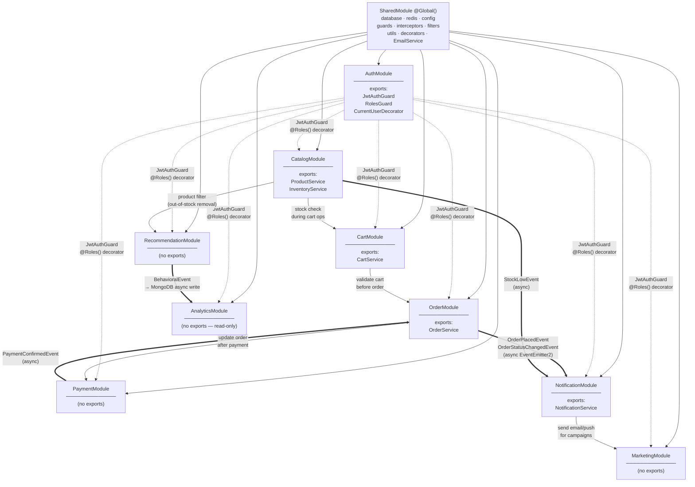

# Module Structure & Code Organization

**Project:** SMART ECOMMERCE AI SYSTEM
**Version:** 2.0.0
**Date:** 2026-04-01
**Author:** Senior Backend Engineer
**Status:** Approved
**References:** `docs/ARCHITECTURE.md` v2.0.0 · `docs/TECH_STACK.md` v2.0.0

---

## Mục Lục

1. [Project Root Structure](#1-project-root-structure)
2. [Standard NestJS Module Template](#2-standard-nestjs-module-template)
3. [Module Dependency Map](#3-module-dependency-map)
4. [Module Detail — 9 NestJS Modules](#4-module-detail--9-nestjs-modules)
5. [Shared Infrastructure Layer](#5-shared-infrastructure-layer)
6. [Shared TypeScript Library](#6-shared-typescript-library)
7. [Naming Conventions](#7-naming-conventions)
8. [Import Path Aliases](#8-import-path-aliases)
9. [Module Creation Checklist](#9-module-creation-checklist)

---

## 1. Project Root Structure

```
SMART-ECOMMERCE-AI-SYSTEM/
│
├── apps/                                      # Deployable applications (3 units)
│   │
│   ├── api/                                   # NestJS 10 — Modular Monolith (Render.com)
│   │   ├── src/
│   │   │   ├── main.ts                        # Bootstrap: global pipes, filters, Swagger, CORS
│   │   │   ├── app.module.ts                  # Root module — imports all 9 feature modules
│   │   │   │
│   │   │   ├── modules/                       # 9 feature modules (one per FR domain)
│   │   │   │   ├── auth/                      # FR-AUTH-01..08
│   │   │   │   ├── catalog/                   # FR-CATALOG-01..10
│   │   │   │   ├── cart/                      # FR-CART-01..04
│   │   │   │   ├── order/                     # FR-ORDER-01..08
│   │   │   │   ├── payment/                   # FR-CART-05 (VNPay, Momo)
│   │   │   │   ├── recommendation/            # FR-REC-01..10
│   │   │   │   ├── marketing/                 # FR-MKTG-01..08
│   │   │   │   ├── notification/              # FR-NOTIF-01..05
│   │   │   │   └── analytics/                 # FR-ANAL-01..06
│   │   │   │
│   │   │   └── shared/                        # Cross-cutting infrastructure (not a NestJS module)
│   │   │       ├── database/                  # Mongoose connection + base abstractions
│   │   │       ├── redis/                     # Upstash Redis client + helper
│   │   │       ├── config/                    # Env validation, typed config objects
│   │   │       ├── email/                     # nodemailer Gmail SMTP transport wrapper
│   │   │       ├── guards/                    # JwtAuthGuard, RolesGuard
│   │   │       ├── interceptors/              # LoggingInterceptor, ResponseInterceptor
│   │   │       ├── filters/                   # GlobalExceptionFilter
│   │   │       ├── pipes/                     # ValidationPipe config
│   │   │       ├── decorators/                # @Roles(), @CurrentUser(), @ApiPagination()
│   │   │       └── utils/                     # paginate(), generateRequestId(), slug(), hash()
│   │   │
│   │   ├── test/                              # e2e test suites (*.e2e-spec.ts)
│   │   ├── Dockerfile                         # multi-stage: node:20-alpine, compile TS → dist/
│   │   ├── .env.example                       # all required env vars (keys only, no values)
│   │   ├── package.json
│   │   └── tsconfig.json                      # path aliases: @modules/*, @shared/*, @config/*, @lib/*
│   │
│   ├── web/                                   # Next.js 15 — Frontend (Vercel)
│   │   ├── app/                               # App Router (RSC + Client Components)
│   │   │   ├── (shop)/                        # Buyer-facing pages (SSR/ISR/CSR)
│   │   │   │   ├── page.tsx                   # Homepage — SSR (AI recommendations per-user)
│   │   │   │   ├── products/[slug]/page.tsx   # Product detail — ISR 300s
│   │   │   │   ├── category/[slug]/page.tsx   # Category — SSG + ISR 3600s
│   │   │   │   ├── search/page.tsx            # Search results — SSR
│   │   │   │   ├── cart/page.tsx              # Cart — CSR
│   │   │   │   └── checkout/page.tsx          # Checkout — CSR
│   │   │   ├── (admin)/                       # Staff/admin dashboard — CSR
│   │   │   │   ├── dashboard/page.tsx
│   │   │   │   ├── products/page.tsx
│   │   │   │   ├── orders/page.tsx
│   │   │   │   ├── marketing/page.tsx
│   │   │   │   └── analytics/page.tsx
│   │   │   └── api/                           # Next.js Route Handlers (BFF / proxy)
│   │   │       └── [...]/route.ts
│   │   ├── components/
│   │   │   ├── ui/                            # shadcn/ui primitive components
│   │   │   ├── features/                      # Feature-specific composite components
│   │   │   └── layouts/                       # Header, Footer, AdminLayout, ShopLayout
│   │   ├── lib/
│   │   │   ├── api/                           # TanStack Query hooks + axios client
│   │   │   ├── stores/                        # Zustand stores (cart-drawer, auth-modal, ui)
│   │   │   └── utils/                         # Client-side helpers, formatters
│   │   ├── public/                            # Favicons, og-image, robots.txt
│   │   ├── Dockerfile
│   │   └── package.json
│   │
│   └── ai-service/                            # FastAPI 0.111 (Render.com)
│       ├── app/
│       │   ├── main.py                        # FastAPI app init, CORS, /health endpoint
│       │   ├── config.py                      # pydantic-settings: REDIS_URL, MONGO_URI, R2_*
│       │   ├── routers/
│       │   │   ├── recommend.py               # POST /recommend
│       │   │   ├── features.py                # POST /features/update (internal NestJS call)
│       │   │   └── internal.py                # POST /internal/reload-model
│       │   ├── services/
│       │   │   ├── cf_service.py              # LightFM model load + predict()
│       │   │   ├── cbf_service.py             # Cosine similarity matrix compute + query()
│       │   │   ├── hybrid.py                  # α-weighted scoring + post_filter()
│       │   │   └── fallback.py                # get_popular_products() — circuit open fallback
│       │   └── ml/
│       │       ├── train_cf.py                # LightFM fit, evaluate (precision@10, recall@10)
│       │       ├── train_cbf.py               # TF-IDF vectorize + cosine sim matrix build
│       │       └── model_registry.py          # Cloudflare R2 upload/download .pkl artifacts
│       ├── scripts/
│       │   └── train_pipeline.py              # Entry point called by GitHub Actions cron
│       │                                      # Runs: fetch_features → train_CF → evaluate
│       │                                      # → promote_if_better → rebuild_CBF
│       │                                      # → upload .pkl to R2 → update model_versions
│       ├── tests/
│       │   ├── test_recommend.py
│       │   └── test_training.py
│       ├── Dockerfile                         # python:3.11-slim, pip layer cached
│       └── requirements.txt
│
├── libs/                                      # Shared TypeScript — cross-app contracts
│   └── shared/
│       └── src/
│           ├── types/                         # ApiResponse<T>, PaginatedResponse<T>, Role enum
│           ├── constants/                     # error codes, queue names, Redis key patterns
│           └── index.ts                       # Barrel export
│
├── docs/                                      # Project documentation
│   ├── REQUIREMENTS.md                        # v2.2.0 — 62 FRs
│   ├── TECH_STACK.md                          # v2.0.0 — Tech decisions
│   ├── ARCHITECTURE.md                        # v2.0.0 — System design
│   └── MODULE_STRUCTURE.md                    # v2.0.0 — This file
│
├── infra/                                     # Infrastructure config
│   ├── docker-compose.yml                     # Full local dev: 8 services
│   ├── docker-compose.prod.yml                # Production overrides
│   └── nginx/                                 # Local reverse proxy (optional)
│       └── nginx.conf
│
├── scripts/                                   # Developer utility scripts
│   ├── seed.ts                                # Seed MongoDB: products, categories, users
│   ├── generate-swagger.ts                    # Export OpenAPI JSON to docs/
│   └── check-services.sh                      # Ping all free tier services, check health
│
├── .github/
│   └── workflows/
│       ├── ci.yml                             # PR gate: lint + typecheck + Jest + pytest
│       ├── cd-staging.yml                     # push develop → Render staging
│       ├── cd-production.yml                  # push main → Render + Vercel production
│       └── ml-training.yml                    # Daily 02:00 ICT cron → python scripts/train_pipeline.py
│
├── .env.example                               # ALL required env vars (no values committed)
├── .gitignore
├── package.json                               # Root (optional npm workspaces)
└── README.md                                  # Project overview + quick start
```

---

## 2. Standard NestJS Module Template

> **MongoDB note:** Vì dùng Mongoose (NoSQL), folder tên là `schemas/` thay vì `entities/`.
> Mongoose `@Schema()` class = document schema definition, không phải SQL entity.

Template này áp dụng **thống nhất** cho tất cả 9 feature modules:

```
[module-name]/
│
├── dto/                                       # Data Transfer Objects
│   ├── create-[resource].dto.ts               #   POST body: input validation
│   ├── update-[resource].dto.ts               #   PATCH body: partial update
│   ├── [resource]-query.dto.ts                #   GET query params: filters, sort, pagination
│   └── [resource]-response.dto.ts             #   API output shape (no internal fields)
│
├── schemas/                                   # Mongoose document schemas
│   └── [resource].schema.ts                   #   @Schema() + @Prop() + SchemaFactory
│
├── interfaces/                                # TypeScript domain types
│   └── [resource].interface.ts                #   Interface, type, enum — pure TS, no NestJS deps
│
├── controllers/                               # HTTP layer ONLY
│   └── [module].controller.ts                 #   @Controller(): parse request → call service → return DTO
│
├── services/                                  # Business logic layer
│   └── [module].service.ts                    #   All domain logic, validation rules, orchestration
│
├── repositories/                              # Database access layer
│   └── [resource].repository.ts              #   Mongoose queries — service never calls Model directly
│
├── events/                                    # Domain events (async decoupling)
│   └── [event-name].event.ts                  #   Plain TS class dispatched via EventEmitter2
│
├── [module].module.ts                         # NestJS @Module(): providers, imports, exports
└── README.md                                  # Purpose, exported services, endpoints, usage examples
```

### Folder Responsibility Rules

| Folder | Chịu Trách Nhiệm | Được Phép Phụ Thuộc Vào | KHÔNG được |
|---|---|---|---|
| `dto/` | Input validation + output shaping | `class-validator`, `class-transformer`, `@nestjs/swagger` | Business logic |
| `schemas/` | Mongoose document definition, indexes, virtuals | `mongoose`, `@nestjs/mongoose` | HTTP layer, services |
| `interfaces/` | Domain contracts, TypeScript types/enums | Pure TypeScript only | NestJS, Mongoose |
| `controllers/` | HTTP method handlers, route mapping | Service của cùng module, DTOs, guards/decorators | Any business if/else logic |
| `services/` | Business rules, transactions, orchestration | Repository của cùng module, SharedModule, adapters | Mongoose Model trực tiếp, HTTP layer |
| `repositories/` | Mongoose queries, projections, aggregations | Mongoose Model (inject), BaseRepository | Business logic, HTTP layer |
| `events/` | Domain event class definitions | Plain TypeScript | Any NestJS/Mongoose import |
| `*.module.ts` | DI wiring: providers, imports, exports | Modules trong dependency map | Circular imports |

---

## 3. Module Dependency Map

### Dependency Rules

1. `SharedModule` — imported by ALL modules (global infrastructure)
2. `AuthModule` exports guards — applied via decorators, không cần import trực tiếp
3. Feature modules chỉ import modules được liệt kê dưới đây
4. Giao tiếp cross-module async qua `EventEmitter2` (không inject service trực tiếp)
5. **Tuyệt đối không circular import**



**Legend:**
- `→` Solid: NestJS `imports: [ModuleX]` — có thể dùng exported providers
- `-. ->` Dotted: Guards áp dụng qua `@UseGuards()` decorator — không import module
- `==` Bold: Async `EventEmitter2` emit/listen — hoàn toàn decoupled

### Import Matrix

| Module | Imports |
|---|---|
| AuthModule | SharedModule |
| CatalogModule | SharedModule |
| CartModule | SharedModule, CatalogModule |
| OrderModule | SharedModule, CartModule |
| PaymentModule | SharedModule, OrderModule |
| RecommendationModule | SharedModule, CatalogModule |
| MarketingModule | SharedModule, NotificationModule |
| NotificationModule | SharedModule |
| AnalyticsModule | SharedModule |

---

## 4. Module Detail — 9 NestJS Modules

### 4.1 AuthModule — `src/modules/auth/`

```
auth/
├── dto/
│   ├── register.dto.ts                        # {email, password, fullName}
│   ├── login.dto.ts                           # {email, password}
│   ├── refresh-token.dto.ts                   # {} — reads HTTP-only cookie
│   ├── user-response.dto.ts                   # {_id, email, fullName, roles, createdAt}
│   └── auth-response.dto.ts                   # {accessToken, user: UserResponseDto}
├── schemas/
│   └── user.schema.ts                         # UserDocument: email, passwordHash, roles[],
│                                              #   addresses[{street, district, city, phone}],
│                                              #   status (active|suspended), deletedAt, createdAt
├── interfaces/
│   ├── jwt-payload.interface.ts               # {sub: string, roles: Role[], iat: number, exp: number}
│   └── auth-tokens.interface.ts               # {accessToken: string, refreshToken: string}
├── controllers/
│   └── auth.controller.ts                     # POST /auth/login, /auth/register, /auth/refresh
│                                              # DELETE /auth/logout
│                                              # GET /auth/me, PATCH /auth/me/password
├── services/
│   └── auth.service.ts                        # login(), register(), refresh(), logout()
│                                              # changePassword(), validateUser()
├── repositories/
│   └── user.repository.ts                     # findByEmail(), findById()
│                                              # createUser(), updateRoles(), updatePassword()
├── events/
│   └── user-registered.event.ts               # {userId, email, fullName, timestamp}
├── auth.module.ts                             # exports: JwtStrategy, JwtAuthGuard, RolesGuard
└── README.md
```

**Exported providers:** `JwtAuthGuard`, `RolesGuard`, `CurrentUser` decorator
**MongoDB collection:** `users`

**Key API endpoints:**

| Method | Path | Auth | Description |
|---|---|---|---|
| `POST` | `/api/v1/auth/register` | Public | Register; emits `UserRegisteredEvent` → welcome email |
| `POST` | `/api/v1/auth/login` | Public | Validate credentials, return JWT + set refresh cookie |
| `POST` | `/api/v1/auth/refresh` | Cookie | Rotate refresh token, issue new access token |
| `DELETE` | `/api/v1/auth/logout` | JWT | Invalidate refresh token in Redis, clear cookie |
| `GET` | `/api/v1/auth/me` | JWT | Return current user profile (no passwordHash) |
| `PATCH` | `/api/v1/auth/me/password` | JWT | Change password after verifying current password |

**EventEmitter2 events emitted:**
- `user.registered` → `UserRegisteredEvent{userId, email, fullName}` → NotificationModule sends welcome email

**EventEmitter2 events listened to:** None

**Redis keys read/written:**
- Write: `sess:{hash}` (refresh token SHA-256 hash, TTL 7d) on login/refresh
- Delete: `sess:{hash}` on logout
- Read: `sess:{hash}` on refresh to verify not revoked

**Error scenarios:**
- `AUTH_CREDENTIALS_INVALID` — email/password mismatch
- `AUTH_EMAIL_TAKEN` — duplicate email on register (409)
- `AUTH_REFRESH_INVALID` — refresh token not in Redis
- `AUTH_ACCOUNT_UNVERIFIED` — email not yet verified (403)

---

### 4.2 CatalogModule — `src/modules/catalog/`

```
catalog/
├── dto/
│   ├── create-product.dto.ts                  # {name, sku, price, variants[], categoryId, attributes{}}
│   ├── update-product.dto.ts                  # PartialType(CreateProductDto)
│   ├── product-query.dto.ts                   # {page, limit, sort, categoryId, minPrice, maxPrice,
│   │                                          #  inStock, brand, q (Atlas Search query)}
│   ├── create-category.dto.ts                 # {name, slug?, parentId?}
│   ├── product-response.dto.ts                # Product + resolvedCategory + stockSummary
│   └── bulk-import.dto.ts                     # CSV result: {created, updated, errors[]}
├── schemas/
│   ├── product.schema.ts                      # ProductDocument: sku, name, description{short,long},
│   │                                          #   images[], variants[{sku,size,color,stock,price}],
│   │                                          #   categoryId, attributes{}, tags[], avgRating,
│   │                                          #   soldCount, status (draft|active|inactive), deletedAt
│   └── category.schema.ts                     # CategoryDocument: name, slug, path (materialized),
│                                              #   parentId, level, imageUrl, isActive
├── interfaces/
│   ├── product.interface.ts                   # IProduct, IVariant, IProductAttribute
│   └── category.interface.ts                  # ICategory, ICategoryTree
├── controllers/
│   ├── product.controller.ts                  # CRUD /products, POST /products/bulk-import,
│   │                                          # POST /products/:id/images (R2 presigned URL)
│   └── category.controller.ts                 # CRUD /categories, GET /categories/tree
├── services/
│   ├── product.service.ts                     # CRUD + Atlas Search, R2 presigned URL generation
│   ├── category.service.ts                    # tree build, slug generation, path recalculation
│   └── inventory.service.ts                   # checkStock(), decrementStock(), restoreStock()
├── repositories/
│   ├── product.repository.ts                  # findById, findByCategory, findBySku, bulkUpsert
│   └── category.repository.ts                 # findTree, findBySlug, findAncestors
├── events/
│   ├── product-created.event.ts               # → search index sync
│   ├── product-updated.event.ts               # → search re-sync + Redis cache bust
│   └── stock-low.event.ts                     # {productId, variantId, stock, threshold}
├── catalog.module.ts                          # exports: ProductService, InventoryService
└── README.md
```

**Exported providers:** `ProductService`, `InventoryService`
**MongoDB collections:** `products`, `categories`

**Key API endpoints:**

| Method | Path | Auth | Description |
|---|---|---|---|
| `GET` | `/api/v1/products` | Public | List + filter (category, price, inStock, search); paginated |
| `POST` | `/api/v1/products` | STAFF | Create; emits `product.created` |
| `GET` | `/api/v1/products/:id` | Public | Detail; Redis cache `product:{id}` TTL 5min |
| `PATCH` | `/api/v1/products/:id` | STAFF | Partial update; bust cache; emit `product.updated` |
| `DELETE` | `/api/v1/products/:id` | ADMIN | Soft delete (`deletedAt = now()`) |
| `POST` | `/api/v1/products/bulk-import` | STAFF | CSV multi-part; bulk upsert by SKU |
| `POST` | `/api/v1/products/:id/images` | STAFF | Generate R2 presigned PUT URL |
| `GET` | `/api/v1/categories/tree` | Public | Nested category tree via materialized path |

**EventEmitter2 events emitted:**
- `product.created` → search sync
- `product.updated` → search re-sync + Redis cache bust
- `stock.low` → NotificationModule alerts STAFF

**Redis keys:** Write/Read `product:{id}` (TTL 300s); invalidated on update/delete

**Error scenarios:**
- `PRODUCT_NOT_FOUND` — soft-deleted or wrong ObjectId
- `PRODUCT_OUT_OF_STOCK` — `checkStock()` false
- SKU duplicate → HTTP 409
- R2 presign failure → HTTP 503, client retry

---

### 4.3 CartModule — `src/modules/cart/`

```
cart/
├── dto/
│   ├── add-to-cart.dto.ts                     # {productId, variantId, quantity}
│   ├── update-cart-item.dto.ts                # {quantity}
│   ├── apply-coupon.dto.ts                    # {code}
│   └── cart-response.dto.ts                   # {items[], coupon?, discount, subtotal, total}
├── schemas/
│   ├── cart.schema.ts                         # CartDocument: userId (indexed), sessionId (guest),
│   │                                          #   items[{productId,variantId,qty,price,addedAt}],
│   │                                          #   couponId, updatedAt, abandonedAt
│   └── coupon.schema.ts                       # CouponDocument: code (unique), type (flat|percent),
│                                              #   value, minOrderAmount, usageLimit, usedCount,
│                                              #   expiresAt, isActive
├── interfaces/
│   └── cart.interface.ts                      # ICartItem, ICouponValidation, CartMergeStrategy
├── controllers/
│   └── cart.controller.ts                     # GET /cart, PUT /cart/items, DELETE /cart/items/:id
│                                              # POST /cart/coupon, DELETE /cart/coupon
│                                              # POST /cart/merge
├── services/
│   ├── cart.service.ts                        # addItem(), removeItem(), updateQty()
│   │                                          # mergeGuestCart(), validateCartStock()
│   └── coupon.service.ts                      # validateCoupon(), applyCoupon(), releaseCoupon()
├── repositories/
│   ├── cart.repository.ts                     # findByUserId, findBySession, upsertCart, clearCart
│   └── coupon.repository.ts                   # findByCode, incrementUsageCount
├── events/
│   └── cart-abandoned.event.ts                # {userId, cartId, items[], totalValue, timestamp}
├── cart.module.ts                             # exports: CartService
└── README.md
```

**Exported providers:** `CartService`
**MongoDB collections:** `carts`, `coupons`

**Key API endpoints:**

| Method | Path | Auth | Description |
|---|---|---|---|
| `GET` | `/api/v1/cart` | JWT/Session | Fetch cart; resolves product snapshots |
| `PUT` | `/api/v1/cart/items` | JWT/Session | Upsert item; calls `InventoryService.checkStock()` |
| `DELETE` | `/api/v1/cart/items/:itemId` | JWT/Session | Remove line item |
| `POST` | `/api/v1/cart/coupon` | JWT | Apply + validate coupon |
| `DELETE` | `/api/v1/cart/coupon` | JWT | Remove coupon |
| `POST` | `/api/v1/cart/merge` | JWT | Merge guest → authenticated cart on login |

**EventEmitter2 events emitted:**
- `cart.abandoned` → BullMQ 24h delayed job → recovery push/email

**EventEmitter2 events listened to:**
- `user.registered` (AuthModule) → `mergeGuestCart()` if sessionId present

**Error scenarios:**
- `PRODUCT_OUT_OF_STOCK`, `COUPON_EXPIRED`, `COUPON_USAGE_EXCEEDED`, `CART_EMPTY`
- Guest merge conflict: quantities summed, capped at stock level

---

### 4.4 OrderModule — `src/modules/order/`

```
order/
├── dto/
│   ├── create-order.dto.ts                    # {shippingAddressId, paymentMethod, note?}
│   ├── update-order-status.dto.ts             # {status: OrderStatus, trackingNumber?}
│   └── order-response.dto.ts                  # Full order: items[], shippingAddress{}, payment{},
│                                              #   timeline[], status, totals
├── schemas/
│   └── order.schema.ts                        # OrderDocument:
│                                              #   userId, orderNumber (auto-gen), items[{productId,
│                                              #   variantId, qty, unitPrice, productSnapshot{}}],
│                                              #   shippingAddress{street, district, city, phone},
│                                              #   payment{method, transactionId, paidAt, amount},
│                                              #   status, timeline[{status, timestamp, note, actor}],
│                                              #   couponCode, discount, subtotal, shippingFee, total
├── interfaces/
│   ├── order.interface.ts                     # IOrder, IOrderItem, IOrderTimeline
│   └── order-status.enum.ts                   # PENDING_PAYMENT → PAID → PROCESSING → SHIPPED
│                                              # → DELIVERED → COMPLETED | CANCELLED | REFUNDED
├── controllers/
│   └── order.controller.ts                    # POST /orders, GET /orders, GET /orders/:id
│                                              # PATCH /orders/:id/status, POST /orders/:id/cancel
├── services/
│   └── order.service.ts                       # placeOrder() — 5-step MongoDB session transaction:
│                                              #   1. validateCart, 2. decrementStock,
│                                              #   3. createOrder, 4. clearCart, 5. initiatePayment
│                                              # updateStatus(), cancelOrder(), getHistory()
├── repositories/
│   └── order.repository.ts                    # findById, findByUser, findByStatus
│                                              # countByStatus, revenueByPeriod (analytics)
├── events/
│   ├── order-placed.event.ts                  # {orderId, userId, total}
│   ├── order-status-changed.event.ts          # {orderId, newStatus, userId}
│   └── order-cancelled.event.ts               # {orderId, items[]} → restore inventory
├── order.module.ts                            # exports: OrderService
└── README.md
```

**Exported providers:** `OrderService`
**MongoDB collection:** `orders`

**Key API endpoints:**

| Method | Path | Auth | Description |
|---|---|---|---|
| `POST` | `/api/v1/orders` | JWT (BUYER) | Place order; 5-step MongoDB transaction |
| `GET` | `/api/v1/orders` | JWT | BUYER: own; STAFF: all; status filter |
| `GET` | `/api/v1/orders/:id` | JWT | Full detail; ownership check for BUYER |
| `PATCH` | `/api/v1/orders/:id/status` | JWT (STAFF) | Advance state; FSM validation |
| `POST` | `/api/v1/orders/:id/cancel` | JWT | BUYER: only PENDING_PAYMENT; STAFF: pre-SHIPPED |

**EventEmitter2 events emitted:**
- `order.placed` → NotificationModule: confirmation email + push
- `order.status.changed` → NotificationModule: status update
- `order.cancelled` → CatalogModule: `InventoryService.restoreStock()`

**EventEmitter2 events listened to:**
- `payment.confirmed` (PaymentModule) → `updateStatus(orderId, PAID)` + timeline append

**Error scenarios:**
- `CART_EMPTY`, `PRODUCT_OUT_OF_STOCK` (transaction retry ×3), `ORDER_INVALID_STATUS`
- Payment timeout → order stays `PENDING_PAYMENT`; retryable

---

### 4.5 PaymentModule — `src/modules/payment/`

```
payment/
├── dto/
│   ├── initiate-payment.dto.ts                # {orderId, amount, method: 'vnpay'|'momo'}
│   ├── vnpay-webhook.dto.ts                   # VNPay IPN fields
│   └── momo-webhook.dto.ts                    # Momo IPN fields
├── schemas/                                   # No own collection — embedded in orders.payment{}
├── interfaces/
│   ├── payment-gateway.interface.ts           # IPaymentGateway:
│   │                                          #   initiate(order): Promise<{paymentUrl, transactionId}>
│   │                                          #   verifyWebhook(payload, signature): boolean
│   └── payment-result.interface.ts            # {paymentUrl: string, transactionId: string}
├── controllers/
│   └── payment.controller.ts                  # POST /payments/initiate
│                                              # POST /payments/vnpay/webhook
│                                              # POST /payments/momo/webhook
├── services/
│   ├── payment.service.ts                     # initiatePayment() → adapter by method
│   │                                          # handleWebhook() → verify sig → emit event
│   ├── vnpay.adapter.ts                       # IPaymentGateway: HMAC-SHA512 sign/verify
│   └── momo.adapter.ts                        # IPaymentGateway: RSA sign/verify
├── events/
│   └── payment-confirmed.event.ts             # {orderId, transactionId, amount, method}
├── payment.module.ts
└── README.md
```

**MongoDB collection:** None (embedded in `orders.payment{}`)

**Key API endpoints:**

| Method | Path | Auth | Description |
|---|---|---|---|
| `POST` | `/api/v1/payments/initiate` | JWT (BUYER) | Generate VNPay/Momo payment URL |
| `POST` | `/api/v1/payments/vnpay/webhook` | Public (HMAC) | VNPay IPN; HMAC-SHA512 verify |
| `POST` | `/api/v1/payments/momo/webhook` | Public (RSA) | Momo IPN; RSA verify |

**EventEmitter2 events emitted:**
- `payment.confirmed` → OrderModule updates order to `PAID`

**Redis keys:** `rl:vnpay:{txId}` / `rl:momo:{txId}` — idempotency (TTL 24h) to prevent double-processing

**Error scenarios:**
- `PAYMENT_WEBHOOK_INVALID` — signature mismatch → HTTP 400
- Duplicate webhook → Redis key exists → return ack without re-processing

---

### 4.6 RecommendationModule — `src/modules/recommendation/`

```
recommendation/
├── dto/
│   ├── recommend-query.dto.ts                 # {placement: 'homepage'|'pdp'|'cart', n?: number}
│   ├── behavioral-event.dto.ts                # {eventType: 'view'|'add_to_cart'|'purchase'|'search'|'rec_click',
│   │                                          #  productId?, query?, metadata{}}
│   └── recommendation-response.dto.ts         # {products: ProductResponseDto[],
│                                              #  source: 'ai'|'fallback'|'cache', modelVersion?}
├── interfaces/
│   ├── recommendation.interface.ts            # IRecommendRequest, IRecommendResult
│   └── placement-config.interface.ts          # PlacementConfig: {alpha, n, ttl}
│                                              # homepage: {alpha:0.7, n:12, ttl:600}
│                                              # pdp:      {alpha:0.3, n:8,  ttl:600}
│                                              # cart:     {alpha:0.5, n:6,  ttl:300}
├── controllers/
│   └── recommendation.controller.ts           # GET /recommendations, POST /events
├── services/
│   ├── recommendation.service.ts             # getRecommendations(): cache → FastAPI → fallback
│   ├── ai-client.service.ts                   # opossum circuit breaker: timeout=500ms,
│   │                                          # errorThreshold=50%, reset=60s
│   ├── fallback.service.ts                    # getPopularProducts(): MongoDB agg + Redis cache 1h
│   └── behavioral-event.service.ts            # publishEvent(): async MongoDB insertOne fire-and-forget
├── recommendation.module.ts
└── README.md
```

**MongoDB collection:** `behavioral_events` (async write only — read by AnalyticsModule)

**Key API endpoints:**

| Method | Path | Auth | Description |
|---|---|---|---|
| `GET` | `/api/v1/recommendations` | JWT (optional) | Personalized recs; anonymous → popularity fallback |
| `POST` | `/api/v1/events` | JWT (optional) | Ingest behavioral event; fire-and-forget MongoDB insert |

**Redis keys:**
- `rec:{userId}:{placement}` — AI rec cache (TTL per placement config)
- `fallback:popular:{placement}` — popularity fallback (TTL 3600s)

**Error scenarios:**
- FastAPI timeout/error → circuit opens → `fallback:popular:{placement}` served
- Redis `XADD` failure → event silently dropped, HTTP response unaffected

---

### 4.7 MarketingModule — `src/modules/marketing/`

```
marketing/
├── dto/
│   ├── create-campaign.dto.ts                 # {name, segmentId, channel:'email', subject, template, scheduledAt?}
│   ├── update-campaign.dto.ts                 # PartialType(CreateCampaignDto)
│   ├── create-segment.dto.ts                  # {name, rfmRules: {rMin,rMax,fMin,fMax,mMin,mMax}}
│   └── campaign-response.dto.ts               # Campaign + metrics{sent,opened,clicked,converted,revenue}
├── schemas/
│   ├── campaign.schema.ts                     # CampaignDocument: name, segmentId, channel,
│   │                                          #   content{subject,htmlBody}, status, scheduledAt,
│   │                                          #   metrics{sent,opened,clicked,converted}
│   └── segment.schema.ts                      # SegmentDocument: name, rfmRules{}, userIds[],
│                                              #   lastComputedAt, userCount
├── interfaces/
│   ├── campaign.interface.ts                  # ICampaign, CampaignStatus enum
│   └── segment.interface.ts                   # ISegment, RFMRules
├── controllers/
│   ├── campaign.controller.ts                 # CRUD /campaigns, POST /campaigns/:id/send
│   │                                          # GET /campaigns/:id/metrics
│   └── segment.controller.ts                  # CRUD /segments, POST /segments/compute-rfm
├── services/
│   ├── campaign.service.ts                    # create/update/send/pause/archive
│   │                                          # send() → NotificationService.bulkSendEmail()
│   │                                          #   via nodemailer Gmail SMTP
│   └── segment.service.ts                     # computeRFM() — MongoDB aggregation pipeline
│                                              # buildSegment(), refreshSegmentUsers()
├── repositories/
│   ├── campaign.repository.ts                 # CRUD + updateMetrics() (atomic $inc)
│   └── segment.repository.ts                  # CRUD + findUsersBySegment() + updateUserIds()
├── events/
│   └── campaign-send-triggered.event.ts       # → BullMQ delayed job for scheduled campaigns
├── marketing.module.ts
└── README.md
```

**MongoDB collections:** `campaigns`, `segments`

**Key API endpoints:**

| Method | Path | Auth | Description |
|---|---|---|---|
| `GET` | `/api/v1/campaigns` | JWT (STAFF) | List campaigns; status filter |
| `POST` | `/api/v1/campaigns` | JWT (STAFF) | Create campaign (draft) |
| `POST` | `/api/v1/campaigns/:id/send` | JWT (STAFF) | Trigger immediate send via Gmail SMTP nodemailer |
| `GET` | `/api/v1/campaigns/:id/metrics` | JWT (STAFF) | sent, opened, clicked, converted, revenue |
| `POST` | `/api/v1/segments/compute-rfm` | JWT (STAFF) | On-demand RFM MongoDB aggregation |

**EventEmitter2 events emitted:**
- `campaign.send.triggered` → BullMQ delayed job for scheduled campaigns

**Error scenarios:**
- Empty `userIds[]` → HTTP 400; staff must run `compute-rfm` first
- Partial send failure → failed recipients logged; `metrics.sent` increments only successes
- Gmail daily limit (500/day) → remaining jobs queued via BullMQ for next batch

---

### 4.8 NotificationModule — `src/modules/notification/`

```
notification/
├── dto/
│   ├── send-email.dto.ts                      # {to: string[], subject, templateName, variables{}}
│   ├── send-push.dto.ts                       # {userId, title, body, url?, icon?}
│   ├── bulk-send-email.dto.ts                 # {recipients: [{email, variables{}}], subject, templateName}
│   └── push-subscription.dto.ts               # Web Push subscription: {endpoint, keys{p256dh, auth}}
├── schemas/
│   └── push-subscription.schema.ts            # PushSubscriptionDocument: userId, endpoint, keys{}, createdAt
├── interfaces/
│   └── notification.interface.ts              # IEmailPayload, IPushPayload, INotificationResult
├── controllers/
│   └── notification.controller.ts             # POST /notifications/push/subscribe
│                                              # DELETE /notifications/push/unsubscribe
│                                              # POST /notifications/test (ADMIN)
├── services/
│   ├── notification.service.ts                # sendEmail(), sendPush(), bulkSendEmail()
│   ├── email.service.ts                       # nodemailer Gmail SMTP wrapper
│   │                                          # GMAIL_USER + GMAIL_APP_PASSWORD env vars
│   │                                          # Renders Handlebars HTML templates
│   └── push.service.ts                        # web-push VAPID send; auto-cleanup expired endpoints
├── repositories/
│   └── push-subscription.repository.ts        # save, findByUserId, deleteByEndpoint
├── events/                                    # Listens to (via EventEmitter2):
│   │                                          #   order.placed → order confirmation email
│   │                                          #   order.status.changed → status update push/email
│   │                                          #   stock.low → STAFF alert email
│   │                                          #   user.registered → welcome email
├── notification.module.ts                     # exports: NotificationService
└── README.md
```

**Exported providers:** `NotificationService`
**MongoDB collection:** `push_subscriptions`

**Key API endpoints:**

| Method | Path | Auth | Description |
|---|---|---|---|
| `POST` | `/api/v1/notifications/push/subscribe` | JWT | Register Web Push subscription |
| `DELETE` | `/api/v1/notifications/push/unsubscribe` | JWT | Remove subscription by endpoint |
| `POST` | `/api/v1/notifications/test` | JWT (ADMIN) | Send test email + push to specific user |

**EventEmitter2 events listened to:**
- `order.placed` → order confirmation email
- `order.status.changed` → status update email + push
- `stock.low` → STAFF alert
- `user.registered` → welcome email

**Error scenarios:**
- Gmail auth failure → logged as critical; non-blocking
- Gmail daily limit (500/day) → BullMQ queues remainder
- Push endpoint expired (410 Gone) → `deleteByEndpoint()` auto-cleanup
- Missing template variable → Handlebars renders empty string; logged as warning

---

### 4.9 AnalyticsModule — `src/modules/analytics/`

```
analytics/
├── dto/
│   ├── dashboard-query.dto.ts                 # {from, to, granularity: 'day'|'week'|'month'}
│   ├── product-performance-query.dto.ts       # {productId, from, to}
│   └── analytics-response.dto.ts              # {revenue, orders, aov, conversionRate, aiCTR,
│                                              #  topProducts[], revenueByDay[]}
├── schemas/
│   └── behavioral-event.schema.ts             # BehavioralEventDocument: userId, sessionId,
│                                              #   eventType (view|add_to_cart|purchase|search|rec_click),
│                                              #   productId?, recommendationSource?,
│                                              #   query?, metadata{}, timestamp
├── interfaces/
│   └── analytics.interface.ts                 # IDashboardMetrics, IProductPerformance,
│                                              #   ICampaignROI, IAIPerformance
├── controllers/
│   └── analytics.controller.ts                # GET /analytics/dashboard
│                                              # GET /analytics/products/:id/performance
│                                              # GET /analytics/campaigns/:id/roi
│                                              # GET /analytics/ai/ctr
├── services/
│   ├── analytics.service.ts                   # getDashboard(), getProductPerformance()
│   │                                          # getCampaignROI(), getAICTR()
│   └── aggregation.service.ts                 # MongoDB aggregation pipeline builders:
│                                              #   revenueByPeriod(), topProductsByViews()
│                                              #   conversionFunnel(), rfmScoring()
│                                              #   aiCTRByPlacement()
├── repositories/
│   └── behavioral-event.repository.ts         # bulkInsert() (from GitHub Actions training pipeline)
│                                              # aggregateByEventType(), getTopProducts()
│                                              # countBySource() — AI vs fallback clicks
├── events/                                    # Listens to: order.placed (revenue tracking)
├── analytics.module.ts
└── README.md
```

**MongoDB collection:** `behavioral_events`

**Key API endpoints:**

| Method | Path | Auth | Description |
|---|---|---|---|
| `GET` | `/api/v1/analytics/dashboard` | JWT (STAFF) | Revenue, orders, AOV, conversion rate |
| `GET` | `/api/v1/analytics/products/:id/performance` | JWT (STAFF) | Views, add-to-cart rate, purchase rate |
| `GET` | `/api/v1/analytics/campaigns/:id/roi` | JWT (STAFF) | Campaign ROI attribution |
| `GET` | `/api/v1/analytics/ai/ctr` | JWT (STAFF) | AI CTR by placement; tracks BG-02 (>= 5%) |

**EventEmitter2 events listened to:**
- `order.placed` → increment revenue tracking for conversion funnel

**Error scenarios:**
- Date range > 90 days → HTTP 400 (TTL retention limit)
- Aggregation timeout → `maxTimeMS: 30000`; HTTP 500; reduce date range

---

## 5. Shared Infrastructure Layer

```
apps/api/src/shared/
│
├── database/
│   ├── base.schema.ts                         # Abstract base: timestamps: true
│   ├── base.repository.ts                     # BaseRepository<T>: findById, create, updateById,
│   │                                          # deleteById, findWithPagination
│   └── database.module.ts                     # @Global() MongooseModule.forRootAsync()
│                                              # Retry: 5 attempts, exponential backoff
│
├── redis/
│   ├── redis.client.ts                        # ioredis createClient(REDIS_URL) — Upstash TLS
│   ├── redis.service.ts                       # get/set/del/exists/expire/hgetall
│   │                                          # setWithTTL(key, value, ttl)
│   │                                          # getOrSet<T>(key, factory, ttl): Promise<T>
│   └── redis.module.ts                        # @Global() — exports RedisService
│
├── config/
│   ├── app.config.ts                          # {port, nodeEnv, corsOrigins[]}
│   ├── jwt.config.ts                          # {secret, accessExpiresIn:'15m', refreshExpiresIn:'7d'}
│   ├── redis.config.ts                        # {url: UPSTASH_REDIS_REST_URL}
│   ├── mongo.config.ts                        # {uri: MONGO_URI}
│   ├── r2.config.ts                           # {accountId, accessKeyId, secretAccessKey, bucket, publicUrl}
│   ├── ai-service.config.ts                   # {baseUrl: AI_SERVICE_URL, internalToken}
│   └── env.validation.ts                      # Joi schema — app crashes at startup if env missing
│                                              # Required: MONGO_URI, REDIS_URL, JWT_SECRET,
│                                              # R2_ACCESS_KEY, AI_SERVICE_URL,
│                                              # VNPAY_HASH_SECRET, MOMO_SECRET_KEY,
│                                              # GMAIL_USER, GMAIL_APP_PASSWORD,
│                                              # VAPID_PUBLIC_KEY, VAPID_PRIVATE_KEY
│
├── email/
│   └── email.service.ts                       # nodemailer Gmail SMTP transport wrapper
│                                              # createTransport({ host: 'smtp.gmail.com', port: 587,
│                                              #   secure: false, // STARTTLS
│                                              #   auth: { user: GMAIL_USER, pass: GMAIL_APP_PASSWORD }})
│                                              # sendMail(options): Promise<SentMessageInfo>
│                                              # @Global() — consumed by NotificationModule
│
├── guards/
│   ├── jwt-auth.guard.ts                      # extends AuthGuard('jwt') — verifies Bearer token
│   └── roles.guard.ts                         # Reads @Roles() metadata vs req.user.roles
│
├── interceptors/
│   ├── logging.interceptor.ts                 # Logs: [METHOD] /path → statusCode (Xms)
│   └── response.interceptor.ts                # Wraps: {success:true, data, meta:{requestId}}
│                                              #   or: {success:false, error:{code,message,details[]}}
│
├── filters/
│   └── global-exception.filter.ts             # Catches ALL exceptions
│                                              # Maps to error codes from @lib/constants/error-codes
│                                              # Async insert to error_logs MongoDB collection
│
├── pipes/
│   └── validation.pipe.ts                     # whitelist:true, forbidNonWhitelisted:true,
│                                              # transform:true, enableImplicitConversion:true
│
├── decorators/
│   ├── roles.decorator.ts                     # @Roles(...roles: Role[]) sets metadata
│   ├── current-user.decorator.ts              # @CurrentUser() → req.user (JWT payload)
│   └── api-pagination.decorator.ts            # @ApiPagination() adds Swagger page/limit/sort
│
└── utils/
    ├── paginate.util.ts                       # paginate(model, filter, {page,limit,sort})
    ├── request-id.util.ts                     # generateRequestId() → crypto.randomUUID()
    ├── slug.util.ts                           # Vietnamese diacritic removal + kebab-case
    └── hash.util.ts                           # SHA-256 hex; used for refresh token storage
```

---

## 6. Shared TypeScript Library

```
libs/shared/src/
│
├── types/
│   ├── api-response.type.ts                   # ApiResponse<T>, PaginatedResponse<T>, ApiError
│   ├── pagination.type.ts                     # PaginationMeta, PaginationQuery
│   └── role.enum.ts                           # enum Role { BUYER, STAFF, ADMIN }
│
├── constants/
│   ├── error-codes.ts                         # ALL error codes (source of truth)
│   │                                          # AUTH_*, PRODUCT_*, CART_*, ORDER_*,
│   │                                          # PAYMENT_*, COUPON_*, CAMPAIGN_*,
│   │                                          # AI_SERVICE_UNAVAILABLE, VALIDATION_ERROR,
│   │                                          # INTERNAL_ERROR, RATE_LIMIT_EXCEEDED
│   ├── queue-names.ts                         # EMAIL_QUEUE, SEARCH_SYNC_QUEUE,
│   │                                          # INVENTORY_QUEUE, ANALYTICS_QUEUE
│   ├── redis-keys.ts                          # KEY template functions:
│   │                                          # SESSION_KEY = (hash) => `sess:${hash}`
│   │                                          # REC_CACHE_KEY = (uid, place) => `rec:${uid}:${place}`
│   │                                          # PRODUCT_CACHE_KEY = (id) => `product:${id}`
│   │                                          # FEATURE_KEY = (uid) => `features:user:${uid}`
│   │                                          # FALLBACK_KEY = (place) => `fallback:popular:${place}`
│   │                                          # IDEMPOTENCY_KEY = (gw,txId) => `rl:${gw}:${txId}`
│   └── placement-config.ts                    # PLACEMENT_CONFIG record:
│                                              # homepage: {alpha:0.7, n:12, ttl:600}
│                                              # pdp:      {alpha:0.3, n:8,  ttl:600}
│                                              # cart:     {alpha:0.5, n:6,  ttl:300}
│
└── index.ts                                   # Barrel export
```

---

## 7. Naming Conventions

| Element | Convention | Example |
|---|---|---|
| **File** | `kebab-case.{type}.ts` | `user-profile.service.ts` |
| **Class** | `PascalCase` | `UserProfileService` |
| **Interface** | `PascalCase` (no `I` prefix) | `JwtPayload`, `CartItem` |
| **DTO** | `PascalCase` + `Dto` suffix | `CreateProductDto` |
| **Mongoose Schema** | `PascalCase` + `Document` | `UserDocument` |
| **Enum** | `PascalCase` name, `UPPER_SNAKE` values | `enum OrderStatus { PENDING_PAYMENT }` |
| **Constant** | `UPPER_SNAKE_CASE` | `EMAIL_QUEUE`, `MAX_RETRY_COUNT` |
| **Variable** | `camelCase` | `userId`, `accessToken` |
| **Boolean** | `is` / `has` / `can` prefix | `isAuthenticated`, `hasStock` |
| **Event class** | `PascalCase` + `Event` | `OrderPlacedEvent` |
| **Adapter** | `PascalCase` + `Adapter` | `VNPayAdapter` |
| **URL path** | `kebab-case`, plural noun | `/api/v1/products`, `/marketing-campaigns` |
| **MongoDB field** | `camelCase` | `createdAt`, `passwordHash` |
| **Redis key** | `namespace:qualifier:{id}` | `rec:{userId}:homepage` |
| **Environment var** | `UPPER_SNAKE_CASE` | `GMAIL_USER`, `GMAIL_APP_PASSWORD` |

**Python / FastAPI:**

| Element | Convention | Example |
|---|---|---|
| **File** | `snake_case.py` | `train_cf.py`, `model_registry.py` |
| **Class** | `PascalCase` | `CFService`, `ModelRegistry` |
| **Function/Variable** | `snake_case` | `train_model()`, `user_id` |
| **Constant** | `UPPER_SNAKE_CASE` | `MAX_RETRAIN_HOURS`, `REDIS_STREAM_KEY` |

---

## 8. Import Path Aliases

```json
// apps/api/tsconfig.json
{
  "compilerOptions": {
    "baseUrl": ".",
    "paths": {
      "@modules/*":  ["src/modules/*"],
      "@shared/*":   ["src/shared/*"],
      "@config/*":   ["src/shared/config/*"],
      "@lib/*":      ["../../libs/shared/src/*"]
    }
  }
}
```

**Usage examples:**

```typescript
// ✅ Correct — always use path aliases
import { ProductService }      from '@modules/catalog/services/product.service';
import { JwtAuthGuard }        from '@shared/guards/jwt-auth.guard';
import { EmailService }        from '@shared/email/email.service';
import { RedisService }        from '@shared/redis/redis.service';
import { paginateQuery }       from '@shared/utils/paginate.util';
import { JwtConfig }           from '@config/jwt.config';
import type { ApiResponse }    from '@lib/types/api-response.type';
import { Role }                from '@lib/types/role.enum';
import { EMAIL_QUEUE }         from '@lib/constants/queue-names';
import { AUTH_TOKEN_EXPIRED }  from '@lib/constants/error-codes';
import { SESSION_KEY }         from '@lib/constants/redis-keys';

// ❌ Wrong — deep relative paths across modules/layers
import { ProductService }  from '../../catalog/services/product.service';
import { JwtAuthGuard }    from '../../../shared/guards/jwt-auth.guard';
```

**Jest module name mapper:**

```json
{
  "jest": {
    "moduleNameMapper": {
      "^@modules/(.*)$": "<rootDir>/src/modules/$1",
      "^@shared/(.*)$":  "<rootDir>/src/shared/$1",
      "^@config/(.*)$":  "<rootDir>/src/shared/config/$1",
      "^@lib/(.*)$":     "<rootDir>/../../libs/shared/src/$1"
    }
  }
}
```

---

## 9. Module Creation Checklist

```markdown
## Module Creation Checklist — {ModuleName}

### Phase 1: Scaffold
- [ ] Tạo thư mục `apps/api/src/modules/{module-name}/` + 7 subfolders
- [ ] Tạo `{module}.module.ts` với @Module({ imports:[], controllers:[], providers:[], exports:[] })
- [ ] Tạo `README.md`: Purpose, Exported services, Endpoints list, Dependencies

### Phase 2: Schema
- [ ] `@Schema({ timestamps: true })` + đầy đủ `@Prop()` với type/required/default/index
- [ ] Compound indexes nếu cần
- [ ] `SchemaFactory.createForClass()` export
- [ ] Register: `MongooseModule.forFeature([{ name: Resource.name, schema: ResourceSchema }])`

### Phase 3: Repository
- [ ] Extend `BaseRepository<ResourceDocument>`
- [ ] `@InjectModel(Resource.name)` — không để raw queries trong service
- [ ] Export trong module `providers` + `exports`

### Phase 4: Service
- [ ] Inject repository (KHÔNG inject Model trực tiếp)
- [ ] All business logic ở đây — không trong controller, không trong repository
- [ ] Throw HttpException subclasses với codes từ `@lib/constants/error-codes`
- [ ] Export nếu các module khác cần dùng

### Phase 5: Controller
- [ ] `@Controller('api/v1/{resources}')` — plural noun, kebab-case
- [ ] `@UseGuards(JwtAuthGuard)` + `@Roles()` trên endpoints cần auth
- [ ] Chỉ gọi service — không chứa if/else business logic
- [ ] `@ApiOperation()`, `@ApiResponse()`, `@ApiBearerAuth()` Swagger decorators
- [ ] Return DTO instance (KHÔNG return raw Mongoose document)

### Phase 6: DTOs
- [ ] CreateDto: required fields với validators
- [ ] UpdateDto: `PartialType(CreateDto)`
- [ ] QueryDto: `@IsOptional()` + `@Transform()` cho numerics
- [ ] ResponseDto: `@Exclude()` internal fields (passwordHash, __v)

### Phase 7: Tests
- [ ] `services/{service}.spec.ts` — unit test với mocked repository
- [ ] `test/{module}.e2e-spec.ts` — integration test
- [ ] Happy path + 404 + 422 + 403 + edge cases
- [ ] Coverage >= 80% branches in service layer
- [ ] `npm run test -- --testPathPattern={module}` — all pass

### Phase 8: Registration
- [ ] Import trong `app.module.ts`
- [ ] `nest build` — no circular dependency warning
- [ ] `GET /health` → 200 after adding module

### Phase 9: Documentation
- [ ] Update module README.md
- [ ] Update `docs/MODULE_STRUCTURE.md` if new MongoDB collections
- [ ] `@ApiTags('{resource}')` on controller for Swagger grouping
```

---

*MODULE_STRUCTURE.md — v2.0.0 — 2026-04-01*
*References: ARCHITECTURE.md v2.0.0 · TECH_STACK.md v2.0.0*
*Next step: Implement Sprint 1 — SharedModule → AuthModule → CatalogModule*
