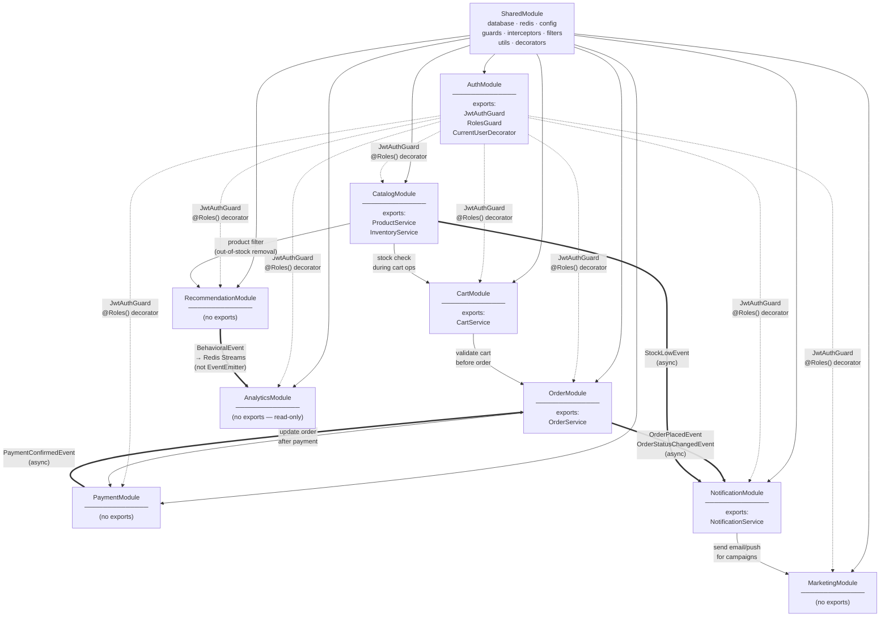

# Module Structure & Code Organization

**Project:** SMART ECOMMERCE AI SYSTEM
**Version:** 1.0.0
**Date:** 2026-03-24
**Author:** Senior Backend Engineer
**Status:** Approved
**References:** `docs/ARCHITECTURE.md` v1.0.0 · `docs/TECH_STACK.md` v1.0.0

---

## Mục Lục

1. [Project Root Structure](#1-project-root-structure)
2. [Standard NestJS Module Template](#2-standard-nestjs-module-template)
3. [Module Dependency Map](#3-module-dependency-map)
4. [Module Detail — 9 NestJS Modules](#4-module-detail--9-nestjs-modules)
5. [Shared Infrastructure Layer](#5-shared-infrastructure-layer)
6. [Shared TypeScript Library](#6-shared-typescript-library)
7. [Naming Conventions](#7-naming-conventions)
8. [Import Path Aliases](#8-import-path-aliases)
9. [Module Creation Checklist](#9-module-creation-checklist)

---

## 1. Project Root Structure

```
SMART-ECOMMERCE-AI-SYSTEM/
│
├── apps/                                      # Deployable applications (3 units)
│   │
│   ├── api/                                   # NestJS 10 — Modular Monolith (Render.com)
│   │   ├── src/
│   │   │   ├── main.ts                        # Bootstrap: global pipes, filters, Swagger, CORS
│   │   │   ├── app.module.ts                  # Root module — imports all 9 feature modules
│   │   │   │
│   │   │   ├── modules/                       # 9 feature modules (one per FR domain)
│   │   │   │   ├── auth/                      # FR-AUTH-01..08
│   │   │   │   ├── catalog/                   # FR-CATALOG-01..10
│   │   │   │   ├── cart/                      # FR-CART-01..04
│   │   │   │   ├── order/                     # FR-ORDER-01..08
│   │   │   │   ├── payment/                   # FR-CART-05 (VNPay, Momo)
│   │   │   │   ├── recommendation/            # FR-REC-01..10
│   │   │   │   ├── marketing/                 # FR-MKTG-01..08
│   │   │   │   ├── notification/              # FR-NOTIF-01..05
│   │   │   │   └── analytics/                 # FR-ANAL-01..06
│   │   │   │
│   │   │   └── shared/                        # Cross-cutting infrastructure (not a NestJS module)
│   │   │       ├── database/                  # Mongoose connection + base abstractions
│   │   │       ├── redis/                     # Upstash Redis client + helper
│   │   │       ├── config/                    # Env validation, typed config objects
│   │   │       ├── guards/                    # JwtAuthGuard, RolesGuard
│   │   │       ├── interceptors/              # LoggingInterceptor, ResponseInterceptor
│   │   │       ├── filters/                   # GlobalExceptionFilter
│   │   │       ├── pipes/                     # ValidationPipe config
│   │   │       ├── decorators/                # @Roles(), @CurrentUser(), @ApiPagination()
│   │   │       └── utils/                     # paginate(), generateRequestId(), slug(), hash()
│   │   │
│   │   ├── test/                              # e2e test suites (*.e2e-spec.ts)
│   │   ├── Dockerfile                         # multi-stage: node:20-alpine, compile TS → dist/
│   │   ├── .env.example                       # all required env vars (keys only, no values)
│   │   ├── package.json
│   │   └── tsconfig.json                      # path aliases: @modules/*, @shared/*, @config/*, @lib/*
│   │
│   ├── web/                                   # Next.js 15 — Frontend (Vercel)
│   │   ├── app/                               # App Router (RSC + Client Components)
│   │   │   ├── (shop)/                        # Buyer-facing pages (SSR/ISR/CSR)
│   │   │   │   ├── page.tsx                   # Homepage — SSR (AI recommendations per-user)
│   │   │   │   ├── products/[slug]/page.tsx   # Product detail — ISR 300s
│   │   │   │   ├── category/[slug]/page.tsx   # Category — SSG + ISR 3600s
│   │   │   │   ├── search/page.tsx            # Search results — SSR
│   │   │   │   ├── cart/page.tsx              # Cart — CSR
│   │   │   │   └── checkout/page.tsx          # Checkout — CSR
│   │   │   ├── (admin)/                       # Staff/admin dashboard — CSR
│   │   │   │   ├── dashboard/page.tsx
│   │   │   │   ├── products/page.tsx
│   │   │   │   ├── orders/page.tsx
│   │   │   │   ├── marketing/page.tsx
│   │   │   │   └── analytics/page.tsx
│   │   │   └── api/                           # Next.js Route Handlers (BFF / proxy)
│   │   │       └── [...]/route.ts
│   │   ├── components/
│   │   │   ├── ui/                            # shadcn/ui primitive components
│   │   │   ├── features/                      # Feature-specific composite components
│   │   │   └── layouts/                       # Header, Footer, AdminLayout, ShopLayout
│   │   ├── lib/
│   │   │   ├── api/                           # TanStack Query hooks + axios client
│   │   │   ├── stores/                        # Zustand stores (cart-drawer, auth-modal, ui)
│   │   │   └── utils/                         # Client-side helpers, formatters
│   │   ├── public/                            # Favicons, og-image, robots.txt
│   │   ├── Dockerfile
│   │   └── package.json
│   │
│   └── ai-service/                            # FastAPI 0.111 + Celery 5 (Render.com)
│       ├── app/
│       │   ├── main.py                        # FastAPI app init, CORS, /health endpoint
│       │   ├── config.py                      # pydantic-settings: REDIS_URL, MONGO_URI, R2_*
│       │   ├── routers/
│       │   │   ├── recommend.py               # POST /recommend
│       │   │   ├── features.py                # POST /features/update (internal NestJS call)
│       │   │   └── internal.py                # POST /internal/reload-model
│       │   ├── services/
│       │   │   ├── cf_service.py              # LightFM model load + predict()
│       │   │   ├── cbf_service.py             # Cosine similarity matrix compute + query()
│       │   │   ├── hybrid.py                  # α-weighted scoring + post_filter()
│       │   │   └── fallback.py                # get_popular_products() — circuit open fallback
│       │   ├── ml/
│       │   │   ├── train_cf.py                # LightFM fit, evaluate (precision@10, recall@10)
│       │   │   ├── train_cbf.py               # sentence-transformers embed + cosine sim matrix
│       │   │   └── model_registry.py          # Cloudflare R2 upload/download .pkl artifacts
│       │   └── workers/
│       │       ├── celery_app.py              # Celery config (Redis broker + backend)
│       │       ├── beat_schedule.py           # Cron: daily 02:00 ICT training pipeline
│       │       └── event_consumer.py          # Redis Streams XREADGROUP → MongoDB bulk insert
│       ├── tests/
│       │   ├── test_recommend.py
│       │   └── test_training.py
│       ├── Dockerfile                         # python:3.11-slim, pip layer cached
│       └── requirements.txt
│
├── libs/                                      # Shared TypeScript — cross-app contracts
│   └── shared/
│       └── src/
│           ├── types/                         # ApiResponse<T>, PaginatedResponse<T>, Role enum
│           ├── constants/                     # error codes, queue names, Redis key patterns
│           └── index.ts                       # Barrel export
│
├── docs/                                      # Project documentation
│   ├── REQUIREMENTS.md                        # v2.1.0 — 62 FRs
│   ├── TECH_STACK.md                          # v1.0.0 — Tech decisions
│   ├── ARCHITECTURE.md                        # v1.0.0 — System design
│   └── MODULE_STRUCTURE.md                    # v1.0.0 — This file
│
├── infra/                                     # Infrastructure config
│   ├── docker-compose.yml                     # Full local dev: 8 services
│   ├── docker-compose.prod.yml                # Production overrides
│   └── nginx/                                 # Local reverse proxy (optional)
│       └── nginx.conf
│
├── scripts/                                   # Developer utility scripts
│   ├── seed.ts                                # Seed MongoDB: products, categories, users
│   ├── generate-swagger.ts                    # Export OpenAPI JSON to docs/
│   └── check-services.sh                      # Ping all free tier services, check health
│
├── .github/
│   └── workflows/
│       ├── ci.yml                             # PR gate: lint + typecheck + Jest + pytest
│       ├── cd-staging.yml                     # push develop → Render staging
│       └── cd-production.yml                  # push main → Render + Vercel production
│
├── .env.example                               # ALL required env vars (no values committed)
├── .gitignore
├── package.json                               # Root (optional npm workspaces)
└── README.md                                  # Project overview + quick start
```

---

## 2. Standard NestJS Module Template

> **MongoDB note:** Vì dùng Mongoose (NoSQL), folder tên là `schemas/` thay vì `entities/`.
> Mongoose `@Schema()` class = document schema definition, không phải SQL entity.

Template này áp dụng **thống nhất** cho tất cả 9 feature modules:

```
[module-name]/
│
├── dto/                                       # Data Transfer Objects
│   ├── create-[resource].dto.ts               #   POST body: input validation
│   ├── update-[resource].dto.ts               #   PATCH body: partial update
│   ├── [resource]-query.dto.ts                #   GET query params: filters, sort, pagination
│   └── [resource]-response.dto.ts             #   API output shape (no internal fields)
│
├── schemas/                                   # Mongoose document schemas
│   └── [resource].schema.ts                   #   @Schema() + @Prop() + SchemaFactory
│
├── interfaces/                                # TypeScript domain types
│   └── [resource].interface.ts                #   Interface, type, enum — pure TS, no NestJS deps
│
├── controllers/                               # HTTP layer ONLY
│   └── [module].controller.ts                 #   @Controller(): parse request → call service → return DTO
│
├── services/                                  # Business logic layer
│   └── [module].service.ts                    #   All domain logic, validation rules, orchestration
│
├── repositories/                              # Database access layer
│   └── [resource].repository.ts              #   Mongoose queries — service never calls Model directly
│
├── events/                                    # Domain events (async decoupling)
│   └── [event-name].event.ts                  #   Plain TS class dispatched via EventEmitter2
│
├── [module].module.ts                         # NestJS @Module(): providers, imports, exports
└── README.md                                  # Purpose, exported services, endpoints, usage examples
```

### Folder Responsibility Rules

| Folder | Chịu Trách Nhiệm | Được Phép Phụ Thuộc Vào | KHÔNG được |
|---|---|---|---|
| `dto/` | Input validation + output shaping | `class-validator`, `class-transformer`, `@nestjs/swagger` | Business logic |
| `schemas/` | Mongoose document definition, indexes, virtuals | `mongoose`, `@nestjs/mongoose` | HTTP layer, services |
| `interfaces/` | Domain contracts, TypeScript types/enums | Pure TypeScript only | NestJS, Mongoose |
| `controllers/` | HTTP method handlers, route mapping | Service của cùng module, DTOs, guards/decorators | Any business if/else logic |
| `services/` | Business rules, transactions, orchestration | Repository của cùng module, SharedModule, adapters | Mongoose Model trực tiếp, HTTP layer |
| `repositories/` | Mongoose queries, projections, aggregations | Mongoose Model (inject), BaseRepository | Business logic, HTTP layer |
| `events/` | Domain event class definitions | Plain TypeScript | Any NestJS/Mongoose import |
| `*.module.ts` | DI wiring: providers, imports, exports | Modules trong dependency map | Circular imports |
| `README.md` | Documentation | — | Code |

---

## 3. Module Dependency Map

### Dependency Rules

1. `SharedModule` — imported by ALL modules (global infrastructure)
2. `AuthModule` exports guards — applied via decorators, không cần import trực tiếp
3. Feature modules chỉ import modules được liệt kê dưới đây
4. Giao tiếp cross-module async qua `EventEmitter2` (không import trực tiếp)
5. **Tuyệt đối không circular import**



**Legend:**
- `→` Solid: NestJS `imports: [ModuleX]` — can use exported providers
- `-. ->` Dotted: Guards applied via `@UseGuards()` decorator — no module import
- `==` Bold: Async `EventEmitter2` emit/listen — completely decoupled

### Import Matrix

| Module | Imports |
|---|---|
| AuthModule | SharedModule |
| CatalogModule | SharedModule |
| CartModule | SharedModule, CatalogModule |
| OrderModule | SharedModule, CartModule |
| PaymentModule | SharedModule, OrderModule |
| RecommendationModule | SharedModule, CatalogModule |
| MarketingModule | SharedModule, NotificationModule |
| NotificationModule | SharedModule |
| AnalyticsModule | SharedModule |

---

## 4. Module Detail — 9 NestJS Modules

### 4.1 AuthModule — `src/modules/auth/`

```
auth/
├── dto/
│   ├── register.dto.ts                        # {email, password, fullName}
│   ├── login.dto.ts                           # {email, password}
│   ├── refresh-token.dto.ts                   # {} — reads HTTP-only cookie
│   ├── user-response.dto.ts                   # {_id, email, fullName, roles, createdAt}
│   └── auth-response.dto.ts                   # {accessToken, user: UserResponseDto}
├── schemas/
│   └── user.schema.ts                         # UserDocument: email, passwordHash, roles[],
│                                              #   addresses[{street, district, city}], createdAt
├── interfaces/
│   ├── jwt-payload.interface.ts               # {sub: string, roles: Role[], iat: number, exp: number}
│   └── auth-tokens.interface.ts               # {accessToken: string, refreshToken: string}
├── controllers/
│   └── auth.controller.ts                     # POST /auth/login, /auth/register, /auth/refresh
│                                              # DELETE /auth/logout
├── services/
│   └── auth.service.ts                        # login(), register(), refresh(), logout()
│                                              # validateUser() — used by Passport local strategy
├── repositories/
│   └── user.repository.ts                     # findByEmail(), findById()
│                                              # createUser(), updateRoles(), updatePassword()
├── events/
│   └── user-registered.event.ts               # {userId, email, fullName, timestamp}
├── auth.module.ts                             # exports: JwtStrategy, JwtAuthGuard, RolesGuard
└── README.md
```

**Exported providers:** `JwtAuthGuard`, `RolesGuard`, `CurrentUser` decorator
**MongoDB collection:** `users`

---

### 4.2 CatalogModule — `src/modules/catalog/`

```
catalog/
├── dto/
│   ├── create-product.dto.ts                  # {name, sku, price, variants[], categoryId, attributes{}}
│   ├── update-product.dto.ts                  # PartialType(CreateProductDto)
│   ├── product-query.dto.ts                   # {page, limit, sort, categoryId, minPrice, maxPrice,
│   │                                          #  inStock, brand, q (search fallback)}
│   ├── create-category.dto.ts                 # {name, slug, parentId?}
│   ├── product-response.dto.ts                # Product + resolvedCategory + stockSummary
│   └── bulk-import.dto.ts                     # CSV upload result: {created, updated, errors[]}
├── schemas/
│   ├── product.schema.ts                      # ProductDocument: sku, name, description, images[],
│   │                                          #   variants[{sku, size, color, stock, price}],
│   │                                          #   categoryId, attributes{}, tags[], avgRating, soldCount
│   └── category.schema.ts                     # CategoryDocument: name, slug, path (materialized),
│                                              #   parentId, level, imageUrl
├── interfaces/
│   ├── product.interface.ts                   # IProduct, IVariant, IProductAttribute
│   └── category.interface.ts                  # ICategory, ICategoryTree
├── controllers/
│   ├── product.controller.ts                  # GET/POST /products, GET/PATCH/DELETE /products/:id
│   │                                          # POST /products/bulk-import (CSV)
│   │                                          # POST /products/:id/images
│   └── category.controller.ts                 # CRUD /categories, GET /categories/tree
├── services/
│   ├── product.service.ts                     # create/update/delete/list, R2 image presigned URL
│   ├── category.service.ts                    # tree build, slug generation, path update on move
│   └── inventory.service.ts                   # checkStock(productId, variantId, qty): boolean
│                                              # decrementStock() — used in OrderModule (transaction)
│                                              # restoreStock() — used on order cancel
├── repositories/
│   ├── product.repository.ts                  # findById, findByCategory, findBySku, bulkUpsert
│   │                                          # search fallback via MongoDB $text
│   └── category.repository.ts                 # findTree, findBySlug, findAncestors
├── events/
│   ├── product-created.event.ts               # {productId, name} → BullMQ search-sync-queue
│   ├── product-updated.event.ts               # {productId} → BullMQ search-sync-queue
│   └── stock-low.event.ts                     # {productId, variantId, stock, threshold}
│                                              # → BullMQ inventory-queue → NotificationModule
├── catalog.module.ts                          # exports: ProductService, InventoryService
└── README.md
```

**Exported providers:** `ProductService`, `InventoryService`
**MongoDB collections:** `products`, `categories`

---

### 4.3 CartModule — `src/modules/cart/`

```
cart/
├── dto/
│   ├── add-to-cart.dto.ts                     # {productId, variantId, quantity}
│   ├── update-cart-item.dto.ts                # {quantity}
│   ├── apply-coupon.dto.ts                    # {code}
│   └── cart-response.dto.ts                   # {items[{product, variant, qty, unitPrice, subtotal}],
│                                              #  coupon?, discount, subtotal, total}
├── schemas/
│   ├── cart.schema.ts                         # CartDocument: userId (indexed), sessionId (guest),
│   │                                          #   items[{productId, variantId, qty, price, addedAt}],
│   │                                          #   couponId, updatedAt
│   └── coupon.schema.ts                       # CouponDocument: code (unique), type (flat|percent),
│                                              #   value, minOrderAmount, usageLimit, usedCount,
│                                              #   expiresAt, isActive
├── interfaces/
│   └── cart.interface.ts                      # ICartItem, ICouponValidation, CartMergeStrategy
├── controllers/
│   └── cart.controller.ts                     # GET /cart, PUT /cart/items (upsert)
│                                              # DELETE /cart/items/:itemId
│                                              # POST /cart/coupon, DELETE /cart/coupon
├── services/
│   ├── cart.service.ts                        # addItem(), removeItem(), updateQty()
│   │                                          # mergeGuestCart() — on login
│   │                                          # validateCartStock() — before checkout
│   └── coupon.service.ts                      # validateCoupon(), applyCoupon(), releaseCoupon()
├── repositories/
│   ├── cart.repository.ts                     # findByUserId, findBySession, upsertCart, clearCart
│   └── coupon.repository.ts                   # findByCode, incrementUsageCount
├── events/
│   └── cart-abandoned.event.ts                # {userId, cartId, items[], totalValue, timestamp}
│                                              # → BullMQ delayed job (24h) → push/email reminder
├── cart.module.ts                             # exports: CartService
└── README.md
```

**Exported providers:** `CartService`
**MongoDB collections:** `carts`, `coupons`

---

### 4.4 OrderModule — `src/modules/order/`

```
order/
├── dto/
│   ├── create-order.dto.ts                    # {shippingAddressId, paymentMethod, note?}
│   ├── update-order-status.dto.ts             # {status: OrderStatus, trackingNumber?}
│   └── order-response.dto.ts                  # Full order: items[], shippingAddress{}, payment{},
│                                              #   timeline[], status, totals
├── schemas/
│   └── order.schema.ts                        # OrderDocument:
│                                              #   userId, orderNumber (auto-gen), items[{productId,
│                                              #   variantId, qty, unitPrice, productSnapshot{}}],
│                                              #   shippingAddress{street, district, city, phone},
│                                              #   payment{method, transactionId, paidAt, amount},
│                                              #   status, timeline[{status, timestamp, note}],
│                                              #   couponCode, discount, subtotal, total
├── interfaces/
│   ├── order.interface.ts                     # IOrder, IOrderItem
│   └── order-status.enum.ts                   # enum OrderStatus: PENDING_PAYMENT, PAID,
│                                              #   PROCESSING, SHIPPED, DELIVERED,
│                                              #   COMPLETED, CANCELLED, RETURN_REQUESTED, REFUNDED
├── controllers/
│   └── order.controller.ts                    # POST /orders, GET /orders (my orders / all)
│                                              # GET /orders/:id, PATCH /orders/:id/status
│                                              # POST /orders/:id/cancel
├── services/
│   └── order.service.ts                       # placeOrder() — MongoDB session (ACID transaction):
│                                              #   1. validateCart, 2. decrementStock (CatalogModule),
│                                              #   3. createOrder, 4. clearCart, 5. initiatePayment
│                                              # updateStatus(), cancelOrder(), getHistory()
├── repositories/
│   └── order.repository.ts                    # findById, findByUser, findByStatus, updateStatus
│                                              # countByStatus (analytics), revenueByPeriod
├── events/
│   ├── order-placed.event.ts                  # {orderId, userId, total} → email confirmation
│   ├── order-status-changed.event.ts          # {orderId, newStatus} → buyer notification
│   └── order-cancelled.event.ts               # {orderId, items[]} → restore inventory
├── order.module.ts                            # exports: OrderService
└── README.md
```

**Exported providers:** `OrderService`
**MongoDB collection:** `orders`

---

### 4.5 PaymentModule — `src/modules/payment/`

```
payment/
├── dto/
│   ├── initiate-payment.dto.ts                # {orderId, amount, method: 'vnpay' | 'momo'}
│   ├── vnpay-webhook.dto.ts                   # VNPay IPN callback payload fields
│   └── momo-webhook.dto.ts                    # Momo IPN callback payload fields
├── schemas/                                   # No own collection — payment embedded in orders{}
├── interfaces/
│   ├── payment-gateway.interface.ts           # IPaymentGateway:
│   │                                          #   initiate(order): Promise<{paymentUrl, transactionId}>
│   │                                          #   verifyWebhook(payload, signature): boolean
│   └── payment-result.interface.ts            # {paymentUrl: string, transactionId: string}
├── controllers/
│   └── payment.controller.ts                  # POST /payments/initiate
│                                              # POST /payments/vnpay/webhook (VNPay IPN)
│                                              # POST /payments/momo/webhook (Momo IPN)
├── services/
│   ├── payment.service.ts                     # initiatePayment() → chooses adapter by method
│   │                                          # handleWebhook() → verify sig → emit PaymentConfirmedEvent
│   ├── vnpay.adapter.ts                       # Implements IPaymentGateway: HMAC-SHA512 sign/verify
│   └── momo.adapter.ts                        # Implements IPaymentGateway: RSA sign/verify
├── repositories/                              # No own repo — updates orders via event
├── events/
│   └── payment-confirmed.event.ts             # {orderId, transactionId, amount, method}
│                                              # → OrderModule listens → updates status to PAID
├── payment.module.ts
└── README.md
```

**MongoDB collection:** None (embedded in `orders.payment{}`)

---

### 4.6 RecommendationModule — `src/modules/recommendation/`

```
recommendation/
├── dto/
│   ├── recommend-query.dto.ts                 # {placement: 'homepage'|'pdp'|'cart'|'checkout', n?: number}
│   ├── behavioral-event.dto.ts                # {eventType: 'view'|'add_to_cart'|'purchase'|'search',
│   │                                          #  productId?, query?, metadata{}}
│   └── recommendation-response.dto.ts         # {products: ProductResponseDto[], source: 'ai'|'fallback'|'cache',
│                                              #  modelVersion?: string}
├── schemas/                                   # No own schema — reads from Redis + delegates to FastAPI
├── interfaces/
│   ├── recommendation.interface.ts            # IRecommendRequest, IRecommendResult
│   └── placement-config.interface.ts          # PlacementConfig: {alpha: number, n: number, ttl: number}
│                                              # homepage: {alpha:0.7, n:12, ttl:600}
│                                              # pdp:      {alpha:0.3, n:8,  ttl:600}
│                                              # cart:     {alpha:0.5, n:6,  ttl:300}
├── controllers/
│   └── recommendation.controller.ts           # GET /recommendations?placement=&n=
│                                              # POST /events (behavioral event ingest)
├── services/
│   ├── recommendation.service.ts             # getRecommendations(): Redis cache → FastAPI → fallback
│   ├── ai-client.service.ts                   # HTTP call to FastAPI /recommend (opossum circuit breaker)
│   │                                          # Config: timeout=500ms, errorThreshold=50%, reset=60s
│   ├── fallback.service.ts                    # getPopularProducts(): MongoDB agg + Redis cache 1h
│   └── behavioral-event.service.ts            # publishEvent(): Redis XADD behavioral:events MAXLEN 50000
├── repositories/                              # No own repo (behavioral_events in AnalyticsModule)
├── events/
│   └── behavioral-event.event.ts             # {userId, sessionId, eventType, productId, timestamp}
├── recommendation.module.ts
└── README.md
```

**MongoDB collection:** None (delegates to FastAPI + Redis)

---

### 4.7 MarketingModule — `src/modules/marketing/`

```
marketing/
├── dto/
│   ├── create-campaign.dto.ts                 # {name, segmentId, channel: 'email'|'push'|'both',
│   │                                          #  subject, template, scheduledAt?}
│   ├── update-campaign.dto.ts                 # PartialType(CreateCampaignDto)
│   ├── generate-content.dto.ts                # {campaignType, segmentName, targetProducts[],
│   │                                          #  tone: 'urgent'|'friendly'|'informational'}
│   ├── create-segment.dto.ts                  # {name, rfmRules: {rMin,rMax,fMin,fMax,mMin,mMax}}
│   └── campaign-response.dto.ts               # Campaign + metrics{sent, opened, clicked, converted, revenue}
├── schemas/
│   ├── campaign.schema.ts                     # CampaignDocument: name, segmentId, channel, content{},
│   │                                          #   status (draft|scheduled|running|completed|paused),
│   │                                          #   scheduledAt, metrics{sent,opened,clicked,converted}
│   └── segment.schema.ts                      # SegmentDocument: name, rfmRules{}, userIds[],
│                                              #   lastComputedAt, userCount
├── interfaces/
│   ├── campaign.interface.ts                  # ICampaign, CampaignStatus enum
│   ├── segment.interface.ts                   # ISegment, RFMScore, RFMRules
│   └── llm-provider.interface.ts              # ILLMProvider:
│                                              #   generateContent(prompt: string): Promise<string>
│                                              # → swap Gemini ↔ OpenAI ↔ Claude via 1 env var
├── controllers/
│   ├── campaign.controller.ts                 # CRUD /campaigns, POST /campaigns/:id/send
│   │                                          # GET /campaigns/:id/metrics, POST /campaigns/generate-content
│   └── segment.controller.ts                  # CRUD /segments, POST /segments/compute-rfm
├── services/
│   ├── campaign.service.ts                    # create/update/send/pause/archive, trackMetric()
│   ├── segment.service.ts                     # computeRFM() via MongoDB aggregation pipeline
│   │                                          # buildSegment(), refreshSegmentUsers()
│   ├── content-generator.service.ts           # generateContent() via ILLMProvider
│   │                                          # Fallback: template-based content if LLM unavailable
│   └── gemini.adapter.ts                      # Implements ILLMProvider for Google Gemini 1.5 Flash
│                                              # Free: 1M tokens/day, 15 req/min
├── repositories/
│   ├── campaign.repository.ts                 # CRUD + updateMetrics() (atomic $inc)
│   └── segment.repository.ts                  # CRUD + findUsersBySegment() + updateUserIds()
├── events/
│   └── campaign-send-triggered.event.ts       # {campaignId, segmentId, channel}
│                                              # → BullMQ delayed job for scheduled campaigns
├── marketing.module.ts
└── README.md
```

**MongoDB collections:** `campaigns`, `segments`

---

### 4.8 NotificationModule — `src/modules/notification/`

```
notification/
├── dto/
│   ├── send-email.dto.ts                      # {to: string[], subject, templateName, variables{}}
│   ├── send-push.dto.ts                       # {userId, title, body, url?, icon?}
│   ├── bulk-send-email.dto.ts                 # {recipients: [{email, variables{}}], subject, templateName}
│   └── push-subscription.dto.ts               # Web Push API subscription object
│                                              # {endpoint, expirationTime, keys: {p256dh, auth}}
├── schemas/
│   └── push-subscription.schema.ts            # PushSubscriptionDocument: userId, endpoint,
│                                              #   keys{p256dh, auth}, createdAt
├── interfaces/
│   └── notification.interface.ts              # IEmailPayload, IPushPayload, INotificationResult
├── controllers/
│   └── notification.controller.ts             # POST /notifications/push/subscribe
│                                              # DELETE /notifications/push/unsubscribe
│                                              # POST /notifications/test (admin only)
├── services/
│   ├── notification.service.ts                # sendEmail(), sendPush(), bulkSendEmail()
│   │                                          # Orchestrates email.service + push.service
│   ├── email.service.ts                       # Resend SDK: send transactional + marketing emails
│   │                                          # React Email template render
│   └── push.service.ts                        # web-push VAPID: send to subscribed browsers
│                                              # Handles expired endpoints cleanup
├── repositories/
│   └── push-subscription.repository.ts        # save, findByUserId, deleteByEndpoint
├── events/                                    # Listens to:
│   │                                          #   OrderPlacedEvent → send order confirmation email
│   │                                          #   OrderStatusChangedEvent → send status update push/email
│   │                                          #   StockLowEvent → send alert to staff
├── notification.module.ts                     # exports: NotificationService
└── README.md
```

**Exported providers:** `NotificationService`
**MongoDB collection:** `push_subscriptions`

---

### 4.9 AnalyticsModule — `src/modules/analytics/`

```
analytics/
├── dto/
│   ├── dashboard-query.dto.ts                 # {from: Date, to: Date, granularity: 'day'|'week'|'month'}
│   ├── product-performance-query.dto.ts       # {productId, from, to}
│   └── analytics-response.dto.ts              # {revenue, orders, aov, conversionRate, aiCTR,
│                                              #  topProducts[], revenueByDay[]}
├── schemas/
│   └── behavioral-event.schema.ts             # BehavioralEventDocument: userId, sessionId,
│                                              #   eventType (view|add_to_cart|purchase|search|rec_click),
│                                              #   productId?, recommendationSource?,
│                                              #   query?, metadata{}, timestamp (indexed)
├── interfaces/
│   └── analytics.interface.ts                 # IDashboardMetrics, IProductPerformance,
│                                              #   ICampaignROI, IAIPerformance
├── controllers/
│   └── analytics.controller.ts                # GET /analytics/dashboard
│                                              # GET /analytics/products/:id/performance
│                                              # GET /analytics/campaigns/:id/roi
│                                              # GET /analytics/ai/ctr (BG-02: AI CTR >= 5%)
├── services/
│   ├── analytics.service.ts                   # getDashboard(), getProductPerformance()
│   │                                          # getCampaignROI(), getAICTR()
│   └── aggregation.service.ts                 # MongoDB aggregation pipeline builders:
│                                              #   revenueByPeriod(), topProductsByViews()
│                                              #   conversionFunnel(), rfmScoring()
│                                              #   aiCTRByPlacement()
├── repositories/
│   └── behavioral-event.repository.ts         # bulkInsert() — called from Celery consumer
│                                              # aggregateByEventType(), getTopProducts()
│                                              # countBySource() — AI vs fallback rec clicks
├── events/                                    # Listens to OrderPlacedEvent for revenue tracking
├── analytics.module.ts
└── README.md
```

**MongoDB collection:** `behavioral_events`

---

## 5. Shared Infrastructure Layer

```
apps/api/src/shared/
│
├── database/
│   ├── base.schema.ts                         # Abstract base: timestamps: true → createdAt, updatedAt
│   │                                          # All schemas extend this implicitly via @Schema options
│   ├── base.repository.ts                     # BaseRepository<T extends Document>:
│   │                                          #   findById(id): Promise<T | null>
│   │                                          #   create(data): Promise<T>
│   │                                          #   updateById(id, update): Promise<T>
│   │                                          #   deleteById(id): Promise<boolean>
│   │                                          #   findWithPagination(filter, page, limit): Promise<PaginatedResult<T>>
│   └── database.module.ts                     # @Global() MongooseModule.forRootAsync()
│                                              # Reads MONGO_URI from ConfigService
│                                              # Retry strategy: 5 attempts, exponential backoff
│
├── redis/
│   ├── redis.client.ts                        # ioredis createClient(REDIS_URL) — Upstash TLS
│   ├── redis.service.ts                       # get/set/del/exists/expire/hgetall
│   │                                          # setWithTTL(key, value, ttl): Promise<void>
│   │                                          # getOrSet(key, factory, ttl): Promise<T>
│   └── redis.module.ts                        # @Global() module — exports RedisService globally
│
├── config/
│   ├── app.config.ts                          # {port, nodeEnv, corsOrigins[]}
│   ├── jwt.config.ts                          # {secret, accessExpiresIn: '15m', refreshExpiresIn: '7d'}
│   ├── redis.config.ts                        # {url: UPSTASH_REDIS_REST_URL}
│   ├── mongo.config.ts                        # {uri: MONGO_URI}
│   ├── r2.config.ts                           # {accountId, accessKeyId, secretAccessKey, bucket, publicUrl}
│   ├── ai-service.config.ts                   # {baseUrl: AI_SERVICE_URL, internalToken: INTERNAL_API_SECRET}
│   └── env.validation.ts                      # Joi/zod schema — app crashes at startup if env missing
│                                              # Required: MONGO_URI, REDIS_URL, JWT_SECRET,
│                                              # R2_ACCESS_KEY, AI_SERVICE_URL, GEMINI_API_KEY,
│                                              # VNPAY_HASH_SECRET, MOMO_SECRET_KEY,
│                                              # RESEND_API_KEY, VAPID_PUBLIC_KEY, VAPID_PRIVATE_KEY
│
├── guards/
│   ├── jwt-auth.guard.ts                      # extends AuthGuard('jwt') — verifies Bearer token
│   └── roles.guard.ts                         # implements CanActivate
│                                              # Reads @Roles() metadata vs req.user.roles
│
├── interceptors/
│   ├── logging.interceptor.ts                 # Logs: [METHOD] /path → statusCode (Xms)
│   └── response.interceptor.ts                # Wraps all responses:
│                                              # {success: true, data, meta: {requestId}}
│                                              # or {success: false, error: {code, message, details[]}}
│
├── filters/
│   └── global-exception.filter.ts             # Catches ALL exceptions including unhandled
│                                              # Maps to error code from @lib/constants/error-codes
│                                              # Sends to Sentry for tracking
│
├── pipes/
│   └── validation.pipe.ts                     # GlobalValidationPipe:
│                                              # whitelist: true (strip unknown fields)
│                                              # forbidNonWhitelisted: true (throw on unknown)
│                                              # transform: true (auto-cast primitives)
│
├── decorators/
│   ├── roles.decorator.ts                     # @Roles(...roles: Role[]) sets metadata
│   ├── current-user.decorator.ts              # @CurrentUser() → req.user (JWT payload)
│   └── api-pagination.decorator.ts            # @ApiPagination() adds Swagger page/limit/sort docs
│
└── utils/
    ├── paginate.util.ts                       # paginate(model, filter, {page, limit, sort})
    │                                          # → {data: T[], meta: PaginationMeta}
    ├── request-id.util.ts                     # generateRequestId() → crypto.randomUUID()
    ├── slug.util.ts                           # generateSlug('Áo thun Nam') → 'ao-thun-nam'
    │                                          # Vietnamese diacritic removal + kebab-case
    └── hash.util.ts                           # hashToken(token) → SHA-256 hex string
                                               # Used for storing refresh tokens in Redis
```

---

## 6. Shared TypeScript Library

```
libs/shared/src/
│
├── types/
│   ├── api-response.type.ts                   # ApiResponse<T> = {success: true, data: T, meta: {requestId}}
│   │                                          # PaginatedResponse<T> = ApiResponse + PaginationMeta
│   │                                          # ApiError = {success: false, error: {code, message, details[]}}
│   ├── pagination.type.ts                     # PaginationMeta = {total, page, limit, totalPages}
│   │                                          # PaginationQuery = {page?, limit?, sort?, order?}
│   └── role.enum.ts                           # enum Role { BUYER = 'buyer', STAFF = 'staff', ADMIN = 'admin' }
│
├── constants/
│   ├── error-codes.ts                         # ALL error code strings (source of truth):
│   │                                          # AUTH_TOKEN_EXPIRED, AUTH_TOKEN_INVALID,
│   │                                          # AUTH_FORBIDDEN, AUTH_REFRESH_INVALID,
│   │                                          # PRODUCT_NOT_FOUND, PRODUCT_OUT_OF_STOCK,
│   │                                          # CART_EMPTY, ORDER_NOT_FOUND, ORDER_INVALID_STATUS,
│   │                                          # PAYMENT_WEBHOOK_INVALID, COUPON_EXPIRED,
│   │                                          # COUPON_USAGE_EXCEEDED, RATE_LIMIT_EXCEEDED,
│   │                                          # AI_SERVICE_UNAVAILABLE, GEMINI_UNAVAILABLE,
│   │                                          # VALIDATION_ERROR, INTERNAL_ERROR
│   ├── queue-names.ts                         # EMAIL_QUEUE = 'email-queue'
│   │                                          # SEARCH_SYNC_QUEUE = 'search-sync-queue'
│   │                                          # INVENTORY_QUEUE = 'inventory-queue'
│   │                                          # ANALYTICS_QUEUE = 'analytics-queue'
│   ├── redis-keys.ts                          # KEY patterns (template literals):
│   │                                          # SESSION_KEY = (hash: string) => `sess:${hash}`
│   │                                          # REC_CACHE_KEY = (uid, place) => `rec:${uid}:${place}`
│   │                                          # PRODUCT_CACHE_KEY = (id) => `product:${id}`
│   │                                          # FEATURE_KEY = (uid) => `features:user:${uid}`
│   │                                          # FALLBACK_KEY = (place) => `fallback:popular:${place}`
│   │                                          # RATE_LIMIT_KEY = (ip, ep) => `rl:${ip}:${ep}`
│   └── placement-config.ts                    # PLACEMENT_CONFIG: Record<Placement, PlacementConfig>
│                                              # homepage: {alpha: 0.7, n: 12, ttl: 600}
│                                              # pdp:      {alpha: 0.3, n: 8,  ttl: 600}
│                                              # cart:     {alpha: 0.5, n: 6,  ttl: 300}
│
└── index.ts                                   # Barrel export: export * from './types/...'
                                               #                export * from './constants/...'
```

---

## 7. Naming Conventions

### TypeScript / NestJS

| Element | Convention | Example |
|---|---|---|
| **File** | `kebab-case.{type}.ts` | `user-profile.service.ts` |
| **Class** | `PascalCase` | `UserProfileService` |
| **Interface** | `PascalCase` (no `I` prefix) | `JwtPayload`, `CartItem` |
| **Interface file** | `kebab-case.interface.ts` | `jwt-payload.interface.ts` |
| **DTO** | `PascalCase` + `Dto` suffix | `CreateProductDto`, `LoginDto` |
| **DTO file** | `kebab-case.dto.ts` | `create-product.dto.ts` |
| **Mongoose Schema class** | `PascalCase` + `Document` suffix | `UserDocument`, `ProductDocument` |
| **Schema file** | `kebab-case.schema.ts` | `user.schema.ts` |
| **Enum** | `PascalCase` name, `UPPER_SNAKE` values | `enum OrderStatus { PENDING_PAYMENT }` |
| **Constant** | `UPPER_SNAKE_CASE` | `MAX_RETRY_COUNT`, `EMAIL_QUEUE` |
| **Constant file** | `kebab-case.ts` | `queue-names.ts`, `error-codes.ts` |
| **Controller** | `PascalCase` + `Controller` | `ProductController` |
| **Controller file** | `kebab-case.controller.ts` | `product.controller.ts` |
| **Service** | `PascalCase` + `Service` | `CartService`, `GeminiAdapter` |
| **Service file** | `kebab-case.service.ts` | `cart.service.ts` |
| **Repository** | `PascalCase` + `Repository` | `UserRepository` |
| **Repository file** | `kebab-case.repository.ts` | `user.repository.ts` |
| **Guard** | `PascalCase` + `Guard` | `JwtAuthGuard`, `RolesGuard` |
| **Guard file** | `kebab-case.guard.ts` | `jwt-auth.guard.ts` |
| **Interceptor** | `PascalCase` + `Interceptor` | `LoggingInterceptor` |
| **Interceptor file** | `kebab-case.interceptor.ts` | `logging.interceptor.ts` |
| **Filter** | `PascalCase` + `Filter` | `GlobalExceptionFilter` |
| **Filter file** | `kebab-case.filter.ts` | `global-exception.filter.ts` |
| **Decorator** | `PascalCase` function | `@Roles()`, `@CurrentUser()` |
| **Decorator file** | `kebab-case.decorator.ts` | `roles.decorator.ts` |
| **Adapter** | `PascalCase` + `Adapter` | `VNPayAdapter`, `MomoAdapter`, `GeminiAdapter` |
| **Adapter file** | `kebab-case.adapter.ts` | `vnpay.adapter.ts` |
| **Event class** | `PascalCase` + `Event` | `OrderPlacedEvent`, `StockLowEvent` |
| **Event file** | `kebab-case.event.ts` | `order-placed.event.ts` |
| **Module** | `PascalCase` + `Module` | `AuthModule`, `CatalogModule` |
| **Module file** | `kebab-case.module.ts` | `auth.module.ts` |
| **Config** | `kebab-case.config.ts` | `jwt.config.ts`, `r2.config.ts` |
| **Util** | `kebab-case.util.ts` | `paginate.util.ts`, `slug.util.ts` |
| **Test file (unit)** | `*.spec.ts` | `auth.service.spec.ts` |
| **Test file (e2e)** | `*.e2e-spec.ts` | `auth.e2e-spec.ts` |
| **Variable** | `camelCase` | `userId`, `accessToken`, `orderTotal` |
| **Boolean variable** | `is` / `has` / `can` prefix | `isAuthenticated`, `hasStock`, `canCancel` |

### Next.js / React

| Element | Convention | Example |
|---|---|---|
| **Page component file** | `page.tsx` | `app/(shop)/products/[slug]/page.tsx` |
| **Component file** | `PascalCase.tsx` | `ProductCard.tsx`, `CartDrawer.tsx` |
| **Hook file** | `use-kebab-case.ts` | `use-cart.ts`, `use-recommendations.ts` |
| **Store file** | `kebab-case.store.ts` | `cart.store.ts`, `ui.store.ts` |
| **API client file** | `kebab-case.api.ts` | `products.api.ts`, `orders.api.ts` |

### URL / API

| Element | Convention | Example |
|---|---|---|
| **URL path segment** | `kebab-case`, plural noun | `/api/v1/products`, `/marketing-campaigns` |
| **Query param** | `camelCase` | `?minPrice=100000&sortBy=createdAt` |
| **MongoDB field** | `camelCase` | `createdAt`, `passwordHash`, `soldCount` |
| **Redis key** | `namespace:qualifier:{id}` | `rec:{userId}:homepage`, `sess:{hash}` |
| **BullMQ queue** | `kebab-case-queue` | `email-queue`, `search-sync-queue` |
| **Environment variable** | `UPPER_SNAKE_CASE` | `MONGO_URI`, `JWT_SECRET`, `REDIS_URL` |

### Python / FastAPI

| Element | Convention | Example |
|---|---|---|
| **File** | `snake_case.py` | `train_cf.py`, `cf_service.py` |
| **Class** | `PascalCase` | `CFService`, `ModelRegistry`, `HybridScorer` |
| **Function** | `snake_case` | `train_model()`, `get_recommendations()` |
| **Variable** | `snake_case` | `user_id`, `model_version`, `alpha` |
| **Constant** | `UPPER_SNAKE_CASE` | `MAX_RETRAIN_HOURS = 25`, `REDIS_STREAM_KEY` |
| **Test file** | `test_*.py` | `test_recommend.py`, `test_training.py` |

---

## 8. Import Path Aliases

### Configuration — `apps/api/tsconfig.json`

```json
{
  "compilerOptions": {
    "module": "commonjs",
    "target": "ES2022",
    "baseUrl": ".",
    "paths": {
      "@modules/*":  ["src/modules/*"],
      "@shared/*":   ["src/shared/*"],
      "@config/*":   ["src/shared/config/*"],
      "@lib/*":      ["../../libs/shared/src/*"]
    },
    "strict": true,
    "esModuleInterop": true,
    "skipLibCheck": true,
    "outDir": "./dist",
    "rootDir": "./src"
  }
}
```

### Usage Examples

```typescript
// ✅ Correct — always use path aliases for cross-folder imports

// Importing from another module (must be explicitly exported)
import { ProductService }    from '@modules/catalog/services/product.service';
import { InventoryService }  from '@modules/catalog/services/inventory.service';

// Importing shared infrastructure
import { JwtAuthGuard }      from '@shared/guards/jwt-auth.guard';
import { RolesGuard }        from '@shared/guards/roles.guard';
import { Roles }             from '@shared/decorators/roles.decorator';
import { CurrentUser }       from '@shared/decorators/current-user.decorator';
import { RedisService }      from '@shared/redis/redis.service';
import { paginateQuery }     from '@shared/utils/paginate.util';
import { generateSlug }      from '@shared/utils/slug.util';

// Importing config
import { JwtConfig }         from '@config/jwt.config';
import { R2Config }          from '@config/r2.config';

// Importing shared library (cross-app contracts)
import type { ApiResponse }  from '@lib/types/api-response.type';
import { Role }              from '@lib/types/role.enum';
import { EMAIL_QUEUE }       from '@lib/constants/queue-names';
import { AUTH_TOKEN_EXPIRED } from '@lib/constants/error-codes';
import { SESSION_KEY }       from '@lib/constants/redis-keys';


// ❌ Wrong — relative paths that cross module or layer boundaries
import { ProductService }    from '../../catalog/services/product.service';  // cross-module relative
import { JwtAuthGuard }      from '../../../shared/guards/jwt-auth.guard';   // deep relative path
import { EMAIL_QUEUE }       from '../../../../libs/shared/src/constants';   // skip @lib alias
```

### Jest Module Name Mapper — `apps/api/package.json`

```json
{
  "jest": {
    "moduleNameMapper": {
      "^@modules/(.*)$":  "<rootDir>/src/modules/$1",
      "^@shared/(.*)$":   "<rootDir>/src/shared/$1",
      "^@config/(.*)$":   "<rootDir>/src/shared/config/$1",
      "^@lib/(.*)$":      "<rootDir>/../../libs/shared/src/$1"
    }
  }
}
```

---

## 9. Module Creation Checklist

Copy checklist này vào mỗi `README.md` khi tạo module mới:

```markdown
## Module Creation Checklist — {ModuleName}

### Phase 1: Scaffold
- [ ] Tạo thư mục: `apps/api/src/modules/{module-name}/`
- [ ] Tạo 7 subfolders: `dto/` `schemas/` `interfaces/` `controllers/` `services/` `repositories/` `events/`
- [ ] Tạo `{module}.module.ts` với @Module({ imports: [], controllers: [], providers: [], exports: [] })
- [ ] Tạo `README.md` với: Purpose, Exported services, Endpoints list, Dependencies

### Phase 2: Schema (Mongoose)
- [ ] Tạo `schemas/{resource}.schema.ts` với `@Schema({ timestamps: true })`
- [ ] Khai báo đầy đủ `@Prop()` với type + required + default + index
- [ ] Thêm compound indexes nếu cần (vd: `{userId: 1, createdAt: -1}`)
- [ ] Export `SchemaFactory.createForClass(Resource)` và `ResourceDocument` type
- [ ] Register trong module: `MongooseModule.forFeature([{ name: Resource.name, schema: ResourceSchema }])`

### Phase 3: Repository
- [ ] Extend `BaseRepository<ResourceDocument>`
- [ ] Inject model: `@InjectModel(Resource.name) private model: Model<ResourceDocument>`
- [ ] Implement domain-specific queries (không để raw queries trong service)
- [ ] Export repository trong module `providers` và `exports`

### Phase 4: Service
- [ ] Inject repository (KHÔNG inject Model trực tiếp vào service)
- [ ] Tất cả business logic nằm ở đây — không trong controller, không trong repository
- [ ] Throw `HttpException` subclasses với codes từ `@lib/constants/error-codes`
- [ ] Export service trong module `exports` nếu các module khác cần dùng

### Phase 5: Controller
- [ ] `@Controller('api/v1/{resources}')` — plural noun, kebab-case
- [ ] `@UseGuards(JwtAuthGuard)` + `@Roles(Role.STAFF)` trên endpoints cần auth
- [ ] Chỉ gọi service — controller KHÔNG chứa if/else business logic
- [ ] `@ApiOperation()`, `@ApiResponse()`, `@ApiBearerAuth()` Swagger decorators
- [ ] Input validated via DTOs + global ValidationPipe (không validate thủ công)
- [ ] Return DTO instance (KHÔNG return raw Mongoose document — expose __v, passwordHash, etc.)

### Phase 6: DTOs
- [ ] CreateDto: tất cả required fields với `@IsNotEmpty()` `@IsString()` `@IsNumber()` etc.
- [ ] UpdateDto: `PartialType(CreateDto)` hoặc `PickType`/`OmitType` từ mapped-types
- [ ] QueryDto: tất cả filter fields `@IsOptional()` + `@Transform(({ value }) => Number(value))` cho numerics
- [ ] ResponseDto: `@Exclude()` internal fields (passwordHash, __v, refreshToken)

### Phase 7: Tests
- [ ] Tạo `services/{service}.spec.ts` — unit test với `jest.mock()` repository
- [ ] Tạo `test/{module}.e2e-spec.ts` — integration test với in-memory MongoDB
- [ ] Test: happy path, 404 not found, 422 validation, 403 forbidden, edge cases
- [ ] Coverage target: ≥ 80% branches trong service layer
- [ ] Run: `npm run test -- --testPathPattern={module}` — tất cả pass

### Phase 8: Registration & Integration
- [ ] Import module trong `apps/api/src/app.module.ts` `imports` array
- [ ] `nest build` — không có circular dependency warning
- [ ] `GET /health` trả 200 sau khi thêm module
- [ ] `GET /api/v1/{resources}` trả 200 hoặc 401 (không phải 500)

### Phase 9: Documentation
- [ ] Update `README.md` trong module: Purpose, Public API, Endpoint list với examples
- [ ] Update `docs/MODULE_STRUCTURE.md` nếu có MongoDB collections mới
- [ ] Thêm Swagger `@ApiTags('{resource}')` trong controller để group Swagger docs
```

---

*MODULE_STRUCTURE.md — v1.0.0 — 2026-03-24*
*Tài liệu này là Bước 4/5 trong workflow thiết kế hệ thống.*
*Bước tiếp theo: Bắt đầu implement Sprint 1 theo thứ tự: SharedModule → AuthModule → CatalogModule*
